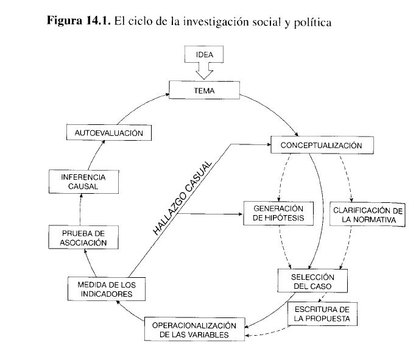
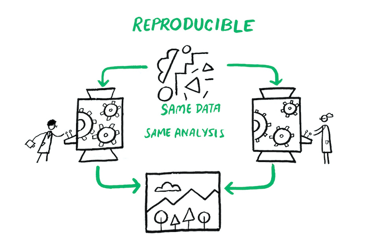
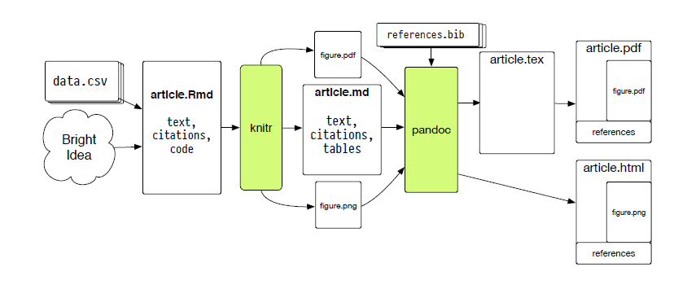

```{r, load_refs, include=FALSE, cache=FALSE}
library(RefManageR)
BibOptions(check.entries = FALSE,
           bib.style = "authoryear",
           cite.style = "authoryear",
           style = "markdown",
           hyperlink = "to.bib",
           dashed = FALSE)
bib <- ReadBib("../../bibliografia/bib.bib", check = FALSE)
```

```{r setup, include=FALSE}
options(htmltools.dir.version = FALSE)
```

```{r xaringan-themer, include=FALSE, warning=FALSE}
library(xaringanthemer)


dark_yellow <- "#EFBE43"
light_yellow <- "#FDF7E9"
gray <- "#333333"
blue <- "#4466B0"

style_duo(
  # colors
  primary_color = light_yellow,
  secondary_color = dark_yellow,
  header_color = gray,
  text_color = gray,
  code_inline_color = colorspace::lighten(gray),
  text_bold_color = colorspace::lighten(gray),
  link_color = blue,
  title_slide_text_color = blue,

  # fonts
  header_font_google = google_font("Martel", "300", "400"),
  text_font_google = google_font("Lato"),
  code_font_google = google_font("Fira Mono")
)
```

```{r echo=FALSE,include=FALSE}
#library(pagedown)
#pagedown::chrome_print("clase1.html")

```

---
class: inverse, center, middle

# Introducción

---

# Objetivo del curso

Entregar una comprensión general del proceso de investigación social cuantitativa y herramientas que permitan elaborar y ejecutar diseños de investigación utilizando el lenguaje R.

--

## Curso de múltiples dimensiones:

+ ¿es posible medir la realidad social?, ¿que implica?

+ ¿cómo medimos y registramos la realidad social? 

+ ¿cómo se hace esto para el caso chileno?

+ ¿cuál es la mejor forma de describir cada tipo de dato cuantitativo?

+ herramientas para analizar y reportar lo registrado en las bases de datos (R)

---

# El ciclo de investigación

```{r fig.align='center', out.width = "70%", echo=FALSE, fig.link="https://dialnet.unirioja.es/servlet/articulo?codigo=4288954"}

```


---

# Programa

El [programa](https://opso791ucsh2021.netlify.app/programa.pdf) se divide en cuatro puntos: 

+ Epistemología y consideraciones generales sobre la ciencia

+ Diseños de investigación social

+ Tipos de datos cuantitativos, estructura de los datos y análisis pertinentes (estadísticas)

+ Lenguajes y herramientas para el análisis de datos y reporte (R)

---

# Programa

Se esperan los siguientes resultados de aprendizaje con el curso:

+ Comprender las posibilidades y limitaciones de la representación numérica de la realidad social.

+ Comprender la lógica de la investigación científica en sociología, su particularidad cuantitativa y los principales desafíos que enfrenta.

--

+ Conocer el panorama de instrumentos de medición y tipos de estudios cuantitativos.

+ Adquirir un panorama general de las bases de datos en ciencias sociales (para el caso chileno).

--

+ Interpretar y analizar los elementos centrales de una base de datos con información social

+ Procesamiento simple de bases de datos (data frames) en R.

---

# Programa

+ Aplicar las técnicas más pertinentes de estadística descriptiva según las distintas características de los datos (en lenguaje R).

+ Presentar de manera visual y efectiva los datos cuantitativos (en lenguaje R).

--

+ Conocer y ejecutar junto a R otras herramientas y lenguajes de la ciencia abierta (Markdown, Zotero, Github, entre otras)


---

# Fundamentos

### La sociología debe aspirar a ser una ciencia (social)

--

+ Sistemática, perfectible y explicativa (desmitificadora) de la realidad. 

+ La sociología debiese aportar a la resolución de problemas sociales. Juicio "práctico" de calidad.

+ Al investigar nos paramos sobre "hombros de gigantes" (rev antecedentes)

---

# Fundamentos

### La sociología necesita de la ciencia abierta para ser confiable y útil

--

+ Transparentar y registrar cómo y porqué hacemos lo que hacemos; 

--

+ abrir a la comunidad científica y política los productos de las investigaciones; 

--

+ interacciones en base a argumentos y evidencia... 

---

# Fundamentos

### En sociología conviven y deben convivir diferentes enfoques. 

--

+ El enfoque cuantitativo es solo una opción. Es necesario reconocer su potencial y sus limitaciones.

--

+ Enfoque cualitativo tiene potencia, puede interactuar con el cuantitativo.

--

+ Triple vocación de la sociología

--

+ Producción científica inserta en "programas de investigación"

---

# Fundamentos

### Relación de confianza e igualdad de trato con las y los estudiantes

--

+ Con trabajo y motivación se puede llegar a elaborar productos de alta calidad

--

+ opinión en clase es siempre válida y provechosa. 

--

+ Se entienden problemas personales (con fundamento se puede ser flexible)

--

+ Respeto mutuo entre asistentes al aula. 

---

# Fundamentos

### Reconocimiento y respeto por el trabajo e ideas de otros/as

--

+ El plagio debe evitarse a toda costa.

--

### Apoyo constante en el aprendizaje y compañerismo

--

+ R puede ser muy difícil sí es su primera aproximación. 

+ Paciencia y apoyo desde los/as más avanzados/as. 

---

# Sobre la web y contacto

Todo el material necesario para el desarrollo del curso se encontrará en la página web del curso (<https://opso791ucsh2021.netlify.app/>).

Acá, podrán encontrar el calendario, la bibliografía para descargar, las presentaciones de las clases y las pautas de las tareas y trabajos. 

--

A la web no se subirá ninguna información relativa a los y las estudiantes del curso. Notas y revisiones serán subidas a la plataforma virtual de la Universidad, manteniéndose el anonimato. Entregas de trabajos por este mismo medio. 

--

El canal "oficial" de comunicación son los correos: <nicolasrattor@gmail.com> y <kevin.carrasco@ug.uchile.cl> . Escribir con copia a ambos. 

---

# Metodología

El curso se realizará por medio de plataforma virtual, donde la metodología será una combinación de clases expositivas y de ejercicios prácticos:

--

+ 15:20 a 16:40. Bloque teórico (epistemología, diseño y estadística descriptiva).

+ 16:50 a 18:10. Bloque práctico (R y herramientas asociadas).


---

# Evaluaciones

La evaluación final del estudiante se compone de: 

+ promedio simple de 5 tareas prácticas en R (30%) 

--

+ Nota por participación en clases (10%)

--

+ 4 pruebas teórico-prácticas a realizar en horario de clases (24/09, 22/10, 26/11 y 10/12) (60%). 

--

En pruebas solo se evalúa bibliografía obligatoria, lo pasado en clases y algunos problemas prácticos a resolver en R. 

--

Viernes 10/12 es la **integrativa final** (30%).  

---

# Herramientas del curso

+ Página web <https://opso791ucsh2021.netlify.app/>

--

+ [R y RStudio](https://dadc1ucsh2021.netlify.app/instalarr) para datos y escritura.

--

+ Buscador de bibliografía: [Google Scholar](https://scholar.google.com/). Otros buscadores más refinadas. 

--

+ Gestor bibliográfico (Zotero)

--

+ [Sci-hub](https://sci-hub.se/) y [libgen](http://libgen.rs/)

--

+ En el curso **no** se utilizará Word ni para la gestión bibliográfica ni para la escritura de textos. 

+ Tampoco usar excel para el procesamiento y análisis de datos.  


---
class: inverse, center, middle

# Introducción a R

## Instalación y cuestiones generales

---


# Introducción a R

R es un lenguaje de programación (1993), creado principalmente para el análisis de datos. 

--

Al principio cuesta comprenderlo, pero con tiempo y dedicación se pueden hacer grandes cosas. 

--

Por ejemplo, con lenguaje R y un poco de otras ayudas se hacen las presentaciones de este curso o incluso la [página web](https://opso791ucsh2021.netlify.app/) del mismo.

--

Gracias a la Entorno de Desarrollo Integrado (IDE) **RStudio** tenemos un software "amigable" que soporta el lenguaje R y nos permite trabajar con éste.

--

R Funciona con un paquete "base" al que se le pueden ir agregando más funciones al instalar otros paquetes.

---

# Introducción a R

Pero si solo quiero hacer análisis descriptivos de datos, ¿por qué utilizar R y no continuar con SPSS?

--

+ R es gratis, su código es abierto y se encuentra disponible en la mayoría de las plataformas (Windows, Mac OS, Linux).


--

+ Actualmente son bien valorados los profesionales de las ciencias sociales que utilizan este lenguaje.

--

+ Permite registrar procesamientos y análisis estadísticos, posibilitando que nuestra investigación sea "reproducible".

--

+ Por lo anterior, facilita el trabajo colaborativo (sobre todo al agregar otros *software*).

---

# Investigación reproducible

```{r fig.align='center', out.width = "70%", echo=FALSE, fig.link="https://the-turing-way.netlify.app/reproducible-research/overview/overview-definitions.html"}

```

---

# Introducción a R

## Ventajas de R (continuación)

+ Tiene una comunidad de usuarios activa, muy dispuesta a ayudar. Por lo general, todas nuestras "panas" ya fueron preguntadas y respondidas en foros-comunidades como [stackoverflow](https://stackoverflow.com/questions/tagged/r).

--


+ Consume pocos recursos informáticos  (no te "pega" el computador como otros programas de análisis estadístico).

--


+ Interactúa con otros lenguajes. Se pueden leer bases en spss, sas, stata o excel (hasta se pueden leer pdfs). También se puede exportar bases de datos a esos lenguajes. 

--

+ Esto facilita el trabajo colaborativo incluso con quienes no usan R.


---

# Introducción a R

Debilidades del lenguaje (todas superables):

--

+ Curva de aprendizaje "empinada" al inicio.

--

+ La mayoría de consultas, respuestas, manuales, registros, etc. están en inglés.

--

+ Un problema puede ser resuelto de muchas formas. A veces, sobre todo al inicio, se seleccionan caminos deficientes que terminan siendo incongruentes con otros procesos. 

--

+ La comunidad está más centrada en resolver problemas que en el proceso que permite su solución. A veces las soluciones no son las más elegantes y concisas. 

---

# La curva de aprendizaje en R

```{r fig.align='center', out.width = "100%", echo=FALSE, fig.link="https://raw.githubusercontent.com/allisonhorst/stats-illustrations/master/rstats-artwork/r_rollercoaster.png"}
knitr::include_graphics("https://raw.githubusercontent.com/allisonhorst/stats-illustrations/master/rstats-artwork/r_rollercoaster.png")
```

---

# Instalemos R y vamos a una pausa


---

# Abramos R

```{r fig.align='center', out.width = "100%", echo=FALSE, fig.link=""}
knitr::include_graphics("imagenes/interfaz_rstudio.png")
```


---

# Interactuando con R

--

Dos formas:

--

## 1) A través de la consola.

El símbolo `>` significa que R está listo para que le entreguemos una instrucción a ejecutar.

Los comandos que se escriban aquí **no** serán grabados para un nuevo inicio de sesión.

El código escrito en consola se ejecuta con la tecla Enter.

---

# Interactuando con R

## 2) Usando archivos *script*

Una práctica habitual y recomendada es guardar rutinas completas en archivos script. Con esto guardamos el código.

--

Texto plano que contiene nuestro código, siendo los archivos `.R` los más comunes.

--

Piensen estos archivos como un "bloc de notas". 

--

Para ejecutar el código en script puedes utilizar el *shortcut* **Ctrl + Enter**.

--

El signo gato (**#**) sirve para "silenciar" códigos o comentar. 


---

# Primeras operaciones con R

R puede ser una calculadora

--

```{r}
## ¿Cuánto es 5 + 5?
5 + 5   #<<
```

--

```{r}
5 * 5 #<<
```

--

```{r}
(400+6783) * 2.7 #<<
```

---

# Primeras operaciones con R

Podemos crear objetos y asignarles valores

```{r}
a <- 7 #<<
b <- 3 #<<
a + b #<<
```
--

incluso el resultado lo podemos asignar a un objeto

```{r}
c <- a+b #<<
c #<<
```
--

Si observamos en nuestro "ambiente", vemos que ahora hay 3 nuevos objetos. 

---

# Primeras operaciones con R

La mayor parte del tiempo usaremos funciones integradas.

Pueden ser entendidas como scripts que funcionan "tras bambalinas".

--

```{r}
sum(5,10) #<<
```

--

```{r}
# aproximar
round(9.556789) #<<
```

--

Gran parte de las funciones que utilizamos en R vienen contenidas en paquetes (packages).

--

Las funciones que acabamos de conocer pertenecen al paquete base, que viene con el software R.

--

Existen más de 10.000 paquetes en R -> funciones y datos.

---


class: inverse, center, middle

# RMarkdown

---

# Introducción a RMarkdown

R Markdown provee de un marco para generar **documentos** en el contexto del análisis de datos. Estos documentos pueden estar básicamente en formato `pdf`, `html` o `word`. 

--

La idea es "integrar" código de análisis de datos con texto plano (R + Markdown).

En un único documento de RMarkdown podemos:

+ Guardar y ejecutar código.

+ Generar reportes de alta calidad que pueden ser compartidos fácilmente.

+ Los documentos creados con R Markdown son completamente reproducibles.

---

# Introducción a RMarkdown

La lógica de los archivos `.rmd` es cercana a un bloc de notas, con la excepción de un "encabezado" (*yaml*). Todo su contenido es texto plano, pudiendose agregar "bloques" (*chunks*) de código `.R` 

--

File -> New File -> RMarkdown -> OK -> knit

--

```{r echo=FALSE, out.width="30%", fig.align = 'center'}
knitr::include_graphics("imagenes/knit-logo.png")
```


---

# RMarkdown

Para ser esquemáticos: los archivos de `R Markdown` en general tienen 3 partes:

(1). Un encabezado que permite configurar inicialmente el documento que vamos a escribir (**yaml**)

--


---


# R Markdown


(2). "Pedazos de código" (o en inglés, ***chunk codes***).

--


---

# R Markdown

(3). Los **cuerpos de texto** donde podemos hacer comentarios sin necesidad de usar "#"

--


---

# R Markdown

En los cuerpos de texto se pueden agregar de forma simple y rápida propiedades y elementos. Siendo los principales:

(4). **Énfasis**

```
 *cursiva*   **negrita**
```

--

(5). **Encabezados**

```
# Capítulo

## Subcapítulo

```

--

(6). **Imagenes**

Imágenes en la web o archivos locales en el mismo directorio:

```


```


---

# R Markdown

Para generar el documento se puede utilizar el comando render o bien utilizar el botón Knit (Tejer).

¿Como funciona? 

.middle[

]


---

# Tarea práctica N°1

Generar en RMarkdown un reporte simple, en formato html. [Descargar instrucciones acá](](https://opso791ucsh2021.netlify.app/tareas/tarea1/tarea1.pdf).

--

+ Nombre del estudiante

--

+ presentación de quién escribe (qué cosas te gusta hacer; por qué decidiste estudiar sociología; si es que has trabajado, en qué cosas; que cosas has investigado en trabajos de la universidad; a futuro, en que te ves trabajando)

--

+ Foto de tú sociólogo o cientista social favorito

--

Adjuntar comprimido con código en `.rmd`, archivos `.html` y foto utilizada. Mandar todo comprimido en un `.zip` o `.rar`. 

--

Entrega a más tardar el **lunes 16 de agosto hasta las 23:59 hrs**, vía correo electrónico

--

Envíos y consultas a mail profesor y ayudante

---

### Recursos web utilizados

+ [Capacitaciones en R del INE](https://capacitacionesdet.github.io/).

+ [R Markdown. Hoja de referencia](https://rstudio.com/wp-content/uploads/2015/03/rmarkdown-spanish.pdf). 

+ [Xaringan: Presentation Ninja, de Yihui Xie](https://github.com/yihui/xaringan). Para generar esta presentación.

### Para reforzar y seguir aprendiendo

+ [Introducción a RMarkdown](https://programminghistorian.org/es/lecciones/introduccion-a-markdown). 

### Bibliografía utilizada

```{r echo=FALSE, results=FALSE}
Citet(bib, "Wickham2021")
Citet(bib, "Schmitter2013")
```

```{r refs, echo=FALSE, results="asis"}
PrintBibliography(bib)
```


