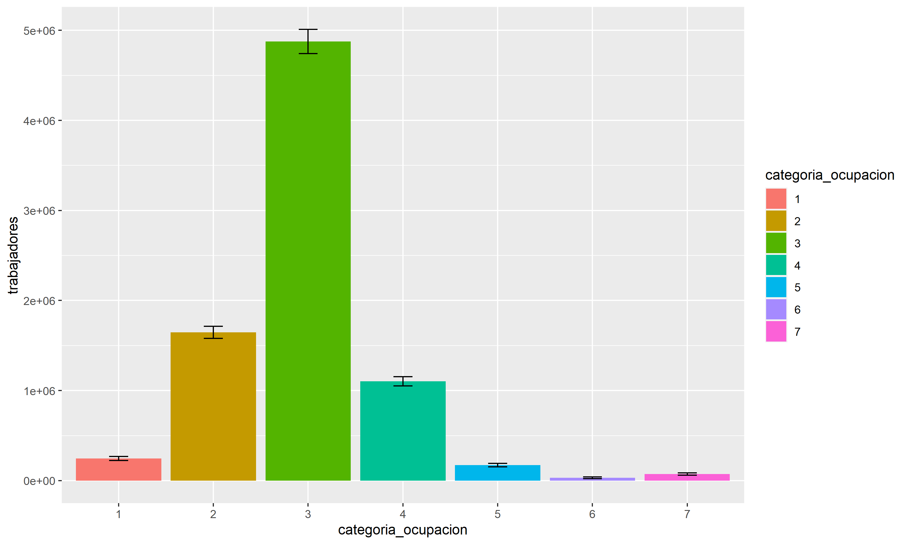
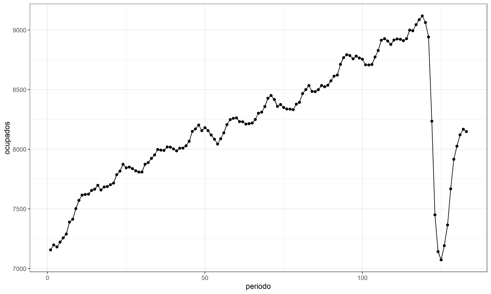
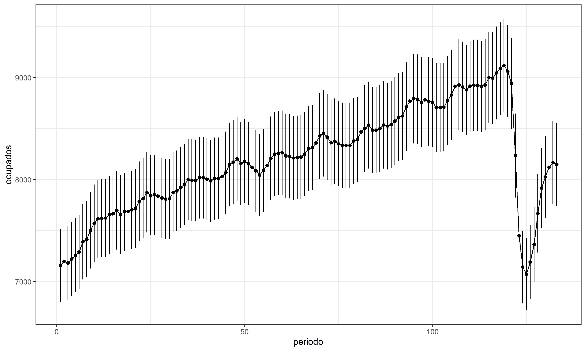
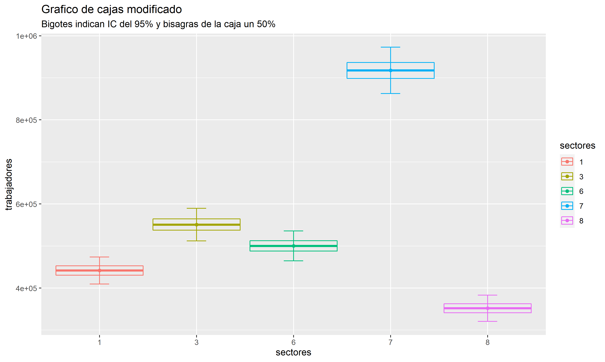

```{r, load_refs, include=FALSE, cache=FALSE}
library(RefManageR)
BibOptions(check.entries = FALSE,
           bib.style = "authoryear",
           cite.style = "authoryear",
           style = "markdown",
           hyperlink = "to.bib",
           dashed = FALSE)
bib <- ReadBib("../../bibliografia/bib.bib", check = FALSE)
```

```{r setup, include=FALSE}
options(htmltools.dir.version = FALSE)

knitr::opts_chunk$set(message = FALSE,
                      warning = FALSE)

```

```{r xaringan-themer, include=FALSE, warning=FALSE}
library(xaringanthemer)
library(dplyr)
library(guaguas)

dark_yellow <- "#EFBE43"
light_yellow <- "#FDF7E9"
gray <- "#333333"
blue <- "#4466B0"

style_duo(
  # colors
  primary_color = light_yellow,
  secondary_color = dark_yellow,
  header_color = gray,
  text_color = gray,
  code_inline_color = colorspace::lighten(gray),
  text_bold_color = colorspace::lighten(gray),
  link_color = blue,
  title_slide_text_color = blue,

  # fonts
  header_font_google = google_font("Martel", "300", "400"),
  text_font_google = google_font("Lato"),
  code_font_google = google_font("Fira Mono")
)
```

```{r echo=FALSE,include=FALSE}
#library(pagedown)
#pagedown::chrome_print("clase12_survey.html")

```

---

class: inverse, center, middle

# Muestras complejas en R

`Inferencia a la población`

---

# El desafío de la inferencia

La reducción de costos y esfuerzos que implica estudiar una población mediante una muestra, se compensa con el costo de la "incertidumbre" o "imprecisión".

--

La estadística nos da elementos para conocer y manejar esta incertidumbre.

--

Desde nuestra muestra vamos a estimar o inferir un valor aproximado del parámetro de la población. 

--

Al hacer este proceso, no solo ocuparemos estimaciones puntuales (como medias, quntiles, medianas, etc.)

--

También tendremos que calcular la precisión de estas estimaciones 

--

Todo estimador está compuesto por dos elementos

+ Estimación puntual
+ Precisión (ci, se, var, cv)


---

# El desafío de la inferencia

```{r echo=FALSE, fig.align='center',out.width="70%"}
knitr::include_graphics('imagenes/population-sample.png')
```

---


# La forma incorrecta

Para estimar el valor del parámetro poblacional existen dos alternativas: 

--

(i) definir un estadístico como estimación del parámetro poblacional (estimación puntual) 

--

(ii) establecer en torno a un estadístico un intervalo de confianza para estimar en términos probabilísticos el parámetro. 

--

La segunda alternativa es la más apropiada. Sin embargo, comprendamos la simplicidad de la primera. 

--

Para la estimación puntual, solo necesitaremos el peso de cada unidad de nuestros datos (`weight`)

--

Este **ponderador** o **factor de expansión (FE)** indica a cuántas unidades representa cada elemento de la muestra. 

--

Los ponderadores suman 1, mientras que los FE suman el tamaño de la población. 


---

# Abramos R

Una vez más, trabajaremos con la Encuesta Nacional de Empleo. 

--

¿Cuántes personas ocupadas existían en Chile en trimestre Enero-Marzo 2021? [Consultar acá](https://www.ine.cl/docs/default-source/ocupacion-y-desocupacion/cuadros-estadisticos/series-de-tiempo-nueva-calibraci%C3%B3n-proyecciones-de-poblaci%C3%B3n-censo-2017/indicadores_principales.xlsx?sfvrsn=afbd6d15_58)

--

8.148.210 ocupados: 4.826.060 hombres y 3.322.150 mujeres. 

--

¿Como podemos reproducir este resultado desde la base de datos?

--

```{r eval=FALSE}
# Descargar la base de datos
ene <- read.csv(file = "https://www.ine.cl/docs/default-source/ocupacion-y-desocupacion/bbdd/2021/formato-csv/ene-2021-02-efm.csv?sfvrsn=6d3786e2_4&download=true",sep = ";")
```

```{r echo=FALSE}
# Descargar la base de datos
ene <- read.csv(file = "data/ene-2021-02-efm.csv",sep = ";")
```


--

```{r}
ene %>% filter(activ==1) %>%   #<<
  group_by(sexo) %>% summarise(ocupados=n())  #<<
```

---

# Abramos R

No nos da lo mismo, ya que solo estamos considerando a los elementos de la muestra.

--

Para estimar el total, tendremos que utilizar la variable factor de expansión.

--

¿Como se comporta esta variable?

--

```{r}
summary(ene$fact_cal)   #<<
#sum(ene$fact_cal) ¿Cuánto debería sumar aproximadamente?
```

--

```{r echo=FALSE}
sum(ene$fact_cal)  #<<
```


---

# Abramos R

Ahora filtramos para dejar solo los ocupados y agrupamos por sexo.

--

```{r}
ene %>% filter(activ==1) %>% 
  group_by(sexo) %>% 
  summarise(ocupados=sum(fact_cal)) #<<
```

--

Y el total de ocupados

--

```{r}
sum(ene[ene$activ==1,]$fact_cal,na.rm = TRUE)
```

---

## Sobre el uso de estimaciones puntuales

Si bien es una mala práctica, tiene buen rendimiento y se usa en estudios descriptivos. 

--

El mismo INE presenta las estimaciones puntuales sin advertencia de su precisión*. 

--

```{r echo=FALSE, fig.align='center',out.width="60%"}
knitr::include_graphics('imagenes/ine_boletin.png')
```

--

*En los tabulados se señala cuando las estimaciones son poco o nada fiables (cv > 15%).


---

## Medir la precisión de la estimación

Si solo nos interesa la estimación puntual, podríamos simplemente usar el peso de cada caso y olvidarnos del resto. 

--

Sin embargo, debemos ser capaces de conocer la precisión de nuestras estimaciones y poder determinar, al menos, si son significativamente diferentes de cero.

--

Para esto debemos suponer cosas, conocer la error estándar de nuestra variable, el nivel de confianza con el que estamos trabajando y otros elementos del diseño muestral. 

--

R tiene unos paquetes que nos simplificarán la vida. 

---


## La forma correcta: `survey` y `srvyr`

Para trabajar con muestras complejas en R son necesarios dos paquetes:

--

`survey`

--

`srvyr`

--

El primero fue creado por [Thomas Lumley](https://unidirectory.auckland.ac.nz/profile/t-lumley). 

--

El segundo es su adaptación por terceros para que dialogue con la gramática de `dplyr` y los `pipes`. 

--

```{r eval=FALSE}
## Opciones generales
options(survey.lonely.psu = "certainty" )

## Crear objeto tbl_svy
ds <- data %>% as_survey_design(ids = conglomerados,  ## ids=1 (no hay conglomerado)
                              strata = estratos, 
                              weights = pesos)
```


---

## La forma correcta: `survey` y `srvyr`

Tenemos que poner atención a las siguientes variables, que hasta ahora dejábamos de lado:

--

```{r}
ene %>% select(ano_trimestre,mes_central,idrph,estrato,conglomerado,fact_cal) %>% str()
```
--

```{r message=FALSE, warning=FALSE}
library(survey)
library(srvyr)
```


---

## La forma correcta: `survey` y `srvyr`

### Crear objeto survey con la ENE

Todas las recodificaciones y ediciones hacerlas antes de crear el objeto `survey`.

--

+ Las variables con las que se harán agrupamientos deben mutarse a formato `factor`.  

--

```{r}
ene$activ<-as.factor(ene$activ) ## ojo
ene$sexo<-as.factor(ene$sexo) ## ojo
ene$categoria_ocupacion<-as.factor(ene$categoria_ocupacion)  ## ojo
```

--

Crear el objeto `survey`

```{r}
ds<- ene %>% as_survey_design(ids = conglomerado,   #<<
                              strata = estrato,     #<<
                              weights = fact_cal)   #<<
```


--

Opciones generales, quedan definidas para toda la sesión de R (como cargar un paquete)

--

```{r}
options(survey.lonely.psu = "certainty" ) 
## Evita que el programa tire error por estratos con solo una unidad primaria de muestreo (PSU) o conglomerado
## La opción certainty indica que los estratos con un conglomerado no aportan varianza a la estimación.
```

--

Más sobre [unidades primarias de muestreo](http://r-survey.r-forge.r-project.org/survey/exmample-lonely.html) en survey.


---

## La forma correcta: `survey` y `srvyr`

--

```{r}
class(ds) ## Consultar tipo de objeto
```

--

### Contar casos por categoría de respuesta

--

```{r}
# Ocupados - Desocupados - Fuera de la FT
ds %>% group_by(activ) %>% summarise(trabajadores=survey_total(na.rm = TRUE))  #<<

```

--

No solo tenemos estimación puntual del número de trabajadores, ahora tenemos una medida de precisión (se)

---

## La forma correcta: `survey` y `srvyr`

Error estandar indica la variabilidad de las medias muestrales. 

Tiende a disminuir cuando aumenta el tamaño de las muestras.

--

$$se=sd/\sqrt{n}$$

--

Como la desviación estándar de la población rara vez se conoce, el error estándar de la media suele estimarse como la desviación estándar de la muestra dividida por la raíz cuadrada del tamaño de la muestra.

--

Con el error estandar podemos obtener los intervalos de confianza


--

$$[\overline{x} + z_{a/2}\frac{sd}{\sqrt{n}} , \overline{x} - z_{a/2}\frac{sd}{\sqrt{n}}]$$

--

Survey lo hace por nosotros...

---

## La forma correcta: `survey` y `srvyr`

--

```{r}
ds %>% group_by(activ) %>% 
  summarise(trabajadores=survey_total(na.rm = TRUE,      #<<
                                      vartype=c("ci")))   #<<

```

--

Por defecto `survey` trabaja con nivel de confianza del 95% (z=1,96). Se puede cambiar:

--

```{r}
ds %>% group_by(activ) %>% 
  summarise(trabajadores=survey_total(na.rm = TRUE, 
                                      vartype=c("ci"),
                                      level=c(0.90)))   #<<

```


---

## La forma correcta: `survey` y `srvyr`

--

Con esto, la tasa de desocupación publicada de 10,4% en EFM 2021 tendrá un nivel de precisión:

--

```{r}
tasa<-ds %>% group_by(activ) %>% 
  summarise(trabajadores=survey_total(na.rm = TRUE,  #<<
                         vartype=c("ci"))) %>% 
  filter(activ==1|activ==2) %>% # seleccionar solo 2 filas
  janitor::adorn_totals("row")  # total por columna

```

Tasas de desocupación:

--

```{r}
tasa[2,2:4]/tasa[3,2:4]  #<<
```

---

## La forma correcta: `survey` y `srvyr`

### Proporciones por categoría de respuesta


--

```{r}

ds %>% filter(categoria_ocupacion!=0) %>% group_by(categoria_ocupacion) %>% 
  summarise(proportion = survey_mean(vartype = c("ci"),na.rm = TRUE)) #<<

```

---

## La forma correcta: `survey` y `srvyr`

### Media

Similar a como se programan las proporciones, pero incluyendo una variable numérica dentro de `survey_mean`

--

```{r}

ds %>% filter(categoria_ocupacion!=0) %>% group_by(categoria_ocupacion) %>% 
  summarise(media_edad = survey_mean(edad,vartype = c("ci"),na.rm = TRUE))   #<<

```

---

### Mediana (2do cuartil)

--

```{r}

ds %>% filter(categoria_ocupacion!=0) %>% group_by(categoria_ocupacion) %>% 
  summarise(mediana_edad = survey_median(edad,vartype = c("ci"),na.rm = TRUE))   #<<

```


---

## La forma correcta: `survey` y `srvyr`

### Cuartiles (y otros percentiles)

--

```{r}

ds %>% filter(!is.na(activ)) %>% group_by(activ) %>% 
  summarise(edad=survey_quantile(edad,c(0.25, 0.5, 0.75),na.rm = TRUE))   #<<

```

---


### Desviación estándar y varianza

--

```{r}

ds %>% filter(categoria_ocupacion!=0) %>% group_by(categoria_ocupacion) %>% 
  summarise(sd_edad=survey_sd(edad,na.rm = TRUE),
            varianza_edad=survey_var(edad,vartype = c("ci"),na.rm = TRUE))   #<<

```


---

class: inverse, center, middle

# Muestras complejas en R

`Visualización de la incertidumbre`

---

# Visualizar la incertidumbre

La forma más común es el gráfico de barras o de líneas con barras de error (A). 

```{r echo=FALSE,fig.align='center', out.width="80%"}
knitr::include_graphics("imagenes/4_mean_ic.png")
```

--

La visualización puede aportar más de un intervalo (B)

--

O incluso se puede ir más allá, visualizando la incertidumbre de forma continua (C y D)

--

La visualización también puede confundir, presentándose errores estándar como si fuesen intervalos. 

--

Revisar Correl, M. [Error bars considered harmful](https://ieeexplore.ieee.org/document/6875915) para conocer la discusión. 


---

# Visualizar la incertidumbre

### `geom_bar`

--

```{r eval=FALSE}

ds %>% filter(categoria_ocupacion!=0) %>% group_by(categoria_ocupacion) %>% 
  summarise(trabajadores=survey_total(na.rm = TRUE, vartype=c("ci"),level=c(0.95))) %>%   #<<
  ggplot(aes(x=categoria_ocupacion,y=trabajadores,fill=categoria_ocupacion))+
  geom_bar(stat = "identity") + 
  geom_errorbar(aes(ymin=trabajadores_low, ymax=trabajadores_upp),  #<<
                  width=0.2, position=position_dodge(.9))

```

--

```{r eval=FALSE, echo=FALSE}
ggsave(
  plot = last_plot(),
  filename = "imagenes/grafico1.png", #<< 
  device = "png",
  dpi = "retina",
  units = "cm",
  width = 25,
  height = 15
)
```

```{r echo=FALSE,fig.align='center', out.width="70%"}

```


---

# Visualizar la incertidumbre

### Gráfico de líneas

Data con la evolución de los ocupados (en miles) en Chile entre 2010 y 2021.

```{r echo=FALSE}

serie<-readxl::read_excel("data/población-en-edad-de-trabajar-por-situación-en-la-fuerza-de-trabajo.xlsx",sheet = 2,skip = 6)
serie<-serie[1:133,8]
serie$periodo<-c(1:133)
names(serie)<-c("ocupados","periodo")
serie<-serie %>% mutate(ocupados_low=ocupados*0.95,  ## IC ficticios para el gráfico
                 ocupados_upp=ocupados*1.05)         ## IC ficticios para el gráfico

serie

```


---

# Visualizar la incertidumbre

### Gráfico de líneas, solo estimaciones puntuales

```{r results=FALSE, eval=FALSE}
serie %>%  ggplot(aes(x=periodo, y=ocupados)) + 
  geom_line() + 
  geom_point() +
  theme_bw()
```


```{r echo=FALSE, eval=FALSE}
ggsave(
  plot = last_plot(),
  filename = "imagenes/grafico2.png", #<< 
  device = "png",
  dpi = "retina",
  units = "cm",
  width = 25,
  height = 15
)
```

```{r echo=FALSE,fig.align='center', out.width="70%"}

```

---

# Visualizar la incertidumbre

### Gráfico de líneas, con medidas de precisión

```{r results=FALSE, eval=FALSE}
serie %>%  ggplot(aes(x=periodo, y=ocupados)) + 
  geom_line() + 
  geom_point() +
  theme_bw() + 
  geom_errorbar(aes(ymin=ocupados_low, ymax=ocupados_upp), width=.01) #<<
```


```{r echo=FALSE, eval=FALSE}
ggsave(
  plot = last_plot(),
  filename = "imagenes/grafico3.png", #<< 
  device = "png",
  dpi = "retina",
  units = "cm",
  width = 25,
  height = 15
)
```

```{r echo=FALSE,fig.align='center', out.width="65%"}

```


---

## Gráficos de cajas, estimando a la población

```{r fig.align='center',out.width="50%"}
svyboxplot(edad~categoria_ocupacion, design=ds,all.outliers=TRUE)  #<< 
```


---

## Gráficos de cajas, estimando a la población


```{r echo=FALSE,fig.align='center',out.width="65%"}
par(mfrow=c(2,1)) 
boxplot(edad~categoria_ocupacion,data=ene)
svyboxplot(edad~categoria_ocupacion, design=ds,all.outliers=TRUE)  #<< 
```


---

## Gráficos de cajas modificados 

[o The Modern Box Plot](https://towardsdatascience.com/better-boxplots-for-psychological-science-5fbe552b2eef)

--

## Para visulizar precisión (IC) en vez cuartiles

+ Box center: sample mean (o total)
+ Box edges: standard error of the mean (IC 50% en este caso)
+ Box whiskers: 95% confidence interval

--

```{r}
## Crear tabla de ocupados por sector económico
base<-ds %>% filter(categoria_ocupacion==3&r_p_rev4cl_caenes%in%c(1,3,6,7,8)) %>%
  group_by(r_p_rev4cl_caenes) %>% 
  summarise(trabajadores=survey_total(na.rm = TRUE, vartype=c("ci"),level=c(0.50,0.95))) %>% 
  rename(sectores=r_p_rev4cl_caenes) %>% mutate(sectores=as.factor(sectores))

base

```

```{r echo=FALSE}
levels(base$sectores)<- c("Agricultura","Electricidad","Construccion","Comercio","Transporte")
```


---

## Gráficos de cajas modificados

```{r eval=FALSE, fig.align='center',out.width="70%"}
base %>% ggplot(aes(y = trabajadores, x = sectores,color=sectores)) + 
  geom_point() +
  geom_crossbar(aes(ymin = trabajadores_low50, ymax = trabajadores_upp50)) +
  geom_errorbar(aes(ymin = trabajadores_low95, ymax =  trabajadores_upp95), width = 0.2) + labs(title = "Grafico de cajas modificado",subtitle = "Bigotes indican IC del 95% y bisagras de la caja un 50%")

```

--

```{r echo=FALSE, eval=FALSE}
ggsave(
  plot = last_plot(),
  filename = "imagenes/grafico5.png", #<< 
  device = "png",
  dpi = "retina",
  units = "cm",
  width = 25,
  height = 15
)
```

```{r echo=FALSE,fig.align='center', out.width="80%"}

```


---

## Correlación con pesos

```{r}
## Correlación considerando pesos
library(weights)
ene2<-ene %>% select(edad,c2_1_1,c2_2_1)
weighted_corr<-wtd.cor(ene2, weight = ene$fact_cal)
weighted_corr$correlation

```

--

```{r}
# Correlación considerando sin considerar pesos
cor(ene2, use = "complete.obs")
```


---

# Bibliografía y elementos consultados

Heiss, A. [Uncertainty](https://datavizs21.classes.andrewheiss.com/content/06-content/). En curso "Data Visualization". 

INE. Boletín Mensual DEF 2021 [Encuesta Nacional de Empleo](https://www.ine.cl/estadisticas/sociales/mercado-laboral/ocupacion-y-desocupacion).

[Xaringan: Presentation Ninja, de Yihui Xie](https://github.com/yihui/xaringan). Para generar esta presentación.

[Lehmann et al (2021) Presentación paquete "calidad" en LatinR](https://www.youtube.com/watch?v=ch3bg2bhOmc)


```{r echo=FALSE, results=FALSE}
Citet(bib, "Lohr2000")
Citet(bib, "Vivanco2006")

```

```{r refs, echo=FALSE, results="asis"}
PrintBibliography(bib)
```


