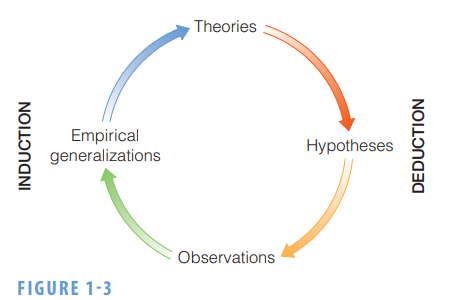
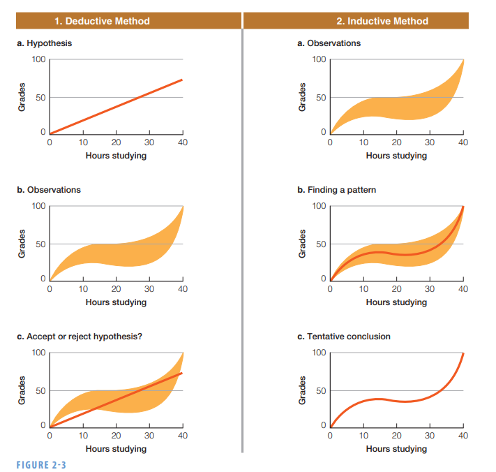
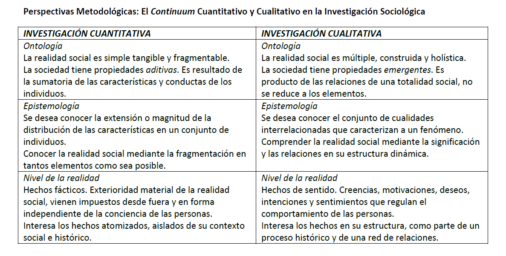
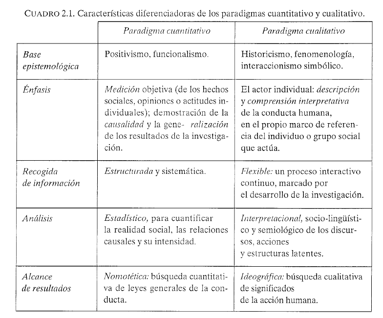

```{r setup, include=FALSE}
options(htmltools.dir.version = FALSE)

```

```{r, load_refs, include=FALSE, cache=FALSE}
library(RefManageR)
library(bibtex)

BibOptions(check.entries = FALSE,
           bib.style = "authoryear",
           cite.style = "authoryear",
           style = "markdown",
           hyperlink = "to.bib",
           dashed = FALSE)
bib <- ReadBib("../../bibliografia/bib.bib", 
               check = FALSE)

```

```{r xaringan-themer, include=FALSE, warning=FALSE}
library(xaringanthemer)


dark_yellow <- "#EFBE43"
light_yellow <- "#FDF7E9"
gray <- "#333333"
blue <- "#4466B0"

style_duo(
  # colors
  primary_color = light_yellow,
  secondary_color = dark_yellow,
  header_color = gray,
  text_color = gray,
  code_inline_color = colorspace::lighten(gray),
  text_bold_color = colorspace::lighten(gray),
  link_color = blue,
  title_slide_text_color = blue,

  # fonts
  header_font_google = google_font("Martel", "300", "400"),
  text_font_google = google_font("Lato"),
  code_font_google = google_font("Fira Mono")
)
```

```{r echo=FALSE,include=FALSE}
#library(pagedown)
pagedown::chrome_print("clase2A.html")

```


class: inverse, center, middle

# Introducción

---

# Introducción

Ciencia como un método de investigación, de aprender y conocer cosas sobre el mundo que nos rodea. 

--

Este aprendizaje es en base **criterios** que deben cumplirse para que se acepte algo como verdad (provisoria). 

Saber científico es diferente al saber de la experiencia. 

--

En general, una afirmación científica debe tener tanto lógica como apoyo empírico. Debe tener sentido y no debe contradecir lo observado. 

--

Nos permitiría ir más allá de la indagación común, las tradiciones y la autoridad. 

---


# Ciencia según [Merton](https://sciencepolicy.colorado.edu/students/envs_5110/merton_sociology_science.pdf)

--

+ **Universalismo:** pretensiones de verdad evaluadas con criterios impersonales preestablecidos. No importan atributos de sus protagonistas. 

--

+ **Comunismo:** Los hallazgos sustantivos de la ciencia son producto de la colaboración social. La propiedad intelectual debe limitarse al reconocimiento y estima. 

--

+ **Desinterés:** curiosidad, altruismo en la búsqueda de beneficiar a la humanidad, y compromiso por la verdad. Rechazo a la acumulación de prestigio y a la subordinación a grupos de interés fuera del campo. 

--

+ **Escepticismo organizado:** escrutinio periódico de las creencias en términos lógicos y empíricos. Potencial conflicto con actitudes e instituciones sociales. No existe la división entre lo sagrado y lo profano. 

---

# Introducción

La investigación social intentará discutir y explicar lo que es, no lo que debería ser (capitalismo < comunismo)

--

Buscando regularidades en la vida social, más allá de lo que parece evidente. 

--

El foco está en conocer y explicar agregados humanos generales, no individuos. 

--

**Objetivo último:** Explicar como funciona el mundo social, o fragmentos del mundo. Relatos lógicos, que no sean refutados empíricamente y que hagan sentido a la comunidad. 


---

# Introducción

El conocimiento científico del mundo no está exento de problemas y desafíos.

--

Podemos caer en una serie de errores (que la metodología puede ayudar a evitar). 

--

1. **Observaciones inexactas** (diseño y herramientas de medición ayudan)

--

2. Pensar que algunos **eventos similares** dan evidencia de un **patrón general** (muestra representativa y réplicas)

--

3. **Observación selectiva** para confirmar el patrón (selección cuidadosa de muestra y casos desviados)

--

4. **Razonamiento ilógico** (sistemas lógicos y teoría)

--

5. **Suponer causalidad** donde hay correlación

--

"La excepción confirma la regla" (en términos lógicos no tiene sentido)

"Si una mujer llega a CEO cualquiera podría (no hay dominación masculina)"

"Después de rachas de mala suerte viene una oportunidad de victoria" (poker)

--


---

# Introducción


Estos problemas se expresan a lo largo del ciclo de la investigación.

--

```{r fig.align='center', out.width = "50%", echo=FALSE}

```

--

El cómo hacer este recorrido no está exento de debates:

--

Deductivo / inductivo

Cuantitativo / Cualitativo

---

# Introducción

```{r fig.align='center', out.width = "60%", echo=FALSE}

```


---

class: inverse, center, middle

# Enfoques o metodologías de investigación

---

# Metodologías de inv.

Lucha y polémica cualitativa - cuantitativa (implicación emocional).

--

¿Cuál diferencia entre las investigaciones cualitativas y cuantitativas?, ¿Existe?

--

Existe una diferencia de enfoques, discutible que sean opuestas y antagónicas. 

--

E.g., `r Citet(bib, "dellaPorta2013")` distingue entre 

(1) "investigación basada en variables" (cuantitativa) e 

(2) "investigación de casos completos" (cualitativa)

--

La primera como nomotética, centrada en la explicación y generalización. 

La segunda ideográfica, centrada en explicar los casos totalmente.

--

¿Que elementos explican la ocurrencia de huelgas laborales o la delincuencia juvenil?


---

# Metodologías de inv.


Explicar parcialmente el resultado en un gran número de casos: teorías de las masas aisladas (Kerr and Siegel) o del poder estructural (Silver). 

--

En el segundo, la huelga en la empresa X ocurrió en un contexto de crisis de las relaciones de confianza con la jefatura, de deslegitimación institucional en el país y de negación del tradicional reajuste del 5% bianual en la empresa. (Yarur, Peter Win)

--

Objetivos, preferencias y disponibilidad de la **información empírica** son determinantes. 


---

# Metodologías de inv.


Si interesa generalizar sobre relaciones entre fenómenos, conviene aislar variables de múltiples casos

Explica parcialmente en muchos casos

Codificar mediante números es una buena forma de abordar grandes volumenes de información. 

--

Si interesa el contexto y la complejidad de situaciones, tiene sentido explorar casos. 

Explica la mayor parte pero en pocas situaciones

La codificación es opcional y es mediante "códigos" o "nodos".


---

# El dualismo con lo cualitativo

Alrededor de la metodología cuantitativa se han construido *malentendidos*: 

--

+ es positivista, por lo que busca leyes causales

--

+ y también es objetiva (dualismo s-o)

--

+ es políticamente regresiva

--

+ es la metodología dominante

--

+ simplifica la realidad

--

+ es alienante de los sujetos 


---

# El dualismo

Textos españoles clásicos, vinculaban las metodologías cualitativas y cuantitativas a paradigmas epistemológicos:

--

+ la medición por variables es positivista y funcionalista. Su objeto son hechos fácticos. 

--

+ la medición por casos es interpretativa, humanista o dialéctica. Su objeto son hechos de sentido. 

--

Ambos enfoques serían formas de conocer especialmente distintos, desde lo epistemológico e ideológico, hasta lo metodológico y técnico.

---

# El dualismo en Ibañez

```{r fig.align='center', out.width = "100%", echo=FALSE}

```

---

# El dualismo en Cea

```{r fig.align='center', out.width = "70%", echo=FALSE}

```


---

# ¿Dualismo en Corbetta?

```{r fig.align='center', out.width = "100%", echo=FALSE}
knitr::include_graphics("imagenes/corbetta1.PNG")
```

---

# ¿Dualismo en Corbetta?

```{r fig.align='center', out.width = "80%", echo=FALSE}
knitr::include_graphics("imagenes/corbetta2.PNG")
```


---

# Se desmorona el mito

--

+ Los estudios cuantitativos no se dedican a buscar leyes (y tampoco las encuentran). ¿Consultoras?

--

+ Sí buscan generalizar resultados, pero en general considerando el contexto (espacio y tiempo en que datos fueron levantados).

--

+ Por otro lado, la investigación cualitativa también busca generalizar (e.g. caso )

--

+ Ambos enfoques quieren comprender la realidad, pero con técnicas distintas. 


--

+ El carácter ideológico de un instrumento descansa más de la forma en que éste se utiliza y las motivaciones de quien lo utiliza, que en sus características intrínsecas (Asún, 2006). 

---

# Se desmorona el mito

El proyecto de la Investigación Obrera: proyecto de encuesta de [Marx (1880)](https://www.marxists.org/archive/marx/works/1880/04/20.htm).

--

```{r fig.align='center', out.width = "30%", echo=FALSE}
knitr::include_graphics("https://images-na.ssl-images-amazon.com/images/I/5155rEOSCzL._SX331_BO1,204,203,200_.jpg")
```

--

Lógica de la reforma. 

---

# Se desmorona el mito

La medición no es objetiva:

+ Instrumento producido subjetivamente

+ Aplicación subjetiva

+ Sujetos cambia en el tiempo y responde a instrumento de diferente forma

+ No es posible que la ciencia sea ajena al investigador 

--

No necesariamente lo cuantitativo busca conocer "objetos" o "hechos". 

Por ejemplo, cuestionarios de la SUSESO. 

--

Grueso de la medición son fenómenos subjetivos. 

--

Al menos el positivismo clásico en sociología no existe. Existe postpositivismo, pero este esta lejos de leyes causales o incluso predecir comportamiento humano. 

--

Sujeto se mide individualmente, pero se asume que comparte grupos sociales y determinaciones estructurales con otros sujetos. 

---

# Se desmorona el mito

La relación entre metodología cuantitativa y encuesta no es determinista. 

--

Lo que requiere el investigador cuantitativo no es trabajar con encuestas. 

--

Diversos tipos de instrumentos de producción de datos (entrevistas individuales, observaciones, entrevistas
grupales), ya que casi cualquier información puede ser transformada en números utilizando procedimientos de codificación.


---

# No todo es mito

Fases estructuradas. 

Objetivos y cuestionario debe estar terminado antes de aplicarlo. 

Análisis posterior a la producción de información. 

--

La complejidad, amplitud y cambios del sujeto son forzados a ser codificados en un set de variables

--

La reducción a número implica una pérdida de riqueza en los significados de los sujetos (Babbie 2014)


---

# Estrategia cuantitativa 

--

Hay instrumentos que permiten esta transformación (cuestionarios). 

Hay unos mejores que otros, todos tienes sesgos y son perfectibles. 

--

Este proceso es una interacción social que produce datos, información. **No es recolección de datos.**

--

Las estrategias cuantitativas emplean **números para representar la realidad**. 

--

Estos números tienen "propiedades" que permiten su manipulación y diferentes análisis. 

--

Estadística: procedimiento de análisis de la información que permita manipular, sintetizar y describir
grandes volúmenes de números con facilidad.

---

# Medir en Cs. Sociales

Con los números:

+ Se pueden contar cosas y hechos (número de hijos). Demografía. 

--
 
+ Contar entidades continuas, en donde la escala de medida es arbitraria pero compartida (metros, tiempo, dinero). Economía. 

--

+ Medir objetos sociales sin unidad de medida. Asignamos números conforme a una regla. 

--

Fragmentamos personas en propiedades. 

Indagamos en que grado, magnitud o forma se posee una propiedad. 

Las propiedades varía entre los sujetos, de ahí que las llamamos “variables".

--

No asignamos números a personas, se los asignamos a sus características. 

---

# Medir en Cs. Sociales

Estas propiedades no se observan directamente.

En sociología trabajamos con conceptos, que son representaciones más o menos abstractas de la realidad.

--

Diferencia con economía, que tendrá por objetos de estudios cuestiones más directas (brechas salariales, o productividad). 

--

Diferencia salarial entre dos grupos (hombres y mujeres)

Relación entre la cantidad de productos producida en un tiempo t y los recursos utilizados para obtener dicha producción (PIB/NT, por ejemplo). 


---

# Medir en Cs. Sociales

¿Cuáles serían conceptos abordados por investigaciones sociológicas?

Clase, estado y sociedad (muy abstracto)

--

Ideología política, conciencia de clase, neoliberalismo, capitalismo, dominación, movimiento social, etc. (poco menos abstractos)

--

Incluso algunos que parecen más concretos, como empresa, huelga, sindicato o partido político, **no son unívocos**. 

---

# Moraleja

Revisar literatura sobre el tema de investigación antes de comenzar a producir información. 

--

Antes de iniciar cualquier investigación estos deben ser definidos. 

Por lo general, no habrá consenso ni definiciones unívocas. Cada concepto ha sido definido por diferentes autores. 

--

No hay definiciones naturales... Evitar caer en el fetichismo o reificación de los conceptos, como si fuese obvio lo que significan.

--

Como son conceptos abstractos, no pueden medirse directamente. Por lo general tienen más de una dimensión. 

---

# Medir en ciencias sociales

Un mismo concepto puede ser propiedad de diferentes unidades de análisis. 

--

+ La clase puede ser un rasgo de las personas. Otros la definirán como un actor que se expresa en formas sindicales, movimientistas e incluso partidistas.

+ La conciencia de clase puede ser un las personas, de las organizaciones o de un barrio.

---

# Riesgos medición

+ Medir es simplificación analítica.

--

+ Medir implica riesgos, como errores de medición. 

--

+ Medir implica riesgos, como no medir algo fundamental (nada que hacer)

--

+ Supuesto del *homomorfismo*. Dividimos, medimos y recomponemos en el análisis. Se conservan las relaciones reales entre objeto.

--

+ Reificar la data. Ignorar como se produce o suponer que son de calidad (se gasta mucho tiempo en limpiarlos y validar)


---

# Potencia medición cuantitiva

+ Apuesta por medir grandes cantidades de información. Errores pequeños o individuales se tienden a eliminar.

--

+ Apuesta por asociación entre variables.

--

+ Estándares procedimentales. 

--

+ Permite generar representaciones simples de la realidad (modelos)

--

+ Mecanismos para ponderar la influencia relativa de diversas variables sobre otras

--

+ La operacionalización obliga claridad conceptual antes de comenzar el terreno

--

+ Legitimidad social de las técnicas cuantitativas


---
class: inverse, center, middle

# Posibilidades de integración de los enfoques metodológicos

---

# Integración

--

No solo no existe dualismo entre los enfoques. Es posible su integración.

--

Uno de los posibles caminos para hacer frente a los dilemas y desafíos de las ciencias sociales

--

Esta integración permitiría generar mejores relatos sobre como funciona la sociedad o aspectos específicos de ella; por qué la sociedad cambia o cómo es que persistentemente se reproduce de determinada manera.

--

Si la sociedad es el producto de la interacción en el tiempo de acción y estructura, vamos a necesitar de mucha colaboración y técnicas de investigación para abordar el fenómeno.

--

Distintas propuestas: **triangulación**, métodos mixtos y análisis anidado (Lieberman).

---

# Triangulación

[Norman Denzin, 1970](https://journals.sagepub.com/doi/10.1177/1558689812437186)

--

1. Triangulación de datos (muchas fuentes de datos producidas con diferentes objetivos pero utilizadas en la misma investigación)

--

2. Triangulación del investigador (múltiples investigadores)

--

3. Triangulación teórica

--

4. Triangulación metodológica (datos recogidos con diferentes métodos en el marco de la misma investigación, mismo objetivo)


---

# Triangulación

Ejemplos:

+ Informes Banco Central

+ Subcontrato en universidades

+ Entrevistas cognitivas

---

### Bibliografía utilizada

```{r echo=FALSE, results=FALSE}
Citet(bib, "dellaPorta2013")
Citet(bib, "Wickham2021")
Citet(bib, "Schmitter2013")
Citet(bib, "Babbie2014")
Citet(bib, "Asun2006a")
```

```{r refs, echo=FALSE, results="asis"}
PrintBibliography(bib)
```


---
class: inverse, center, middle

# Repaso lenguaje R y comentarios sobre texto ciencia de datos

```{r, echo=FALSE}
#devtools::install_github("gadenbuie/countdown")
library(countdown) 
countdown(minutes=10, seconds=30)
```


