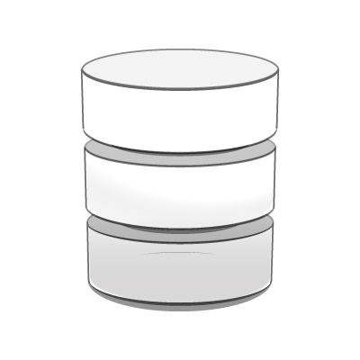

```{r setup, include=FALSE}
options(htmltools.dir.version = FALSE)

```

```{r, load_refs, include=FALSE, cache=FALSE}
library(RefManageR)
library(bibtex)
BibOptions(check.entries = FALSE,
           bib.style = "authoryear",
           cite.style = "authoryear",
           style = "markdown",
           hyperlink = "to.bib",
           dashed = FALSE)
bib <- ReadBib("../../bibliografia/bib.bib", 
               check = FALSE)

```

```{r xaringan-themer, include=FALSE, warning=FALSE}
library(xaringanthemer)


dark_yellow <- "#EFBE43"
light_yellow <- "#FDF7E9"
gray <- "#333333"
blue <- "#4466B0"

style_duo(
  # colors
  primary_color = light_yellow,
  secondary_color = dark_yellow,
  header_color = gray,
  text_color = gray,
  code_inline_color = colorspace::lighten(gray),
  text_bold_color = colorspace::lighten(gray),
  link_color = blue,
  title_slide_text_color = blue,

  # fonts
  header_font_google = google_font("Martel", "300", "400"),
  text_font_google = google_font("Lato"),
  code_font_google = google_font("Fira Mono")
)
```

```{r echo=FALSE,include=FALSE}
#library(pagedown)
#pagedown::chrome_print("clase2B.html")

```


class: inverse, center, middle

# Repaso lenguaje R y comentarios sobre texto ciencia de datos


---

# R repaso

+ R lenguaje de programación para el análisis estadístico (archivos `.R`)

--

+ RStudio interfaz "amigable" (IDE)

--

+ Markdown lenguaje de texto plano y de marcado

--

+ RMarkdown integración de los dos lenguajes (archivos `.rmd`)

--

+ RMarkdown permite integrar en un mismo documento el análisis de los datos y su interpretación. 

--

+ Documentos en RMarkdown son reproducibles

--

+ Para agregar imagen: ``

---


```{r fig.align='center', out.width = "100%", echo=FALSE}
knitr::include_graphics("https://raw.githubusercontent.com/allisonhorst/stats-illustrations/master/rstats-artwork/rmarkdown_wizards.png")
```


---

# Ciencia de datos

El modelo de la ciencia de datos según Wickham (2021):

--

.pull-left[
```{r fig.align='center', out.width = "50%", echo=FALSE}
knitr::include_graphics("https://es.r4ds.hadley.nz/cover.png")
```
]


.pull-right[
```{r fig.align='center', out.width = "100%", echo=FALSE}
knitr::include_graphics("https://es.r4ds.hadley.nz/diagrams_w_text_as_path/es/data-science.svg")
```
]


---

# Ciencia de datos

La pregunta sobre cuáles datos importar y con qué objetivo debe ser central para la sociología. 

--

La comunicación no se limita a presentar el dato. Hay que interpretarlo, ponerlo en discusión teórica e intentar dar respuesta a pregunta inicial.

--

Debemos ser consciente de cómo los datos son producidos y distribuidos (o no distribuidos). Proceso de producción y análisis estadístico por instituciones. 


---

# R

Importar, ordenar y transformar los datos no es sencillo. 

--

Visualizar los datos suele ser la parte más sencilla y cercana. 

--

*"Una buena visualización te mostrará cosas que no esperabas o hará surgir nuevas preguntas acerca de los datos."* `r Citet(bib, "Wickham2021")`. 

--

Trabajaremos con una data frame que se carga fácilmente, está ordenada y transformada según nuestro interés inicial. 

--

Antes, revisemos cosas básicas de R y algunos conceptos.

---
class: inverse, center, middle

# Lenguaje R

---

# Vectores

Es el objeto más básico en R.

--

Un vector es una forma de almacenar datos que permite contener una serie de valores del mismo tipo.

--

Simples de solo 1 elemento:

```{r}
a<-7     #<<
a       
```

--

Cosas más complejas con la función `c()` para concatenar elementos:

--

```{r}
a<-c(7,8,9,5,7,9)#<<
a
```


---

# Vectores

Podemos crear un vector con los nombres del curso:

--

```{r echo=FALSE}
estudiantes <- readxl::read_excel("data/estudiantes.xlsx")$NOMBRE
estudiantes <- stringr::str_extract_all(estudiantes,',.*')
estudiantes <- stringr::str_remove_all(estudiantes,', ')
estudiantes <- stringr::str_remove_all(estudiantes,"\\s+(\\S)\\S*(?!\\S)")


```


```{r}
nombres<-c("ISIDORA", "ALEJANDRA", "NOEMÍ", "LESLIE","MARCO", "JAVIER", 
           "DANTE","VALENTINA", "DIANA" ,  "ANDRÉS",   "BRUNO", "JAVIERA", 
           "JAVIERA" , "PAOLA", "ALONSO" ,  "THABATA", "JENNIFER", "FRANCISCO", 
           "MATÍAS",  "VALENTINA", "GERALDINE","ALEJANDRA" , "VALENTINA", 
           "FRANCISCO", "DIEGO", "MATIAS", "CAMILA" , "CARLA", 
           "JAVIER")
```

--

Ver el vector:

--

```{r}
nombres
```


---

# Vectores e indexación

Y luego seleccionar la posición 8.

```{r}
nombres[8] #<<
```

--

O también las posiciones 8, 12 y 15

```{r}
nombres[c(8,12,13)]   ## necesitamos c()  #<< 
```

--

O de la 15 a la 17

```{r}
nombres[c(15:17)] #<<
```


---

# Vectores

--

Creamos dos vectores de distintos tipo. 

Existen 5 tipos de vectores en R:

```{r}
character <- c("gato", "perro")   
numeric <- c(8, 15.9) # reales o decimales 
integer <-  c(2L, 4L) # L indica que son enteros   
logical <- c(TRUE, FALSE, TRUE)   
complex <- 3 + 4i # complejos  
```

--

Podemos saber su tipo, preguntándole a R:

```{r}
class(nombres)    #<< 
class(a)           #<< 
```


---

# Data frames

Las `data frames` son lo que en SPSS llamamos "bases de datos". 

--

Técnicamente son tablas, estructuras rectangulares de observaciones y variables.

.pull-left[
```{r fig.align='center', out.width = "100%", echo=FALSE}

```
]

.pull-right[
```{r fig.align='center', out.width = "100%", echo=FALSE}
knitr::include_graphics("https://es.justexw.com/wp-content/uploads/sites/2/tabla-de-datos-en-Excel2.png")
```
]

--

Recordatorio: que sean tablas no implica orden (`tidy`).

--

# Data frames

Data frames que ocupamos para estudiar fenómenos en ciencias sociales las podemos cargar y ocupar en R (`.dta`, `.csv`, `.xlsx`, `.sav`, etc.)

--

Es una lista de vectores de igual longitud, lo que las hace una estructura bidimensional. 

Cada uno de sus vectores (columnas) puede ser de diferentes tipos: `character`, `numeric`, `logical` e `integer`.

--

En otras palabras, conviven variables cuantitativas, ordinales y categóricas.


---

# Paquetes

*"Incluyen funciones reutilizables, la documentación que describe cómo usarlas y datos de muestra"* `r Citet(bib, "Wickham2021")`. 

--

Estas funciones, datos y documentación permiten extender las capacidades de R base. 

--

Cualquier persona puede hacer un paquete, es código compartido para que terceros puedan usarlo. 

--

Los servidores de [CRAN](https://cran.r-project.org/) almacenan los paquetes que ya han sido probados y autorizados por la comunidad R. 

--

Para usar paquetes debemos instalarlos con `install.packages()` y cargarlos con `library()` 

---

# Paquetes

```{r fig.align='center', out.width = "50%", echo=FALSE}
knitr::include_graphics("https://songeo.github.io/introduccion-r-bookdown/figures/rstudiopackages.png")
```

---

# Paquetes guaguas

--

Datos sobre nombres de guaguas (bebés) registrados en Chile entre 1920 y 2020, según el Servicio de Registro Civil e Identificación.

```{r fig.align='center', out.width = "100%", echo=FALSE}
knitr::include_graphics("imagenes/guaguas.png")
```

--

Es un paquete con datos (`data frame`), no con funciones. 

--

```{r}
#install.packages("guaguas")  ## Instalar paquete (solo una vez) 
library(guaguas)              ## Cargamos el paquete (cada vez que usemos RStudio)
```

---

# Paquetes guaguas

```{r}
guaguas <- guaguas   ## cargamos en nuestro ambiente guaguas como "guaguas"  #<<
```

--

¿Cuántas columnas y cuantas filas tiene la base de datos?

--

```{r}
dim(guaguas)
```

--

```{r}
head(guaguas)
```


---

# Gráfico con guaguas

```{r echo=FALSE, message=FALSE, error=FALSE, fig.align='center',  fig.width=10, fig.height=5}
library(dplyr)
library(ggplot2)

firstup <- function(x) {
  substr(x, 1, 1) <- toupper(substr(x, 1, 1))
  x
}

nombres <- firstup(stringr::str_to_lower(nombres))

guaguas %>% 
  filter(nombre %in% c(nombres),anio>1950) %>% 
  ggplot(aes(anio, n, color = nombre)) + 
  geom_line() +
  labs(x = "Año", y = "Total inscripciones", color = "Nombre",
       title = "Popularidad histórica de los nombres de estudiantes")


```

---

# Solo los más populares

```{r echo=FALSE, message=FALSE, error=FALSE, fig.align='center',  fig.width=10, fig.height=5}

guaguas %>% 
  filter(nombre %in% c(nombres),anio>1950) %>% 
  group_by(nombre) %>% 
  mutate(acum=sum(n)) %>% 
  filter(acum>100000) %>% 
  ggplot(aes(anio, n, color = nombre)) + 
  geom_line() +
  labs(x = "Año", y = "Total inscripciones", color = "Nombre",
       title = "Popularidad histórica de los nombres de estudiantes")


```

---

# Funciones elementales

Contar el número de observaciones

```{r}
nrow(guaguas)
```

--

Conocer el nombre de las variables

```{r}
names(guaguas)
```

--

Seleccionar primera fila

```{r}
guaguas[1,]
```
--

Seleccionar primera celda

```{r}
guaguas[1,1]
```


---

# Funciones elementales

Seleccionar una variable

```{r}
guaguas[,2]
```


---

# Funciones elementales

Tabular una variable

```{r}
table(guaguas[,3])
```

--

```{r}
prop.table(table(guaguas[,3]))
```

--

Sacar el porcentaje de un tabulado

```{r}
prop.table(table(guaguas[,3]))*100
```


---

# Funciones elementales

Filtrar según valor (por ejemplo, para encontrar un nombre)

--

La lógica es similar a encontrar una fila

```{r}
guaguas[500,]
```

--

Pero en vez seleccionar la fila 500, queremos seleccionar según una condición

`guaguas$nombre=="Nicolás"`

--

```{r eval=FALSE}
guaguas[guaguas$nombre=="Nicolás",]
```

```{r echo=FALSE}
guaguas[guaguas$anio<1926& guaguas$nombre=="Nicolás",]

```


---

# Funciones elementales

También se pueden sacar sumas

```{r}
sum(guaguas[,4])
```
--

O promedios (otra forma de seleccionar variables)

```{r}
mean(guaguas$n)
```
--

Y mediana:

```{r}
median(guaguas$n)
```


---

# Ejercicios para practicar

+ ¿Cuantas guaguas se inscribieron en 1920 con tu nombre?

+ ¿Cuantas guaguas se inscribieron el año en que naciste con tu nombre?

+ Crea una nueva data frame que se llame como tú y que solo contenga inscripciones de tu nombre

+ ¿Cuantas observaciones tiene esta nueva data frame?

+ ¿Cuántas mujeres y hombres hay en esta nueva data frame?

+ Crea una nueva data que solo tenga datos de 2020 (llamala "pandemia")

+ ¿Cuánto suma la variable "proporción" de "pandemia"?

+ **Desafío**: el nombre más popular en 2020 (mayor N)


---

### Bibliografía utilizada

```{r echo=FALSE, results=FALSE}
Citet(bib, "Wickham2021")
```

```{r refs, echo=FALSE, results="asis"}
PrintBibliography(bib)
```

Quiroga, R. (2021). guaguas: Nombres Inscritos en Chile (1920 - 2020). R package version
  0.2.0. <https://CRAN.R-project.org/package=guaguas>

### Para seguir aprendiendo

La trágica y heroica biografía de uno de los creadores de Markdown y CC [(documental)](https://www.youtube.com/watch?v=7jhdj0vKbYo). 

El paquete guaguas y los nombres Salvador, Augusto, de Romané y de los Backstreet Boys [(Viñeta)](https://rivaquiroga.github.io/guaguas/index.html). 


