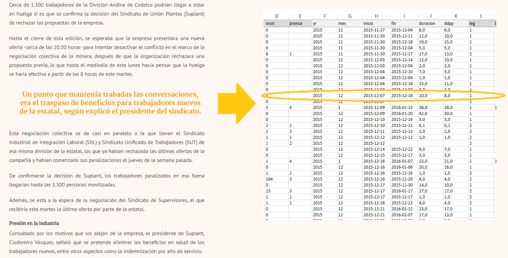

```{r, load_refs, include=FALSE, cache=FALSE}
library(RefManageR)
BibOptions(check.entries = FALSE,
           bib.style = "authoryear",
           cite.style = "authoryear",
           style = "markdown",
           hyperlink = "to.bib",
           dashed = FALSE)
bib <- ReadBib("../../bibliografia/bib.bib", check = FALSE)
```

```{r setup, include=FALSE}
options(htmltools.dir.version = FALSE)
```

```{r xaringan-themer, include=FALSE, warning=FALSE}
library(xaringanthemer)


dark_yellow <- "#EFBE43"
light_yellow <- "#FDF7E9"
gray <- "#333333"
blue <- "#4466B0"

style_duo(
  # colors
  primary_color = light_yellow,
  secondary_color = dark_yellow,
  header_color = gray,
  text_color = gray,
  code_inline_color = colorspace::lighten(gray),
  text_bold_color = colorspace::lighten(gray),
  link_color = blue,
  title_slide_text_color = blue,

  # fonts
  header_font_google = google_font("Martel", "300", "400"),
  text_font_google = google_font("Lato"),
  code_font_google = google_font("Fira Mono")
)
```

```{r echo=FALSE,include=FALSE}
#library(pagedown)
#pagedown::chrome_print("clase3a_tipos.html")

```


class: inverse, center, middle

# Introducción

---

# Introducción

Cuando analizamos datos cuantitativos, representaciones numéricas del mundo social, nos encontraremos con cosas muy diferentes.

--

Revisaremos los distintos tipos de datos cuantitativos que nos encontraremos según distintos criterios (orden, nivel de medida y nivel de agregación)

--

Definiremos también cuestiones básicas como que es una variable, que es una observación, que es un microdato, que implica que un dato esté ordenado y que procesos garantizan que un dato sea de calidad.

--

Según el tipo de datos que tengamos dependerá el tipo de análisis a realizar (o incluso acciones previas como ordenar el dato).


---

# Producción de un orden

Los datos rectangulares (tablas, *data frame*) y de calidad son una producción que demanda **tiempo**, **trabajo** y **dinero**.

--

Sin importar el cómo son producidos:

+ Cuestionario y entrevistas

+ Observación directa o indirecta

+ Análisis de contenido de documentos (episódicos o sistemáticos)

+ Análisis de contenido de producciones visuales y audiovisuales

+ Registros sistemáticos administrativos (cotizaciones, huelgas)

+ *big data*

---

# Producción de un orden

Si los datos son producidos por nosotros para nuestros propios objetivos de investigación (**datos primarios**), seremos conscientes de sus validación y validaciones.

--

¿Que pasa cuando los datos son producidos por otros para otros fines, pero nosotros/as lo usemos para los fines propios (**datos secundarios**)?

--

A este segundo escenario nos enfrentamos la mayor parte de las veces cuando hacemos investigación cuantitativa.

--

Existen cientos de organizaciones gubernamentales, no gubernamentales, internacionales, produciendo y liberando datos ordenados y de calidad.

--

(Además las empresas hoy estás constamente recopilando datos sobre nuestros comportamientos. Esto queda como dato en bruto o también es procesado y utilizado para fines privados)


---

# Producción de un orden

El dato ordenado y de calidad no es fortuito ni está en estado natural. 

--

Los datos responden a una necesidad de información y son producidos en el marco de un diseño.

--

Posteriormente los datos pasan por un proceso de **validación**, **ordenamiento** y **análisis**. 

--

La subjetividad del encuestado debe pasar a una hoja estándar (cuestionario), el cuestionario marcado por el encuestador debe pasar a una tabla, el texto codificado, el registro debe ser depurado, los valores no deben ser contradictorios entre sí ni imposibles, no todo se libera, etcétera. 

---

# Producción de un orden

```{r fig.align='center', out.width = "100%", echo=FALSE}
knitr::include_graphics("imagenes/stimulus.png")
```


---

# Producción de un orden

```{r fig.align='center', out.width = "100%", echo=FALSE}

```

---

# Producción de un orden

```{r fig.align='center', out.width = "80%", echo=FALSE}
knitr::include_graphics("imagenes/modulocovid.png")
```


---

# Producción de un orden

```{r fig.align='center', out.width = "100%", echo=FALSE}
knitr::include_graphics("https://raw.githubusercontent.com/allisonhorst/stats-illustrations/master/rstats-artwork/tidydata_2.jpg")
```


---

# El proceso estadístico

Nada garantiza que el dato que nos llega pasó por estos controles (preguntarse por qué institución lo produjo y con que fines es un buen filtro inicial).

--

La producción del dato cuantitativo está estandarizada por las ONEs.

--

El GSBPM [(*Generic Statistical Business Process Model*)](https://statswiki.unece.org/display/GSBPM/GSBPM+v5.1) es un estándar internacional consolidado y adoptado por numerosas oficinas de estadística y organismos internacionales que propone una estructura de procesos y subprocesos del modelo de producción de estadísticas.

--

Pese a su esquematismo el marco es flexible y adaptado. 

--

No son las fases de un diseño de investigación ni el modelo de la ciencia de datos.

--

Es el marco en el cuál se piensan y ordenan los procesos de producción estadística nacionales. 

--

Como usuarios de los datos producidos por las ONEs es relevante comprender el proceso de producción detrás del dato. 


---

# El proceso estadístico

```{r fig.align='center', out.width = "100%", echo=FALSE}
knitr::include_graphics("imagenes/GSBPM.png")
```

---

# El proceso estadístico

El proceso estadístico llega a tal punto que no solo produce las *data frame* que como investigadores/as ocuparemos. 

Llega a analizar e incluso interpretar y explicar los resultados.

--

Al hacer este proceso las instituciones **transforman** y **visualizan** los datos según sus objetivos, produciendo **tabulados**, **cuadros estadísticos** y **gráficos** que resumen la información. 

--

No hay que confundir los productos estadísticos:

+ Microdato o data

+ Cuadro o tabulado

--

Si bien ambos se pueden leer como "data frames" en R, las filas del microdato corresponden a individuos u otras unidades de observación y/o análisis (hogares, empresas, eventos de protesta).

---

# Algunas definiciones

Microdata: *"Conjunto de registros que contienen información sobre encuestados individuales o entidades económicas. Dichos registros pueden contener respuestas a un cuestionario de encuesta o formularios administrativos."* (SDC Practice guide).

--


Unidades de análisis: *El qué o quién está siendo estudiado. En la investigación en ciencias sociales, las unidades de análisis más típicas son las personas individuales (...) Es importante distinguir entre la unidad de análisis y los agregados sobre los que generalizamos.* `r Citep(bib, "Babbie2014")`.

--

Unidades de observación: Las unidades de análisis en un estudio suelen ser también las unidades de observación. Las unidades de observación corresponden a quien(es) nos entregan la información de las unidades de análisis.

--

Ejemplos: empresa (trabajador); hogar (individuo); pareja (individuo); huelga (medio de prensa); individuo (individuo). 

---

# (Micro) datos ordenados

Combinación de observaciones y variables. 

--

Cada fila es una observación. 

Cada variable es una propiedad de las observaciones. 

Cada celda es un solo valor.

--

El término variable hace referencia a que el valor que asume **varía** entre las distintas observaciones. 

--

Los valores pueden ser milímetros de precipitaciones, o respuestas "sí" o "no" a la pregunta de sí llovió. 

--

Las variables se pueden clasificar por su **nivel de medición**. Cada nivel de medición incorpora distintas propiedades de los números. 

---

# Variables categóricas

La variable será **categórica** si cada observación pertenece a un set de diferentes categorías.

--

Aunque ocupemos números para representar categorías como  un "sí" (1) o un "no" (2), la variable sigue siendo categórica.

--

Para las categóricas será clave saber el número de observaciones en cada categoría.

Existiendo protestas con demandas económicas, políticas y culturales, ¿Cuál fue el porcentaje de protestas económicas en 2019?

--

Las variables categóricas se pueden usar tanto para **ordenar** (ordinales) como para **clasificar** (nominales).


---

# Variables categóricas

En el **nivel nominal** la función de los números es sólo distinguir entre sujetos que posean la propiedad de manera igual o diferente.

La asignación del número de cada categoría es arbitraria (bien podría ser 1, 2 y 3, o 567, 89 y 77)

--

La variable puede indicar la presencia o ausencia de una propiedad (**nominal dicotómica**).

--

En el nivel **ordinal* la asignación de números respeta el orden en que los sujetos poseen la propiedad medida.

+ Nivel educacional (1 = Básica incompleta, 2 = Básica completa, 3 = Media Incompleta, etcétera)

+ Nivel de acuerdo con afirmaciones (e.g. *la democracia es siempre preferible a un régimen de gobierno autoritario*). 

---

# Variables cuantitativas


La variable será **cuantitativa** si la observación toma valores numéricos que representan diferentes magnitudes de una variable. 

--

Este nivel incorpora la noción de distancia entre las magnitudes en que los objetos poseen las diversas propiedades.

--

Características claves de las **variables cuantitativas** serán su **centro** y **variabilidad**, 

¿cuántas personas iban al día en las protestas de 2019?, ¿Cómo varió la participación desde octubre hasta fin de año?

--

Pueden ser **discretas** o **continuas**. 


---

# Variables cuantitativas

La variable es **discreta** si sus valores forman un set de número separados (1, 2, 3, 0, 10).

Si tiene un número finito de valores es discreta (hijos, protestas, terremotos, etc.). 

Un decimal no tiene sentido (no pueden haber 3,5 terremotos en un año)

--

La variable es **continua** si sus valores posibles forman un intervalo (1.2, 3.5, 100.1).

Los valores posibles que puede tomar forman un continuo infinito (peso, ingresos)

--

Tanto las discretas como las continuas pueden ser “de razón” o “de cociente”. Este nivel incorpora la existencia de un valor “0” de carácter absoluto.

No se puede mover libremente la escala. El cero representa la ausencia total de la propiedad medida. 

---

# La arbitrariedad del nivel

Que una propiedad corresponda a uno u otro nivel no sólo depende de las características intrínsecas de dicha propiedad, sino sobre todo de las definiciones y operaciones teóricas y técnicas que hemos realizado para medirlas.

--

El cómo se operacionaliza y se llega a medir la propiedad es clave. 

--

El caso de la edad es claro:

+ ¿cuántos años tiene?

+ ¿En cuál grupo de edad te ubicas? (0 a 20, 21 a 50, 51 o más)

+ ¿Eres jóven o no (rango 15-29)?


---

# Distribución de una variable

Un paso fundamental para entender un conjunto de datos, es conocer la distribución de sus variables.

--

La distribución describe como las observaciones "caen" a lo largo de un rango posible de valores. 

--

En las variables categóricas los valores posibles son las diferentes categorías. Cada observación cae en una categoría.

--

Se puede reportar el número de observaciones:

```{r}
table(guaguas::guaguas$sexo)
```
--

Esto es una **tabla de frecuencias** (absolutas). Es un listado de los posibles valores de una variable junto al número de observaciones de cada una.


---

# Distribución de una variable

También podemos observas una tabla de **frecuencias relativas**. 

--

La proporción de observaciones en cada categoría corresponde al número de observaciones en dicha categoría dividido por el total del número de observaciones.

--

Porcentaje de mujeres en guaguas:

```{r}
523623/(523623+321777)
```

--

Con función:

```{r}
prop.table(table(guaguas::guaguas$sexo))
```

--

El porcentaje es cuando la proporción se multiplica por 100. 


---

# Distribución de una variable

La categoría que concentra la mayor frecuencia se llama la **categoría modal**.

--

En las cuantitativas también es importante visualizar la distribución, pero cuando el número de valores posibles es muy alto y cada valor lo asume un reducido número de observaciones **no es pertinente**. 

--

Por ejemplo:

```{r}
table(guaguas::guaguas$n)[1:100]
```

---

# Distribución de una variable

Para una variable cuantitativa resulta más pertinente observar la **forma** de la distribución, el **centro** y su **variabilidad**.

--

```{r}
summary(guaguas::guaguas$n)
```


--

En sesión de estadística descriptiva revisaremos en detalle estos conceptos y sus respectivos estadísticos. 


---

# Conclusiones

Los datos cuantitativos son variados.

Podemos clasificarlos de diferentes formas, siendo algunas:

+ ordenados / desordenados

+ microdatos (unidades de análisis y/o observación) / agregados

+ solo en caso de datos ordenados: nivel de medida de sus variables.

--

Para reflexionar:

--

Datos pueden estar perfectamente ordenados, pero esconder errores y un alto número de valores perdidos:

+ datos consistentes / datos inconsistentes

+ datos válidos / datos no válidos (no respuesta, no sabe, no aplica)


---

### Bibliografía utilizada

```{r echo=FALSE, results=FALSE}
Citet(bib, "Wickham2021")
Citet(bib, "Agresti2018")
Citet(bib, "Asun2006a")
Citet(bib, "Babbie2014")
```

```{r refs, echo=FALSE, results="asis"}
PrintBibliography(bib)
```

Generic Statistical Business Process Model (GSBPM)

[SDC Practice guide](https://sdcpractice.readthedocs.io/en/latest/glossary_acr.html)

[Tidyr](https://tidyr.tidyverse.org/)

---
class: inverse, center, middle

# Revisión tarea, un poco más de R base e introducción a dplyr

```{r, echo=FALSE}
#devtools::install_github("gadenbuie/countdown")
library(countdown) 
countdown(minutes=10, seconds=30)
```


