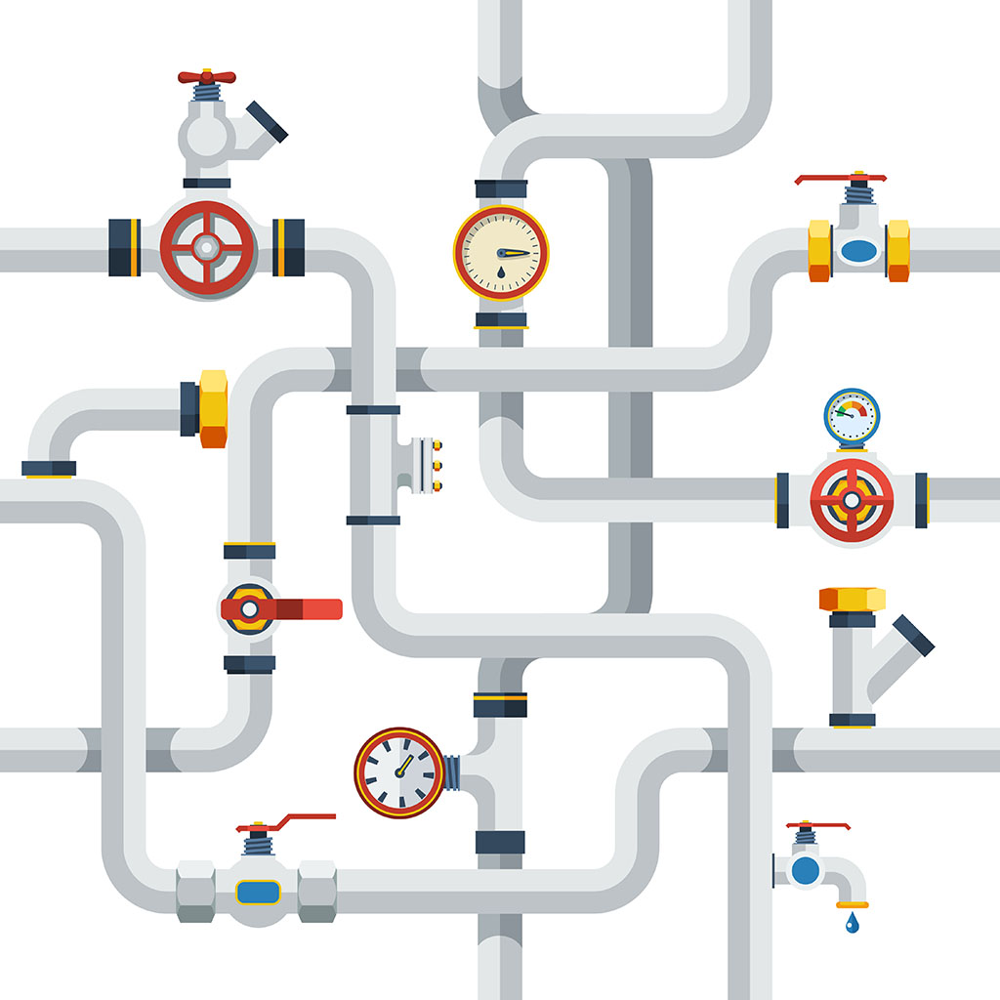

```{r, load_refs, include=FALSE, cache=FALSE}
library(RefManageR)
BibOptions(check.entries = FALSE,
           bib.style = "authoryear",
           cite.style = "authoryear",
           style = "markdown",
           hyperlink = "to.bib",
           dashed = FALSE)
bib <- ReadBib("../../bibliografia/bib.bib", check = FALSE)
```

```{r setup, include=FALSE}
options(htmltools.dir.version = FALSE)
```

```{r xaringan-themer, include=FALSE, warning=FALSE}
library(xaringanthemer)


dark_yellow <- "#EFBE43"
light_yellow <- "#FDF7E9"
gray <- "#333333"
blue <- "#4466B0"

style_duo(
  # colors
  primary_color = light_yellow,
  secondary_color = dark_yellow,
  header_color = gray,
  text_color = gray,
  code_inline_color = colorspace::lighten(gray),
  text_bold_color = colorspace::lighten(gray),
  link_color = blue,
  title_slide_text_color = blue,

  # fonts
  header_font_google = google_font("Martel", "300", "400"),
  text_font_google = google_font("Lato"),
  code_font_google = google_font("Fira Mono")
)
```

```{r echo=FALSE,include=FALSE}
#library(pagedown)
#pagedown::chrome_print("clase3b_dplyr.html")

```


class: inverse, center, middle

# Nuestro mundo en datos (provación)


---

# Our World in data

`OurWorldInData` es una publicación en-línea que presenta datos y resultados empíricos que muestran el cambio en las condiciones de vida en todo mundo. 

--

Un estudiante de magíster en políticas públicas está desarrollando un [paquete en R](https://github.com/piersyork/owidR) para descargar y visualizar directamente estos datos. 

--

Como está en desarrollo aún no se encuentra en la CRAN. Si se quiere ocupar tiene que descargarse así:

```{r eval=FALSE}

install.packages("devtools")

devtools::install_github("piersyork/owidR")

library(owidR)

```

--

Más adelante entenderemos bien. Por ahora veamos lo que nos permite hacer en [R Cloud](https://rstudio.cloud/project/2770951).

---

```{r fig.align='center', out.width = "80%", echo=FALSE}

```


---
class: inverse, center, middle

# Un poco más de R base

---

# Insertar lenguaje R en .rmd

Hemos visto tres formas de interactuar con R:

--

+ Consola.


+ Script `.R`.


+ Script `.rmd` o `Rmarkdown`.

--

En la tarea práctica 1 ocupamos Rmarkdown, pero nos limitamos a escribir en texto plano.

--

Su verdadera potencia se expresa cuando combinamos texto con código. 

--

Para agregar un `chunk` o trozo de código de lenguaje R en RMarkdown: 

```{r fig.align='center', out.width = "80%", echo=FALSE}
knitr::include_graphics("imagenes/insert_chunk.png")
```

---

# Insertar lenguaje R en .rmd

Aparecerá lo siguiente:

```{r fig.align='center', out.width = "80%", echo=FALSE}
knitr::include_graphics("imagenes/chunk.png")
```

--

En el espacio interno podemos escribir código R:

```{r fig.align='center', out.width = "80%", echo=FALSE}
knitr::include_graphics("imagenes/Captura.png")
```

---

# Algunos ejemplos


---

# Operadores lógicos

.medium.par[Los **operadores lógicos** son .medium-par-red[muy] importantes para la programación.]

--

**R** cuenta con operadores de comparación binaria.

```{r, echo=TRUE, eval=FALSE}
x < y    # menor que
x > y    # mayor que
x <= y   # menor o igual que
x >= y   # mayor o igual que
x == y   # igual a 
x != y   # distinto a
```

--

👀: Nota que `==` permite comparar si dos valores son iguales. Ten cuidado de **NO** usar `=` que es interpretado como un operador de asignación (es como usar **<-**).

---

# Operadores lógicos

--

Algunos ejemplos con números:

```{r, echo=TRUE, eval=FALSE}
x <- c(1,2,5)
y <- c(4,4,3)
x == y
#> [1] FALSE FALSE FALSE
x != y
#> [1] TRUE TRUE TRUE
x < y
#> [1]  TRUE  TRUE FALSE
```

--

Otros operadores muy importantes son `|` (o) e `&` (y)

--

```{r echo=FALSE}
guaguas <- guaguas::guaguas
```

```{r}
guaguas[guaguas$nombre=="Salvador" &  
          (guaguas$anio==1972| guaguas$anio==1979),]
```


---

class: inverse, center, middle

# Introducción a paquete dplyr


---

# El paquete dplyr

.pull-left[

Instalar y cargar como cualquier otro paquete:

`install.packages("dplyr")`

`library(dplyr)`

```{r echo=FALSE, message=FALSE, warning=FALSE}
#install.packages("dplyr")
library(dplyr)
```

]


.pull-left[
```{r out.width = "70%", echo=FALSE}
knitr::include_graphics("https://github.com/rstudio/hex-stickers/raw/master/thumbs/dplyr.png")
```
]

---

# El paquete dplyr

Nos proporciona una "gramática" particular para manipular y aplicar funciones sobre bases de datos.

--

El paquete fue desarrollado por [Hadley Wickham](http://hadley.nz/) de RStudio. Todo lo que haremos con sus funciones se puede hacer con r base. 

```{r fig.align='center', out.width = "50%", echo=FALSE}
knitr::include_graphics("imagenes/hadley-wickham.jpg")
```

--

Ocuparemos muchos de sus paquetes (ggplot, tidyr, haven, readxl, httr, lubridate, etc.).


---

# Manipulación básica

Revisaremos 5 verbos básicos de `dplyr`:

+ `select()`

+ `filter()`

+ `arrange()`

+ `rename()`

+ `mutate()`

--

Lo que nos permiten hacer se puede hacer en R base, pero nos simplificarán la vida. 


---

# select()

Nos permite seleccionar de forma intuitiva las columnas que indiquemos.

--

```{r eval=FALSE}
select(data, columna)
```


--

Selecciona 1 columnas de la base `guaguas`:

--

```{r}
select(guaguas,nombre)
```

---

# select()

Podemos seleccionar más de una columna agregandolas como argumento

--

```{r}
select(guaguas,nombre,n)
```

---

# select()

E incluso reordenar las columnas, ocupando sus nombres o sus posiciones

--

```{r}
select(guaguas,5:1)
```

--

```{r eval=FALSE}
guaguas[,c(5:1)] # Lo mismo con R base
```


---

# filter() 

Nos permite seleccionar las filas que satisfacen nuestras condiciones. 

--

Para eso utilizamos los operadores lógicos ya revisados (> , < , >=, <=, ==, !=, &, |)

--


```{r eval=FALSE}
filter(data, condicion)
```

--

```{r}
filter(guaguas, anio==1960 & nombre=="Fidel")
```

--

En R base es bastante más tedioso:

--

```{r eval=FALSE}
guaguas[guaguas$anio==1960 & guaguas$nombre=="Fidel",]
```


---

# filter() 

```{r fig.align='center', out.width = "100%", echo=FALSE}
knitr::include_graphics("https://raw.githubusercontent.com/allisonhorst/stats-illustrations/master/rstats-artwork/dplyr_filter.jpg")
```

---

# arrange()

Ordena las filas de una base de datos. 

--

Dentro de la función hay que indicar por cuál variable, y sí el orden será ascendente o descendente.

--

쮺uáles fueron los **tres** nombres más populares en el año 2000?

```{r}
guaguas %>% 
  filter(anio==2000) %>% 
  arrange(desc(n)) %>%            ### Esta es la función importante. Ojo con "desc" = descendente. #<<
  head(3)
```

---

# rename()

Permite cambiar el nombre de las variables en la data. 


---

# mutate() 

"Muta" nuestra base de datos, agregando una nueva columna. 

--

Por ahora solo la utilizaremos para cosas simples, como replicar una variable

--

```{r}
guaguas %>% mutate(nueva=n) %>% head(2)  #<<
```

--

O multiplicar por 100:

--

```{r}
guaguas %>% mutate(proporcion*100) %>% head(2) #<<
```

---

# mutate()

Podemos también darle valores a nuestro gusto a la nueva variable:

```{r}
guaguas %>% arrange(-n) %>% filter(anio==2018) %>% head(10) %>%   #<<
  mutate(ciudad=c(rep("no ciudad",7),"ciudad",rep("no ciudad",2)))  #<<
```


---

```{r fig.align='center', out.width = "80%", echo=FALSE}
knitr::include_graphics("imagenes/dplyr_mutate.png")
```


---


# Operador pipe

Solo si queda tiempo en la clase.

--

Es un operador de `magrittr` que se combina con los verbos de dplyr.

--

Se escribe `%>%` (*pipe* o tubo).

--

El operador `%>%` nos permite concatenar funciones, haciendo más sencilla la lectura del código. Se lee de izquierda a derecha. 

---


```{r fig.align='center', out.width = "100%", echo=FALSE}

```

---

# Operador pipe 

쮺omo saber los nombres de las variables de la base de datos `guaguas`?

--

```{r}
names(guaguas)   ## la manera "tradicional" o R base  
```

--

Con pipes sería así:

--

```{r}
guaguas %>% names()  ## el objeto primero, luego la función
```


---

# Operador pipe 

쮺uál es la importancia relativa del nombre María en 1920, 1950, 1980 y 2020?

--

```{r}
filter(guaguas, (anio==1920|anio==1950|anio==1980|anio==2020) & nombre=="María")
```

--

Con pipes sería así:

--

```{r eval=FALSE}
guaguas %>% 
  filter( (anio==1920|anio==1950|anio==1980|anio==2020) & nombre=="María")
```


---

# Pipes

쯏 cuál es la gracia de la tubería?

--

Con pipes podemos concatenar funciones.

--

쮺uáles son los años en los que el nombre María es más importante?, 쯈ue porcentajes representa el nombre María?

--

Sin pipes tendríamos que hacer algo más o menos así (con el riesgo de confundir paréntesis)


```{r eval=FALSE}
select(mutate(head(arrange(filter(guaguas,nombre=="María"),-proporcion),4),
              porcentaje=round(proporcion*100,1)),anio,nombre,porcentaje)
```

--

Se dificulta bastante la lectura (desde el centro hacia afuera)

---

# Pipes

Con pipes es como leer, de izquierda a derecha:

(y de abajo hacia arriba opcional)

--

```{r}
guaguas %>% 
  filter(nombre=="María") %>% 
  arrange(-proporcion) %>% 
  head(4) %>% 
  mutate(porcentaje=round(proporcion*100,1)) %>% 
  select(anio,nombre,porcentaje)
```


---

# Tarea práctica N°2 🏠 

Ocupa las herramientas de `dplyr` vistas en clase sobre la base `guaguas` para responder a las preguntas

--

+ Señalar cuantas personas con tu nombre nacieron el mismo año que tú.

--


+ Señalar cual fue el nombre más usado el año que tú naciste.

--

+ Guardar en un objeto nuevo los 10 nombres de mujer más usados el año que tú naciste.

--

+ Crea una nueva variable en el nuevo objeto que se llame "biblico". 

--

+ Determinar cuál de los siguientes tres nombres tiene mayores inscripciones a lo largo del tiempo (1920-2019): 쯄aría, Juan o José?

--

+ Crea dos nuevas bases de datos llamadas Salvador y Augusto. Cada una solo debe tener casos entre 1960 y 1990. Identifica en que año estuvo más de moda cada nombre.

---

### Recursos web utilizados

[Xaringan: Presentation Ninja, de Yihui Xie](https://github.com/yihui/xaringan). Para generar esta presentación.

[Ilustraciones de Allison Horst](https://github.com/allisonhorst/stats-illustrations)

### Para reforzar y seguir aprendiendo

[Administración de datos en R. 쯈ué es dplyr?](https://programminghistorian.org/es/lecciones/administracion-de-datos-en-r#qu%C3%A9-es-dplyr). 

Capítulo 5 libro ["Ciencia de Datos"](https://es.r4ds.hadley.nz/transform.html) de Hadley Wickham

[Operadores lógicos en R](https://bookdown.org/jboscomendoza/r-principiantes4/operadores-logicos.html)

[Otra explicación de las pipes](https://rsanchezs.gitbooks.io/rprogramming/content/chapter9/pipeline.html). 

### Bibliografía utilizada

```{r echo=FALSE, results=FALSE}
Citet(bib, "Wickham2021")
```

```{r refs, echo=FALSE, results="asis"}
PrintBibliography(bib)
```


