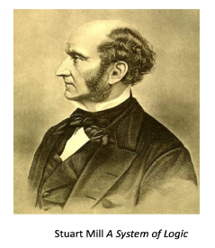
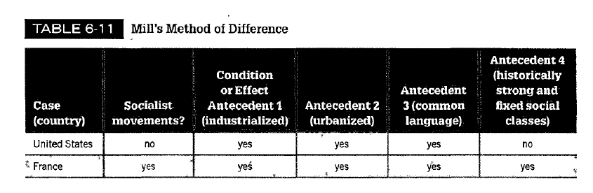
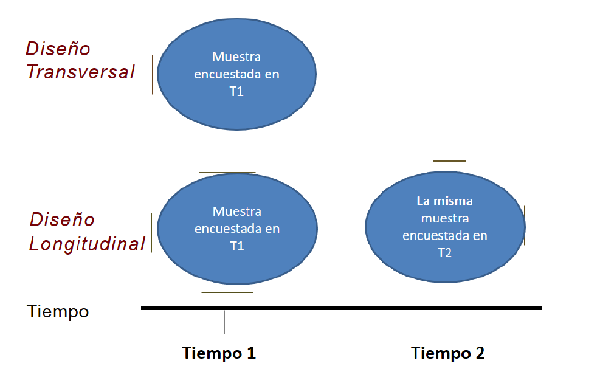
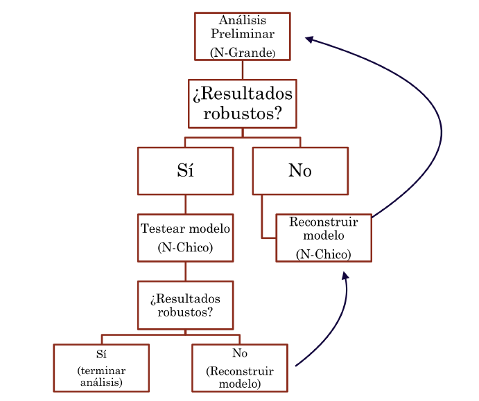

```{r, load_refs, include=FALSE, cache=FALSE}
library(RefManageR)
BibOptions(check.entries = FALSE,
           bib.style = "authoryear",
           cite.style = "authoryear",
           style = "markdown",
           hyperlink = "to.bib",
           dashed = FALSE)
bib <- ReadBib("../../bibliografia/bib.bib", check = FALSE)
```

```{r setup, include=FALSE}
options(htmltools.dir.version = FALSE)
```

```{r xaringan-themer, include=FALSE, warning=FALSE}
library(xaringanthemer)


dark_yellow <- "#EFBE43"
light_yellow <- "#FDF7E9"
gray <- "#333333"
blue <- "#4466B0"

style_duo(
  # colors
  primary_color = light_yellow,
  secondary_color = dark_yellow,
  header_color = gray,
  text_color = gray,
  code_inline_color = colorspace::lighten(gray),
  text_bold_color = colorspace::lighten(gray),
  link_color = blue,
  title_slide_text_color = blue,

  # fonts
  header_font_google = google_font("Martel", "300", "400"),
  text_font_google = google_font("Lato"),
  code_font_google = google_font("Fira Mono")
)
```

```{r echo=FALSE,include=FALSE}
#library(pagedown)
#pagedown::chrome_print("clase4a_diseno.html")

```


class: inverse, center, middle

# Diseños de investigación

---

# El proceso de investigación

```{r fig.align='center', out.width = "80%", echo=FALSE}
knitr::include_graphics("imagenes/diseno.png")
```


---

# El diseño

Plan estructurado de acción y ordenamiento de la situación de investigación, que está orientado a responder empíricamente (evidencia observable) una pregunta de investigación.

+ ¿Qué aspecto de la teoría va a ser testeado?

+ ¿Qué observaciones se harán para responder a la pregunta de investigación?

+ ¿Cómo se levantarán o producirán los datos (observaciones)?

+ ¿Cómo se analizará la información recolectada?

--

Todo buen diseño de investigación busca el mismo objetivo: Sacar conclusiones
fundamentadas y relevantes a partir de un correcto tratamiento de la evidencia
empírica.


---

class: center, middle

# I. Diseños observacionales explicativos

---

# Diseños observacionales explicativos

## ¿Por qué observacionales?

+ Hablamos de un estudio observacional para describir diseños en los que el investigador no manipula variables experimentales ni asigna aleatoriamente a sujetos a tratamientos, sino que simplemente observa secuencias causales y covariaciones.

--

+ La mayoría de lo que nos interesa estudiar en sociología no puede ser manipulado experimentalmente.

---

# Tipos de estudios observacionales

--

Estudios observacionales

--

  + Cualitativos:
  
    + Estudio de caso
    
    + Estudio comparado
    
--
    
  + Cuantitativos:
  
    + Transversales
    
    + Longitudinales
    
--

  + Mixtos
  
---

# Estudio de caso

+ Se selecciona un caso en el que los valores apropiados de las variables independientes y dependientes están presentes.

+ El estudio de caso busca establecer si existe un vínculo real entre las variables, es decir, estudia los mecanismos causales.

+ *"Los estudios de caso no se refieren a cuánto importan las variables, sino de qué manera o cómo importan."* (George y col., 2005).

+ Reduce la correlación espuria al exigir que el investigador identíque un "camino causal ininterrumpido" entre las causas hipotéticas y los resultados observados.

---

# Estudio de caso

```{r fig.align="center", echo=FALSE, out.width="100%"}
knitr::include_graphics("Imagenes/mec_causal.PNG")
```

---

# Estudios comparados (N-Chico)

+ Este tipo de investigación involucra más de un caso; se denominan a menudo estudios de casos comparativos.

+ Múltiples casos no deben considerarse como una "muestra"

+ Más bien, los casos se eligen por la presencia o ausencia de factores que una teoría política ha indicado que son importantes.

+ Comparar casos nos permite simular un control y una intervención. Método de diferencias introducido por Stuart Mill.

---

# ¿Cómo comparar para explicar?

```{r fig.align="left", echo=FALSE, out.width="25%"}

```

--

+ La estrategia de selección que apunta a identicar casos paradigmáticos del fenómeno de interés fue denominada como método de similitud y de diferencia por John Stuart Mill a mediados del siglo XIX.

--

+ En contraste, Adam Przeworski y Henry Teune Teune (1970) caracterizaron a esta estrategia como el disño basado en los casos más diferentes y casos más similares.

---

# Ejemplo: Seymor and Marks (2000)

+ ¿Por qué no apareció un movimiento socialista en EEUU pero sí en Francia? (Lipset y Marks, 2000)

--

```{r fig.align="left", echo=FALSE, out.width="100%"}

```


---

# Diseños transversales (cross-sectional)

--

+ Los datos se toman aproximadamente al mismo tiempo y el investigador no controla ni manipula la variable independiente

--

+ Si las unidades de análisis son individuos, se suelen emplear encuestas; si los sujetos son entidades geográficas, como estados o naciones u otras agrupaciones de unidades, se emplea análisis agregado.

--

+ Observación de fenómenos en entornos más naturales y realistas con alta capacidad de generalización.

---

# Ejemplo estudio transversal

```{r fig.align="center", echo=FALSE, out.width="80%"}
knitr::include_graphics("Imagenes/est_transversal.PNG")
```

---

# Ejemplo estudio transversal

```{r fig.align="center", echo=FALSE, out.width="100%"}
knitr::include_graphics("Imagenes/est_transversal2.PNG")
```

---

# Estudios transversales explicativos

+ Variable instrumental

--

+ Matching

--

+ Ecuaciones estructurales

--

+ ¿Regresión?

--

  + Efectos fijos y aleatorios

  + Errores estándares clusterizados

  + Modelos de máxima verosimilitud

---

# Diseños longitudinales

+ Se caracterizan por la disponibilidad de medidas de variables en diferentes momentos.

--

+ En principio pueden estimar tres tipos de efectos: edad, periodo (historia) y cohorte.

--

+ Los dos tipos principales son los estudio de panel y los análisis de tendencias.

---

# Estudio Panel

```{r fig.align="center", echo=FALSE, out.width="100%"}

```

---

# Estudios longitudinales explicativos

--

+ Efectos potenciales con datos long-wide

+ Regresión con variable lagueada

+ Diff in diff

+ Ecuaciones estructurales

+ Argumentos causales con estadística descriptiva

+ Regresiones discontinuas

---

# Métodos Mixtos

--

+ ¿En qué consisten? ¿Cuáles son sus fortalezas y debilidades?

--

+ El año 2005 Liebreman propuso sistematizar el uso de los métodos mixtos en lo que él llamó: "Nested Analysis" (Lieberman, 2005).

--

+ La estrategia de combinar ambos acercamientos busca:

--

  + Mejorar la calidad de la conceptualización y de las medidas (Validez interna)

  + Analizar explicaciones rivales o alternativas y generalizar (Validez externa).
  
  + Una mayor confianza en los hallazgos principales del estudio (Triangulación).


---

# Métodos Mixtos

--

En términos específicos:

+ El análisis de N-grande ayuda a:

    + A Dar luces sobre explicaciones alternativas y descartarlas o explorarlas.

    + B Motiva a una buena estrategia de seleccion de casos de N-chico.

--

+ El análisis de N-chico ayuda a:

    + A Mejorar y afirmar los instrumentos de medición.

    + B Ayuda a mejorar las especificaciones del modelo.


---

# Métodos Mixtos: Lieberman (2005)

```{r fig.align="center", echo=FALSE, out.width="75%"}

```

---

# Síntesis, ¿cuál es el mejor diseño?

--

+ Todas las formas tienen sus ventajas y desventajas.

+ El mejor diseño va a depender de nuestra pregunta de investigación.

+ Por lo tanto, el mejor diseño va a ser el que ayude mejor a responder una pregunta de investigación y a un conjunto de hipótesis.

+ La recomendación es que no conviene especializarse en un puro tipo de diseño.

+ Debemos estar abertos a estar siempre cambiando en función de nuestros objetivos de investigación.


---

class: center, middle

## Una recomendación importante

--

*"El mensaje más importante a tener en cuenta cuando se avanza a través del ciclo completo es que no existe una estrategia o grupo de estrategias que sean ideales para todos los temas de investigación. Todo depende del punto de partida, de la sustancia inicial que el investigador haya decidido investigar."* (Schmitter, 2013)

---

# Referencias bibliográficas

+ George, Alexander L y col. (2005). Case studies and theory development in the social sciences. mit Press.

+ Gerring, John (2012). "Mere description". En: British Journal of Political Science, págs. 721-746. King, Gary, Robert O Keohane y Sidney Verba (1994). Designing social inquiry: Scientic inference in qualitative research. Princeton university press.

+ Lieberman, Evan S (2005). "Nested analysis as a mixed-method strategy for comparative research". En: American political science review 99.3, págs. 435-452.

+ Lipset, Seymour Martin y Gary Marks (2000). It didn't happen here: why socialism failed in the United States. WW Norton & Company.

+ Schmitter, Philippe C (2013). "El diseño de la investigación social y política". En: Enfoques y metodologías de las Ciencias sociales: una perspectiva pluralista. Akal, págs. 281-312.

+ Teune, Henry y Adam Przeworski (1970). The logic of comparative social inquiry. New York: Wiley-Interscience.

```{r refs, echo=FALSE, results="asis"}

PrintBibliography(bib)

```
