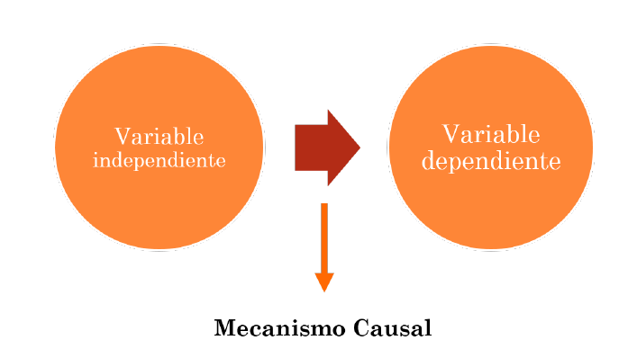

```{r, load_refs, include=FALSE, cache=FALSE}
library(RefManageR)
BibOptions(check.entries = FALSE,
           bib.style = "authoryear",
           cite.style = "authoryear",
           style = "markdown",
           hyperlink = "to.bib",
           dashed = FALSE)
bib <- ReadBib("bib.bib", check = FALSE)
```

```{r setup, include=FALSE}
options(htmltools.dir.version = FALSE)
```

```{r xaringan-themer, include=FALSE, warning=FALSE}
library(xaringanthemer)


dark_yellow <- "#EFBE43"
light_yellow <- "#FDF7E9"
gray <- "#333333"
blue <- "#4466B0"

style_duo(
  # colors
  primary_color = light_yellow,
  secondary_color = dark_yellow,
  header_color = gray,
  text_color = gray,
  code_inline_color = colorspace::lighten(gray),
  text_bold_color = colorspace::lighten(gray),
  link_color = blue,
  title_slide_text_color = blue,

  # fonts
  header_font_google = google_font("Martel", "300", "400"),
  text_font_google = google_font("Lato"),
  code_font_google = google_font("Fira Mono")
)
```

```{r echo=FALSE,include=FALSE}
#library(pagedown)
#pagedown::chrome_print("clase4a_diseno.html")

```


class: inverse, center, middle

# Diseños de investigación

---

# El proceso de investigación

```{r fig.align='center', out.width = "100%", echo=FALSE}
knitr::include_graphics("imagenes/diseno.png")
```


---

# El diseño

Plan estructurado de acción y ordenamiento de la situación de investigación, que está orientado a responder empíricamente (evidencia observable) una pregunta de investigación.

+ ¿Qué aspecto de la teoría va a ser testeado?

+ ¿Qué observaciones se harán para responder a la pregunta de investigación?

+ ¿Cómo se levantarán o producirán los datos (observaciones)?

+ ¿Cómo se analizará la información recolectada?

--

Todo buen diseño de investigación busca el mismo objetivo: Sacar conclusiones
fundamentadas y relevantes a partir de un correcto tratamiento de la evidencia
empírica.

---

# La investigación social

En la investigación social el objetivo es la inferencia.

+ La inferencia, **en sentido amplio**, es un proceso en el que se utilizan hechos que conocemos para aprender sobre los que desconocemos.

--

Las inferencias pueden ser descriptivas o causales

--

**Inferencias descriptivas:**

Proponer conceptos nuevos, asociaciones o agrupaciones entre ellos. 

Lógica de descubrimiento.

--

**Inferencias causales:**

Conocer efectos causales o encontrar causas necesarias y/o suficientes a partir de los fatos observados. 

Lógica de demostración.

---

# Clasificación de los diseños

¿Qué factores determinan la elección de un diseño?

--

Según los objetivos de la investigación los diseños pueden ser:

+ Descriptivos

+ Causales

--

Según el grado de intervención y control del investigador:

+ Experimentales

+ Observacionales

--

```{r fig.align='center', out.width = "100%", echo=FALSE}
knitr::include_graphics("imagenes/experimentos_observacional.png")
```


---

class: inverse, center, middle

*"No existe una estrategia o grupo de estrategias que sean ideales para todos los temas de investigación. Todo depende del punto de partida, de la sustancia inicial que el investigador haya decidido investigar."* (Schmitter, 2013)

---

# Validez del diseño

Además, cada diseño tendrá sus fortalezas. 

--

#### Validez Interna

+ Capacidad de explicar la variable de interés (dependiente) al poder controlar por explicaciones alternativas.

+ Determina entonces si la relación de la hipótesis es espuria o no.

--

#### Validez Externa

+ Capacidad de generalizar los resultados más allá de las condiciones particulares o específicas en las que se realizó el estudio.

--

Mientras que un experimento tiene mayor validez interna y menor validez externa; lo opuesto se aplica diseños observacionales de N grande. 

---

class: inverse, center, middle

# I. Estudios observacionales descriptivos

---

# Estudios Descriptivos

--

El centro de este curso. 

--

De acuerdo con Gerring (2012), la **descripción** y la **causalidad** son en última instancias argumentos.

--

Los argumentos descriptivos se refieren a lo **que es / fue** (por ejemplo, cuándo, quién, de qué, de qué manera).

--

*Por ejemplo: “En el transcurso de los dos últimos siglos ha habido tres grandes olas de democratización”.*

--

Por el contrario, los argumentos causales intentan responder preguntas de por qué.

--

Para responder con certeza se requiere controlar por **explicaciones rivales** y tener un **contrafactual**.

--

*Por ejemplo: “La tercera ola de democratización fue causada, en parte, por el final del Guerra Fría.”*

---

# Estudios descriptivos

```{r fig.align='center', out.width = "100%", echo=FALSE}
knitr::include_graphics("imagenes/description.png")
```

---

class: inverse, center, middle

# II. El problema de la causalidad y los diseños experimentales

---

# 1. Relaciones espurias

Que dos o más variables cavaríen no implica que ambas estén afectadas por el mismo fenómeno o, que una explique a la otra.

--

¿El gasto de EEUU en ciencia afecta impacta en la tasa de suicidios?

--

```{r fig.align='center', out.width = "80%", echo=FALSE, fig.link="https://www.tylervigen.com/spurious-correlations"}
knitr::include_graphics("imagenes/suicides_eeuu.png")
```

---

# Otra más absurda

```{r fig.align='center', out.width = "100%", echo=FALSE, fig.link="https://www.tylervigen.com/spurious-correlations"}
knitr::include_graphics("imagenes/cage.png")
```

---

# 1. Relaciones espurias

En estos casos la relación entre las variables es pura casualidad. 

--

En otros casos una puede estar afectando a la otra efectivamente.

--

Y en otros casos una tercera **variable oculta** u **omitida** puede estar generando la variación observada. 


--

[¿Las cigueñas traen a los niños/as?](https://priceonomics.com/do-storks-deliver-babies/), ¿Hay una relación entre las variables?

--

Hay estudios que indican que existe relación, pero no de causalidad entre una u otra. 

--

Hay una variable "omitida" que explica la asociación (el tiempo):

Las cigüeñas son aves migratorias que regresan a Alemania en primavera, aproximadamente 9 meses después de la mitad del verano (cuando "se hacen los bebés").


---

# 2. Contrafácticos

Cómete la comida para que crezcas sano.

+ Si no te comes la comida, no vas a crecer sano.

--

Gracias al antibiótico, Juan ya no tiene amigdalitis.

+ Si no hubiera tomado el antibiótico, tendría amigdalitis.

--

EEUU invadió Irak porque Bush era el presidente.

+ Si Al Gore hubiera ganado las elecciones, EEUU no hubiera invadido Irak.

--

La ayuda internacional genera crecimiento en los países que la reciben.

+ Sin la ayuda internacional, el país receptor hubiera crecido menos.

---

# 2. Contrafácticos

Efectos causales son afirmaciones relacionadas a una acción (tratamiento / manipulación) que se ejerció sobre una unidad.

--

Contrafactual: lo que hubiera pasado sí sobre la unidad no se ejercía el tratamiento.

--

El problema fundamental de la inferencia causal es que **no podemos observar simultáneamente** el valor de la unidad con y sin el tratamiento. Por lo tanto, no podemos observar el efecto causal en la unidad.

--

Posible solución es seleccionar aleatoriamente dos grupos de unidades idénticas y aplicarles el tratamiento a una y a la otra no. 

--

Los efectos generados solo podrían deberse por el tratamiento, ya que por el azar en todos los demás aspectos los grupos son iguales. 


---

# La solución: experimentos

Asignación aleatoria del tratamiento (variable independiente).

--

Un experimento clásico:

1 Manipulación del Tratamiento (Variable Independiente)

2 Variable Dependiente

3 Pretest

4 Posttest

5 Grupo experimental

6 Grupo de control

7 Asignación aleatoria

--

Permite tener el mayor control posible sobre la variable independiente, las unidades de análisis y el entorno donde ocurre el fenómeno.

---

# Problema experimental

--

+ Alto costo

--

+ La mayoría de lo que nos interesa estudiar en sociología no puede ser manipulado experimentalmente.


--

#### Posible solución: experimentos naturales

1 Grupo de Tratamiento y de Control
2 Asignación aleatoria del tratamiento o "como si fuera" aleatoria
3 El investigador no controla la asignación

No hay manipulación del tratamiento. 

--

#### Posible solución II: medir y controlar variables observacionalmente


---

class: inverse, center, middle

# II. Observacionales explicativos

---

# Diseños observacionales explicativos

## ¿Por qué observacionales?

+ Investigador no manipula variables experimentales ni asigna aleatoriamente a sujetos a tratamientos, sino que simplemente observa secuencias causales y covariaciones.

--

## Tipos de observacionales

--

+ Cualitativos:
  
    + Estudio de caso (N=1)
    
    + Estudio comparado (N>1 & N<20)
    
--
    
+ Cuantitativos:
  
    + Transversales
    
    + Longitudinales
    
--

+ Mixtos
  
---

# Estudio de caso

+ Se selecciona un caso en el que los valores apropiados de las variables independientes y dependientes están presentes.

--

+ El estudio de caso busca establecer si existe un vínculo real entre las variables, es decir, estudia los mecanismos causales.

--

+ No se refieren a cuánto importan las variables, sino de qué manera o cómo importan.

--

+ Hace frente a la correlación espuria al exigir que se identifique un *"camino causal ininterrumpido"* entre las causas hipotéticas y los resultados observados.

---

# Estudio de caso

```{r fig.align="center", echo=FALSE, out.width="100%"}

```

---

# Estudios comparados 

+ Este tipo de investigación involucra más de un caso; se denominan a menudo estudios de casos comparativos.

--

+ Múltiples casos no deben considerarse como una "muestra"

--

+ Más bien, los casos se eligen por la presencia o ausencia de factores que la teoría política ha indicado que son importantes.

--

+ Se pueden buscar casos paradigmáticos del fenómeno de interés o casos raros que se salen de las trayectorias presupuestadas.

--

+ ¿Por qué no apareció un movimiento socialista en EEUU pero sí en Francia? (Lipset y Marks, 2000)

--

Coller, X. (2000) [Estudio de casos. Cuadernos Metodológicos. Centro de Investigaciones Sociológicas.](https://books.google.cl/books/about/Estudio_de_casos.html?id=VwwXjmCNcLUC&redir_esc=y)


---

# Diseños transversales

Volvamos al mundo cuantitativo.

--

+ Los datos se toman aproximadamente al mismo tiempo y el investigador no controla ni manipula la variable independiente

--

+ Si las unidades de análisis son individuos, se suelen emplear encuestas.

--

+ Observación de fenómenos en entornos más naturales y realistas con alta capacidad de generalización.

--

+ Nunca hay completo naturalismo. Se fuerzan situaciones para la producción del dato. 

---

# Diseños transversales

```{r fig.align="center", echo=FALSE, out.width="80%"}

```

---

# Diseños transversales

```{r fig.align="center", echo=FALSE, out.width="100%"}
knitr::include_graphics("Imagenes/est_transversal2.PNG")
```

---

# Estudios transversales explicativos

+ La típica forma de analizar los datos es con regresión líneal simple o múltiple.

--

+ Pero hay muchas otras formas como ecuaciones estructurales, modelos multinivel, análisis factorial, etcétera.

--

+ La realidad social cambia y una foto de un momento particular puede no ser suficiente.

--

+ ¿Como determinar que una variable es la causa de la otra? 

--

Una posible solución es recurrir al tiempo.


---

# Dimensión temporal en diseño

```{r fig.align='center', out.width = "100%", echo=FALSE, fig.link="https://www.tylervigen.com/spurious-correlations"}
knitr::include_graphics("imagenes/cross_longitudinal.png")
```

---

# Diseños longitudinales

+ Se caracterizan por la disponibilidad de medidas de variables en diferentes momentos.

--

+ En principio pueden estimar tres tipos de efectos.

--

+ Los dos tipos principales son los estudio de **panel**, **cohorte** y de **tendencias**.

---

# De tendencia

Una característica dada de alguna población se supervisa a lo largo del tiempo.

--

+ Preferencias electorales de las y los chilenos

--

+ Evolución de la tasa de desocupación y del producto interno bruto en países

--

+ Inscripciones de nombres en el registro electoral


---

# Cohorte

Subpoblación o cohorte se estudia a lo largo del tiempo (generación de los 2000, del 2010, etc.). 

Los datos se pueden recopilar de diferentes miembros en cada conjunto de observaciones


---

# Estudio Panel

Datos se recopilan del mismo conjunto de personas (la muestra o el panel) en varios momentos del tiempo.

--

Mortalidad del panel y abandono (*atrición*) -> refreso de muestra o paneles rotativos

Desafío de transformación de datos (long-wide)

Desafío de análisis (Efectos fijos y aleatorios, Diff in diff, etc.)


---

# Síntesis, ¿cuál es el mejor diseño?

--

+ Todas las formas tienen sus ventajas y desventajas.

+ El mejor diseño va a depender de nuestra pregunta de investigación.

+ Por lo tanto, el mejor diseño va a ser el que ayude mejor a responder una pregunta de investigación y a un conjunto de hipótesis.

+ La recomendación es que no conviene especializarse en un puro tipo de diseño.

+ Debemos estar abiertos a estar siempre cambiando en función de nuestros objetivos de investigación.


---

# Referencias bibliográficas

```{r echo=FALSE, results=FALSE}
Citet(bib, "Gerring2012")
Citet(bib, "Corbetta2007")
Citet(bib, "Elster2010")
Citet(bib, "Schmitter2013")
```

```{r refs, echo=FALSE, results="asis"}

PrintBibliography(bib)

```

---

class: inverse, center, middle

# Revisión tarea, R project e importar data (.rds)

```{r, echo=FALSE}
#devtools::install_github("gadenbuie/countdown")
library(countdown) 
countdown(minutes=10, seconds=30)
```

---
