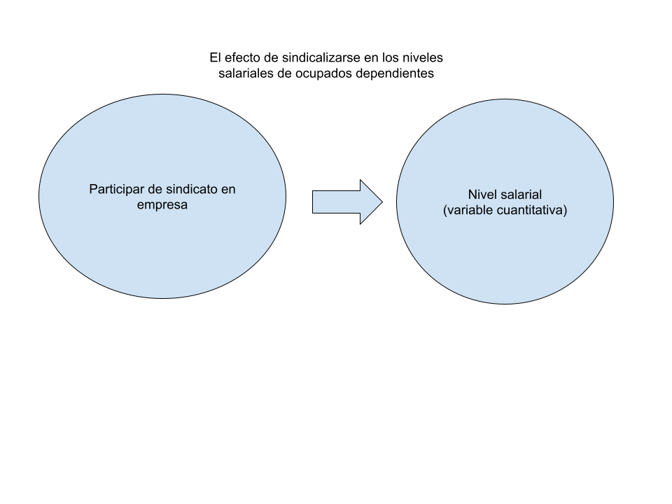
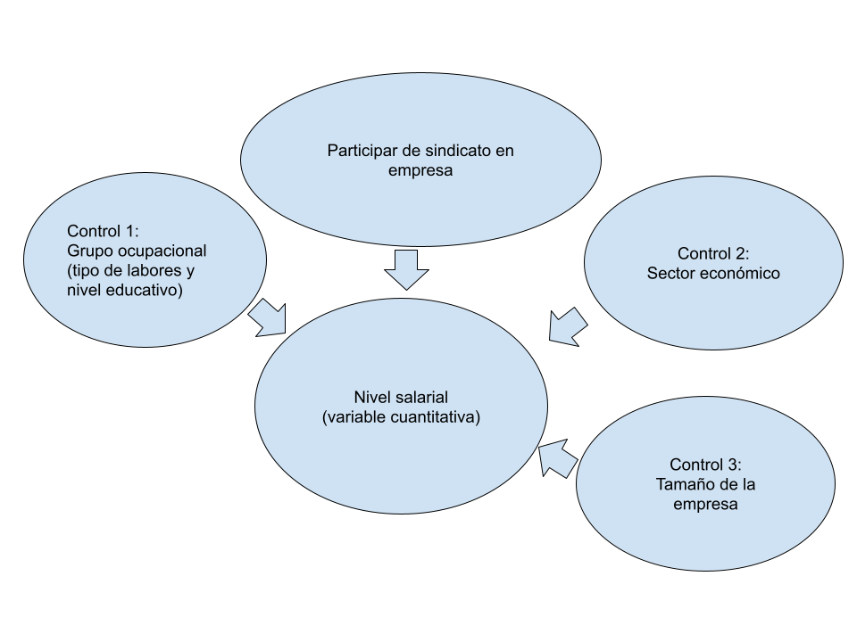
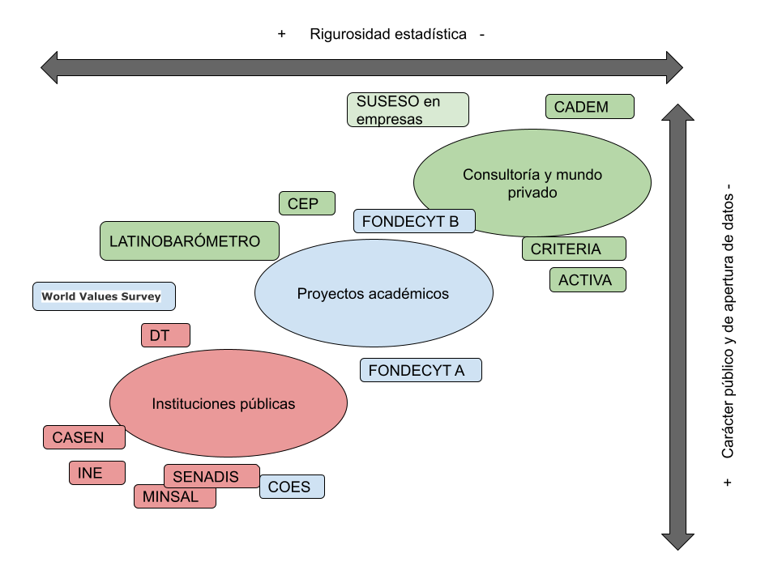

```{r, load_refs, include=FALSE, cache=FALSE}
library(RefManageR)
BibOptions(check.entries = FALSE,
           bib.style = "authoryear",
           cite.style = "authoryear",
           style = "markdown",
           hyperlink = "to.bib",
           dashed = FALSE)
bib <- ReadBib("bib.bib", check = FALSE)
```

```{r setup, include=FALSE}
options(htmltools.dir.version = FALSE)
```

```{r xaringan-themer, include=FALSE, warning=FALSE}
library(xaringanthemer)


dark_yellow <- "#EFBE43"
light_yellow <- "#FDF7E9"
gray <- "#333333"
blue <- "#4466B0"

style_duo(
  # colors
  primary_color = light_yellow,
  secondary_color = dark_yellow,
  header_color = gray,
  text_color = gray,
  code_inline_color = colorspace::lighten(gray),
  text_bold_color = colorspace::lighten(gray),
  link_color = blue,
  title_slide_text_color = blue,

  # fonts
  header_font_google = google_font("Martel", "300", "400"),
  text_font_google = google_font("Lato"),
  code_font_google = google_font("Fira Mono")
)
```

```{r echo=FALSE,include=FALSE}
#library(pagedown)
#pagedown::chrome_print("clase5a_cuestionarios.html")

```


class: inverse, center, middle

# Introducción

---

# Introducción

La aplicación de cuestionarios a sujetos de investigación (**encuesta**) es la técnica de producción de información más común en el mundo cuantitativo.

--

Las encuestas nos permiten responder tanto a objetivos **descriptivos** como aproximarnos a responder objetivos **causales**. 

--

Los argumentos causales intentarán responder preguntas del tipo **por qué** ocurre el fenómeno Y o **en que medida** las variables X explican la ocurrencia de Y. 

--

Antes de profundizar en la metodología de encuestas, terminaremos de revisar los **diseños causales**. 

--

Los experimentos son los diseños con mayor **validez interna** para explicar y aislar el efecto de `X` sobre `Y`

--

Sin embargo, su baja **validez externa** y la especificidad de los fenómenos sociales que estudiamos nos hacen mirar hacia los **diseños observacionales** aún cuando buscamos explicar `Y`. 

---

class: inverse, center, middle

# Diseños observacionales explicativos

---

# Diseños transversales

Los datos se toman aproximadamente al mismo tiempo y el investigador no controla ni manipula la variable independiente (X1)

--

Este registro o producción de datos puede ser mediante **cuestionarios a sujetos** como a través del registro de observaciones, codificación de documentos, etc. 

--

La asignación del tratamiento o variable independiente (X1) ya **no es aleatoria**. Los sujetos ya tienen asignado un valor en la variable X1. 

--

+ **No hay contrafácticos**. Las observaciones ya no son solamente diferentes en X1 e Y, sino que en muchas otras variables (X2, X3, hasta el infinito). 

--

+ **No hay orden temporal** registrado en el que X1 antecede a Y.

--

Por ende, es discutible la capacidad de **"aislar completamente"** el efecto de la variable independiente de interés sobre Y (poca validez interna.

--

+ Controlamos estadísticamente mediante el registro de terceras variables (X2, X3) que también explican Y para descartar relaciones espuras entre X1 e Y. 


---

# Diseños transversales

```{r fig.align="center", echo=FALSE, out.width="80%"}

```

---

# Diseños transversales

```{r fig.align="center", echo=FALSE, out.width="80%"}

```

---

# Diseños transversales

La típica forma de analizar los datos es con regresión líneal simple o múltiple.

--

Pero hay muchas otras formas como ecuaciones estructurales, modelos multinivel, etcétera.

--

La realidad social cambia y una foto de un momento particular puede no ser suficiente.

--

+ Permite observar correlación

+ Y controlar por terceras variables (evitar relación espuria)

+ No permite determinar orden temporal

--

No permiten determinar que una variable es la causa de la otra.

--

Una solución es recurrir al tiempo, midiendo la realidad en diferentes momentos. 

---

# Diseños longitudinales

Aplicar mediciones en diferentes momentos del tiempo (variabilidad temporal)

--

```{r fig.align="center", echo=FALSE, out.width="70%"}
knitr::include_graphics("Imagenes/diseños_segun_temporalidad.png")
```

---

# Diseños longitudinales

Otro esquema: 

```{r fig.align="center", echo=FALSE, out.width="80%"}
knitr::include_graphics("Imagenes/cross_longitudinal.png")
```

---

# Longitudinales Panel

Datos se recopilan del mismo conjunto de personas (la muestra o el panel) en varios momentos del tiempo.

--

Variabilidad de las unidades en cada momentos y en el tiempo. 

--

Facilita la inferencia causal y observar desfases de conducta `r Citep(bib, "Wooldridge2006a")`

--

Dificultades

+ Difícil de obtener. Mortalidad del panel y abandono (*atrición*) -> refresco de muestra o paneles rotativos

+ Desafío de transformación de datos (long-wide)

+ Desafío de análisis (Efectos fijos y aleatorios, Diff in diff, etc.)


---

# Para pasar a encuestas

Un dato producido puede para determinados objetivos puede ser utilizado para otros (**análisis secundario**)

--

La data producida por una encuesta de corte transversal y con fines descriptivos, puede ser utilizadas para responder preguntas (cuasi) causales. 

--

A la inversa también (datos longitudinales panel para fines descriptivos).

--

Una cosa es el **diseño**, otra la forma de **producción** del dato y otra el **microdato** que analizamos. 

--

Ahora veremos la [investigación por encuestas](), la forma de "produccción" o "recolección" de datos mediante entrevistas a sujetos. 


---

class: inverse, center, middle

# Investigación por encuestas

---

# Encuestas

.pull-left[
Las encuestas son una técnica de investigación antigua.


Hasta el día de hoy, una de las más usadas en cs. sociales.  

Inicialmente usadas para fines descriptivos, cada vez más con propósitos explicativos.

]

--

.pull-right[
```{r fig.align="center", echo=FALSE, out.width="50%"}
knitr::include_graphics("Imagenes/censo_chile.png")
```
]


--

Las **unidades de análisis** suelen ser las personas, pero también pueden ser empresas, hogares u otras.

--

Sin embargo, personas individuales deben servir como encuestados o **informantes**.

--

Estos informante responden un **documento estable** que contiene preguntas y otros tipos de artículos diseñados para solicitar
información apropiada para el análisis. 

--

Cuestionarios son centrales en encuesta, pero también en experimentos, investigación de campo y otros modos de observación.

---

# Cuestionarios

¿Cómo preparar o construir cuestionarios?, ¿De que formas se pueden aplicar?, ¿Como asegurar la respuesta y que esta sea de calidad?, ¿A quién y a cuántos le aplicamos el cuestionario?

--

No es tarea sencilla:

--

```{r fig.align="center", echo=FALSE, out.width="100%"}
knitr::include_graphics("Imagenes/preg_encuestamarx.png")
```

--

¿Cómo analizar estadísticamente las respuestas?

--

[Encuesta obrera](https://www.marxists.org/archive/marx/works/1880/04/20.htm) enviada por correo a obreros franceses en 1880. 

--

**Tasa de respuesta: 0%**

---

# Cuestionarios

Hay toda una [ciencia en el hacer preguntas](https://sci-hub.se/https://www.annualreviews.org/doi/pdf/10.1146/annurev.soc.29.110702.110112).

--

Sin embargo, no todo el contenido del cuestionario son **preguntas**.

Uso común de **afirmaciones** frente a las que el informante debe posicionarse.

--

```{r fig.align="center", echo=FALSE, out.width="90%"}
knitr::include_graphics("Imagenes/statement.png")
```


---

# Cuestionarios: preguntas

Al hacer preguntas hay dos opciones: **cerradas** o **abiertas**. 

--

Las de Marx (1880) serían abiertas. 

Lo más común es el uso de preguntas **cerradas**:

--


```{r fig.align="center", echo=FALSE, out.width="60%"}
knitr::include_graphics("Imagenes/question.png")
```

---

# Cuestionarios: preguntas

Ejemplo pregunta abierta:

```{r fig.align="center", echo=FALSE, out.width="80%"}
knitr::include_graphics("Imagenes/abierta.png")
```

---

# Cuestionarios: objeto de estudio

En un mismo cuestionario de ciencias sociales, conviven preguntas:

+ sobre eventos o comportamientos (y características sociodemográficas)

--

+ sobre evaluación y actitudes

--


---

# Cuestionarios: modo interacción

The interactional mode (interviewer or self-administered) and technological
mode (computer or paper) influence the nature of both a survey’s questions and
the processes used to answer them. For


---

# Cuestionarios: modo tecnológico


---

# Cuestionarios: buenas preguntas


---

class: inverse, center, middle

# Panorama de las encuestas en Chile

---

# Marco en el que se producen

```{r fig.align="center", echo=FALSE, out.width="80%"}

```

---

# Clivajes y distinciones

+ Nivel institucional (público, privado, financiamiento público, fines de lucro)

--

+ Apertura de datos (¿liberan los microdatos?, ¿Es posible trabajar con estos?)

--

+ Calidad estadística: muestra representativas, bajos niveles de error, altas tasas de respuesta, validadores, reporte de precisión de estimaciones (entre otros elementos)

--

+ Área temática: salud, trabajo, caracterización económica, opinión y valores, preferencias políticas, etc.


---

# Referencias bibliográficas

```{r echo=FALSE, results=FALSE}
Citet(bib, "Corbetta2007")
Citet(bib, "Schmitter2013")
Citet(bib, "deRada2007")
Citet(bib, "Babbie2014")
Citet(bib, "Schaeffer2003")
```

```{r refs, echo=FALSE, results="asis"}

PrintBibliography(bib)

```

---

class: inverse, center, middle

# Principales encuestas en Chile, como importarlas en R y como pedir ayuda

```{r, echo=FALSE}
#devtools::install_github("gadenbuie/countdown")
library(countdown) 
countdown(minutes=10, seconds=30)
```

---
