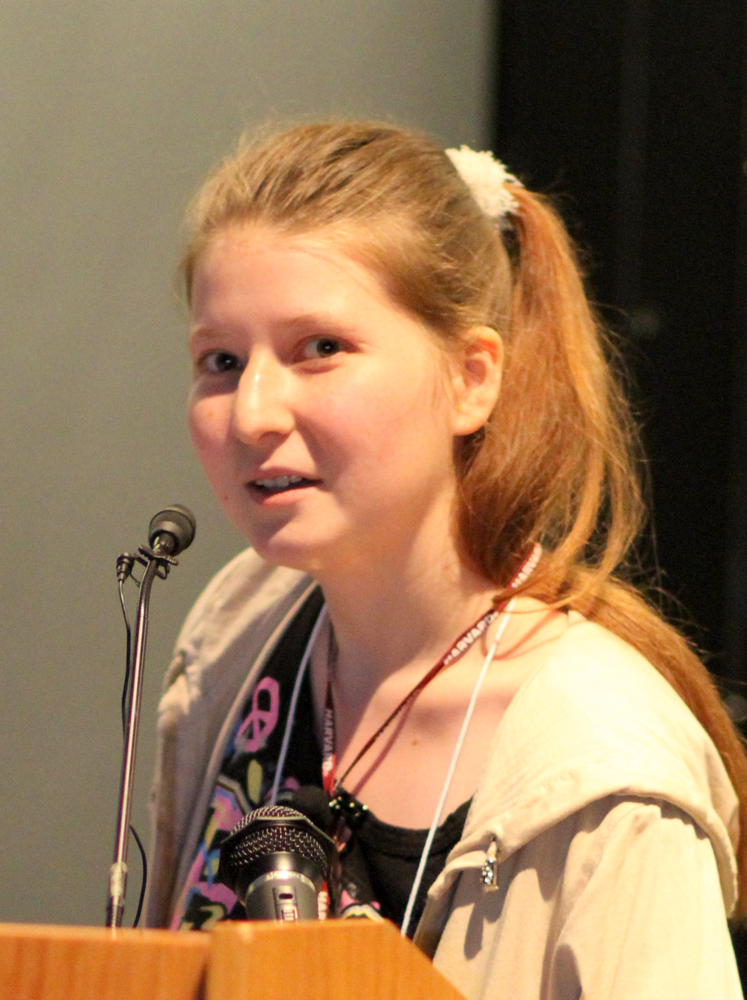
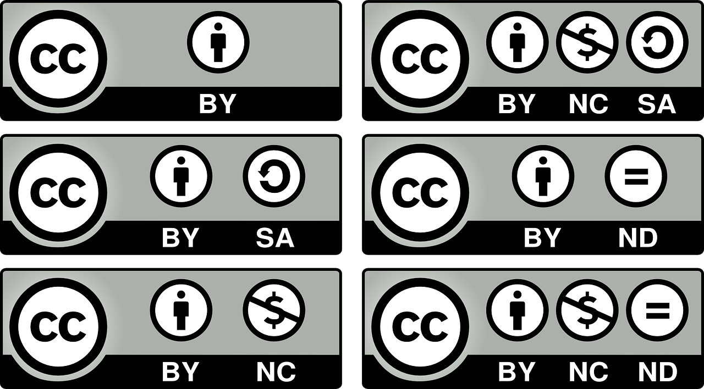
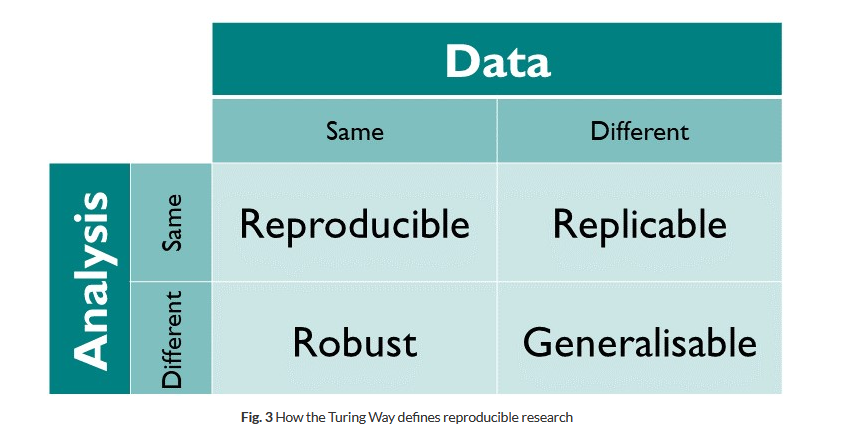

```{r setup, include=FALSE}
options(htmltools.dir.version = FALSE)
```

```{r xaringan-themer, include=FALSE, warning=FALSE}
library(xaringanthemer)
library(pagedown)
library(tidyverse)


dark_yellow <- "#EFBE43"
light_yellow <- "#FDF7E9"
gray <- "#333333"
blue <- "#4466B0"

style_duo(
  # colors
  primary_color = light_yellow,
  secondary_color = dark_yellow,
  header_color = gray,
  text_color = gray,
  code_inline_color = colorspace::lighten(gray),
  text_bold_color = colorspace::lighten(gray),
  link_color = blue,
  title_slide_text_color = blue,

  # fonts
  header_font_google = google_font("Martel", "300", "400"),
  text_font_google = google_font("Lato"),
  code_font_google = google_font("Fira Mono")
)
```

```{r echo=FALSE,include=FALSE}
#library(pagedown)
#pagedown::chrome_print("clase3b.html")

```


```{r, load_refs, include=FALSE, cache=FALSE}
library(RefManageR)
BibOptions(check.entries = FALSE,
           bib.style = "authoryear",
           cite.style = "authoryear",
           style = "markdown",
           hyperlink = "to.bib",
           dashed = FALSE)
bib <- ReadBib("bib/openscience.bib", check = FALSE)
```

class: inverse, center, middle

# Ciencia abierta

## Introducción y desafíos en sociología

---

# Introducción

*"La información es poder. Pero como con todo poder, hay quienes lo quieren mantener para sí mismos. La herencia científica y cultural del mundo completa, publicada durante siglos en libros y journals, está siendo digitalizada y apresada en forma creciente por un manojo de corporaciones privadas (...)"*.

--

*"(...) Es tiempo de salir a la luz y en la gran tradición de la desobediencia civil, declarar nuestra oposición a este robo privado de la cultura pública (...) Necesitamos tomar la información, donde sea que esté guardada, hacer nuestras copias y compartirlas con el mundo"*

--

.right[`r Cite(bib, "Swartz2008")`]

--

```{r, out.width = "15%", fig.pos="h", fig.align="right", echo=FALSE, fig.link="https://www.youtube.com/watch?v=VBkD04z-8V8"}
knitr::include_graphics("imagenes/aaswartz.jpg")
```


---

# Introducción

Esta concepción de ciencia abierta de Aaron Swartz (accesibilidad) es probablemente la que nos es más cercana. 

--

Inspiró a muchos y muchas. A una de ellas probablemente la han escuchado (y sí no es así deberían). 

--

.pull-left[La científica Alexandra Elbakyan ha creado un [repositorio y página web (sci-hub)](https://sci-hub.se/) pirata de más de 84 millones de artículos académicos, consiguiendo en la práctica un acceso abierto a las publicaciones científicas.

Por esto se ha ganado varias demandas. En algunos países se encuentra bloqueada (e.g. Alemania)]

```{r, out.width = "30%", fig.pos="h", fig.align="right", echo=FALSE, fig.link="https://es.wikipedia.org/wiki/Alexandra_Elbakyan"}

```


---

# Introducción

En paralelo a la opción "guerrillera", otras líneas institucionales han avanzado. 

--

.pull-left[
```{r, out.width = "80%", echo=FALSE, fig.link="https://doaj.org/"}

```
]

.pull-right[
```{r, out.width = "80%", echo=FALSE, fig.link="https://creativecommons.cl/tipos-de-licencias/"}

```
]

--

Pero la ciencia abierta no es solo el acceso libre a artículos y libros.

--

Ciencia abierta es un concepto "paraguas", que cubre diferentes usos. Reflexiones pueden agruparse a lo menos en cinco "escuelas" `r Cite(bib, "Fecher2014")` o cuatro "dimensiones" `r Cite(bib, "Breznau2021")`.

---

# Dimensiones o escuelas de la ciencia abierta (I)

--

## Open access (acceso abierto) o Escuela democrática

Los resultados de la investigación científica deben ser accesibles a todos/as, removiendo las barreras de pago de las revistas. 

--

Es justo por el uso de fondos públicos.

--

Es racional por que la ciencia se basa en la acumulación progresiva de conocimiento (nos paramos sobre hombres de gigantes), ¿Como construir investigación de calidad sin revisar lo producido por otros/as?

--

**Posibles salidas:** Publicar en revistas open access, liberar prepints, difundir y cooperar en expandir el repositorio sci-hub/lig-gen, sabotaje a grandes revistas, redireccionar el uso de fondos de las universidades, etc.  


---

# Derivación de acceso abierto según la Escuela de la Medición

--

Crítica a las medidas de productividad y a la permanente obligación por publicar (podría sacrificar la calidad de la misma ciencia)

--

La contribución de la ciencia debe ser medida con indicadores de impactos alternativos. 

--

+ El proceso de revisión de pares consume demasiado tiempo (la misma comunidad científica debería evaluar)

--

+ El impacto de los artículos está más relacionado a la revista que directamente al artículo (importa más el poder simbólico que el argumento)

--

+ Existen nuevos formtos de publicación (blogs, revistas online con acceso abierto), que pocas veces tienen un formato de revista al que se le puede asignar un factor de impacto. 


---

# Dimensiones de la ciencia abierta (II)

## Open process (transparencia)

--

Se deben dar a conocer todos los métodos, códigos, data y conflictos de interés antes y después de que la investigación sea realizada.

--

Siempre que el hacerlo no dañe seres humanos ni viole leyes (*e.g. anonimato informantes*).

--

Permite la sinergia entre investigadores, previniendo la duplicación de recolecciones y análisis de datos. 

--

Permite discusión más transparente y continuar o expandir proyectos de investigación de terceros. 

--

La creación de conocimiento puede ser más eficiente si los científicos trabajan en conjunto (Escuela pragmática). Problemas complejos requieren esfuerzos combinados. 

--

**Posibles salidas:** Preregistro de investigaciones (*OSF*), publicación de códigos y data (*github y otros repositorios*), Investigación Reproducible.


---

# Dimensiones de la ciencia abierta (III)

## Open source (código abierto)

--

Todos los programas, apps, algoritmos, herramientas y scripts deben ser transparentes y usables por otros. 

--

Cuando un científico desarrolla una nueva tecnología, cualquier tecnología de otro puede interactuar con esta.

--

Cualquiera puede modificar la tecnología para adoptarlas mejor a sus propias necesidades

--

**R y sus paquetes van en esta línea**. 


---

# Dimensiones de la ciencia abierta (IV)

## Open academia o Escuela Pública

--

Todos/as pueden participar de la academia. Las desigualdades el mundo social deben ser eliminadas del mundo académico. 

--

Incluso, las cs. podrían tener el objetivo de eliminar las desigualdades del mundo social (e.g. sociología pública de `r Cite(bib, "Burawoy2005")`:

--

+ Intervenir en discusiones públicas o elaboración de pp.

--

+ Apoyar la organización de movimientos sociales. 

--

Debiese importar el argumento y la evidencia, no el poder o posición de los actores. 

--

Desafío de la comunicación de los resultados de la investigación, ¿basta con liberar el *paper*?. 

--

Líneas innovadoras de involucrar a la ciudadanía [(citzen science)](https://www.zooniverse.org/about).


---

# ¿Por qué ciencia abierta en sociología?

--

Principal camino para evitar su fracaso como disciplina científica `r Cite(bib, "Breznau2021")`.

--

Permite resolver la actual crisis de legitimidad en la que se encuentran las ciencias sociales:

--

+ Poca confianza desde el público y de quienes hacen las políticas públicas

--

+ Escándalos por profesores que construyeron su carrera en base a falsa evidencia

--

+ Activistas que publicaron premeditadamente "basura" en prestigiosas revistas [(Sokal Squared" scandal)](https://www.youtube.com/watch?v=kVk9a5Jcd1k).

--

En mundo cuantitativo:

+ *p hacking*: correr modelos una y otra vez hasta que los resultados den significativos. Solo se hace público el modelo final [(Una posible salida es modelar "curvas de especificación")](https://crowdid.hypotheses.org/220). 

+ Valor *p* como objetivo, pero no dice nada sobre si el modelo está mal especificado, sobre la teoría o sobre el tamaño de los efectos.


---

# ¿Por qué ciencia abierta en sociología?

--

Las pretensiones de la ciencia abierta están en las concepciones de ciencia de algunos de los principales referentes de la sociología, como [Merton](https://sciencepolicy.colorado.edu/students/envs_5110/merton_sociology_science.pdf) y Habermas. 

--

+ **Universalismo:** pretensiones de verdad, cualquiera sea la fuente, deben ser evaluadas con criterios impersonales preestablecidos. No importan atributos de sus protagonistas. 

--

+ **Comunismo:** Los hallazgos sustantivos de la ciencia son producto de la colaboración social. La propiedad intelectual debe limitarse al reconocimiento y estima. 

--

+ **Desinterés:** curiosidad, altruismo en la búsqueda de beneficiar a la humanidad, y compromiso por la verdad. Rechazo a la acumulación de prestigio y a la subordinación a grupos de interés fuera del campo. 

--

+ **Escepticismo organizado:** escrutinio periódico de las creencias en términos lógicos y empíricos. Potencial conflicto con actitudes e instituciones sociales. No existe la división entre lo sagrado y lo profano. 

--

+ Cuando la esfera pública está mercantilizada, hay una producción y consumo de **comunicación asimétrica** (sesgo de contenidos y de acceso a calidad)


---

# Desafíos y problemas de la ciencia abierta

--

+ Acción directa de recuperación de literatura es ilegal.

--

+ La apertura nunca puede ser total: dilemas éticos y políticos, y restricciones legales.

--

+ Aparente limitación a los enfoques cuantitativos de las ciencias sociales (*misconception*).

--

+ Crítica de Asún:

  + Ciencia abierta tiene pretensiones positivistas, si no se cumple nuestro modelo no publicamos.
  + Si se sincera el proceso de manipulación de datos y ajuste de modelos (proceso iterativo) nadie nos creería (e.g. Copérnico). 
  
--

*"No debe ser un movimiento positivista. Es un movimiento para abrir la caja negra que rodea lo que hacen los sociólogos, sea lo que sea, para crear una comunidad de control de calidad y diálogo."* `r Cite(bib, "Breznau2021")`.

---

class: inverse, center, middle

# Investigación reproducible

## Apertura de los procesos de investigación social

---

# Investigación reproducible

--

Que otra persona (o mi yo del futuro) pueda ejecutar mi .pur[código] con .pur[los mismos datos] llegando **al mismo resultado**.

--

```{r fig.align='center', out.width = "60%", echo=FALSE, fig.link="https://the-turing-way.netlify.app/reproducible-research/overview/overview-definitions.html"}

```

--

*“Here is everything you need to reproduce my work.” *

*“Read the README file for further instructions.”* 

`r Cite(bib, "Christensen2019")`.

---

# Investigación reproducible


---

# Investigación reproducible

## ¿Que cosas pueden dificultar la reproducción de un procesamiento y análisis de datos?

--

- No sé si estoy usando los mismos datos (*problemas de acceso, diferentes versiones*)

--

- Rutas a archivos que son incorrectas

--

- Aleatoriedad no reproducible

--

- Comentarios escuetos en el código (*no se entienden las decisiones*)

--

- Variables no localizadas (no estaban creadas en la rutina)

--

- Diferentes versiones del *software* o de los paquetes

---

# Investigación reproducible

## Posibles soluciones

--

.pull-left[

- No sé si estoy usando los mismos datos

&nbsp;&nbsp;&nbsp; 👉 &nbsp;&nbsp;&nbsp; .medium-par[.pur[**Script, Control de versiones**]]


- Rutas a archivos que son incorrectas

&nbsp;&nbsp;&nbsp; 👉 &nbsp;&nbsp;&nbsp; .medium-par[.pur[**RProject, RMarkdown**]]


- Aleatoriedad no reproducible

&nbsp;&nbsp;&nbsp; 👉 &nbsp;&nbsp;&nbsp; .medium-par[.pur[**Fijar semillas con set.seed()**]]

]


.pull-right[

- Comentarios escuetos en el código

&nbsp;&nbsp;&nbsp; 👉 &nbsp;&nbsp;&nbsp; .medium-par[.pur[**Orden y estilo de código**]]


- Variables no localizadas

&nbsp;&nbsp;&nbsp; 👉 &nbsp;&nbsp;&nbsp; .medium-par[.pur[**RMarkdown**]]


- Diferentes versiones del *software* o de los paquetes

&nbsp;&nbsp;&nbsp; 👉 &nbsp;&nbsp;&nbsp; .medium-par[.pur[**sessionInfo() y paquetes**]]

]

---

# Importancia de la reproducibilidad (Daniela Ballari)

--

+ Recordar como se hizo lo que se hizo (yo del futuro y supervisión)

--

+ Facilita la detección de errores antes de publicar (si el código no corre es porque hay problemas)

--

+ Permite el control de versiones (volver al pasado)

--

+ Facilita la continuación del trabajo ante el recambio de personal

--

+ Permite la colaboración y transparencia del proyecto

--

+ Credibilidad de lo realizado

--

+ Evita malos entendidos, confusiones frente a revisión o solicitudes innecesarias (cualquier duda consulta el código)

--

+ Código puede reutilizarse o complejizarse para mejorar un procedimiento o una investigación


---

class: inverse, center, middle

# RMarkdown

## Articulación de código y texto para la reproducibilidad

---

# Breve repaso de RMarkdown 
```{r fig.align='center', out.width = "10%", echo=FALSE}
knitr::include_graphics("https://www.rstudio.com/wp-content/uploads/2017/05/rmarkdown.png")
```


--

Articulación de lenguaje R y texto plano. 

--

Los documentos creados con R Markdown son completamente reproducibles.

--

Si intentamos renderizar un documento, y el proceso falla, no hay reproducción:

--

+ Se requieren objetos (data frames, vectores) que no han sido creados todavía

--

+ Se intentan cargar bases de datos o imágenes desde rutas que no existen

--

+ Problemas en la escritura de código (confusión entre mayusc y minusc, guiones bajos)

--

+ Problemas en el orden del código (primero se espcifica modelo y luego se crean las variables)

---

# Breve repaso de RMarkdown 

Si el código se reproduce, tenemos un indicador de la calidad de una investigación social (primer filtro).

--

Otras cuestiones sustantivas (buenas ideas, revisión exhaustiva de antecedentes, validez de las mediciones, justificación de decisiones, gramática, etc.)

--

Los archivos de `R Markdown` en general tienen 3 partes:

--

(1). Un encabezado que permite configurar inicialmente el documento que vamos a escribir (**yaml**)


---

# Breve repaso de RMarkdown 

(2). "Pedazos de código" (o en inglés, ***chunk codes***, shortcut `ctrl+alt+i`).

--


---

# Breve repaso de RMarkdown 

Los chunks tienen muchos argumentos que permiten moldear el output a lo que deseamos.

--

Existe un chunk llamado por defecto "setup" (general para todos los chunks del documento).

--

```
{r setup, include=FALSE}
knitr::opts_chunk$set(echo = TRUE)
```


--

Podemos agregar opciones [(detalle acá)](https://rmarkdown.rstudio.com/lesson-3.html):

- include = FALSE/TRUE
- echo = FALSE/TRUE
- message = FALSE/TRUE
- warning = FALSE/TRUE
- error = FALSE/TRUE

--

O especificar opciones para cada chunk:

```
{r message=FALSE, warning=FALSE}
library(dplyr)
```


---

# Breve repaso de RMarkdown 

(3). Los **cuerpos de texto** donde podemos hacer comentarios sin necesidad de usar "#" (a diferencia de un script)

--


---

# Breve repaso de RMarkdown 

Podemos crear títulos (#), énfasis con negrita o cursiva, listas de elementos, agregar imágenes y enlaces.

--

Existe el código R "en línea" (*in line*), lo que nos permite hacer reportes automáticos:

--

El día de hoy es `r Sys.Date()` y el valor de 5 por 2 es `r 5*10`

--

```{r eval=FALSE}
El día de hoy es `r Sys.Date()` y el valor de 5 por 2 es `r 5*10`
```

--

Para generar el documento se puede utilizar el comando `render` o bien utilizar el botón `Knit` (Tejer).

```{r fig.align='center', out.width = "20%", echo=FALSE}
knitr::include_graphics("https://d33wubrfki0l68.cloudfront.net/eb48bae40b24285c0c8f281e6d2a7500cf3b9fc8/a2e5f/knitr/images/knit-logo.png")
```

--

O podemos ir ejecutando líneas de código en específico, chunks particulares o `Run All`, lo que nos permite detectar errores cuando el código no corre. 


---

# De RMarkdown a otros formatos


--

.pull-left[

```
---
title: "Título"
author: "Autor"
output: 
  html_document:
---
```
]

.pull-right[

```
---
title: "Título"
author: "Autor"
output: 
 pdf_document:
---
```
]

---

# Documentos en formato html

Descargar [formato html](https://github.com/nicolasrattor/formatos/raw/main/Formato%20html/documento.Rmd) estilizado.

Descargar [formato html distill](https://raw.githubusercontent.com/nicolasrattor/formatos/main/Formato%20html%20distill/Paper.Rmd). Para ocupar instalar paquete `distill`. 

---

# Documentos en formato pdf

Descargar [formato pdf](https://github.com/nicolasrattor/formatos/blob/main/Formato%20pdf%20uch/Paper.Rmd). Para utilizarlo se requiere instalar latex: `install.packages('tinytex')` [(más información acá)](https://bookdown.org/yihui/rmarkdown/installation.html)


---

# Documentos en formato word

Descargar [formato word](https://github.com/nicolasrattor/formatos/blob/main/Formato%20word/Paper.Rmd). No utilizar en este curso. 


---

# Formato presentaciones

Uso completamente opcional en presentación de final de semestre. 

--

Es recomendable ya que evita exportar gráficos y tablas trabajadas en RMarkdown. 

--

Tres formas diferentes

--

+ ioslides

+ Beamer

.pull-left[

+ [Xaringan](https://bookdown.org/yihui/rmarkdown/xaringan-start.html)

]

.pull-right[
```{r echo=FALSE, out.width="20%"}
knitr::include_graphics("https://upload.wikimedia.org/wikipedia/commons/b/be/Sharingan_triple.svg")
```
]

--

La tercera es la más simple, tiene varios formatos y solo hay que manejar un par de marcas extras. No es necesario saber latex. 

---

# Recordatorio de elementos a considerar al trabajar en Rmarkdown

--

- La función `setwd()` no funciona dentro de RMarkdown (por eso trabajamos con RProject).

- Las librerías que necesiten deben estar cargadas en el script de 
  Rmarkdown (**error habitual**).

- Tanto las bases de datos como las variables a utilizar deben estar
  llamadas dentro el script de Rmarkdown.

- Knitr() incluye la impresión de los resultados, por lo que no 
  es necesario usar print().

- No usar View() en RMarkdown, porque en el output no mostrará nada.

- Cada chunk puede tener o no tener un nombre. Si los deciden nombrar, 
  los nombres NO DEBEN REPETIRSE


---

# Dar formato a las tablas

Función `kable()` y paquete `kableExtra()`.

--

```{r}
Orange %>% head(4) #<<
```
--

```{r}
library(knitr) #<<
Orange %>% head(4) %>% kable()  #<<
```


---

# Dar formato a las tablas

```{r warning=FALSE}
library(kableExtra) #<<
Orange %>% head(4) %>% kable(caption = "Título de tabla") %>%
 kable_styling(bootstrap_options = c("striped", "hover"))

```

--

Para más información sobre distintos estilos revisar [Create Awesome HTML Table with knitr::kable and kableExtra](https://cran.r-project.org/web/packages/kableExtra/vignettes/awesome_table_in_html.html)

---

# Otras herramientas para la investigación reproducible

<https://github.com/>

<https://sci-hub.se/>

<https://osf.io/> o <https://zenodo.org/>

[Zotero](https://www.zotero.org/)

<https://www.researchgate.net/>

<http://www.shinyapps.org/apps/TransparencyChecklist/>

---

# Material de texto y audiovisual de interés

Curso ["Ciencia Social Abierta"](https://cienciasocialabierta.netlify.app/) de Juan Carlos Castillo (en español). 

[¿Por qué es importante la reproducibilidad computacional?](https://www.youtube.com/watch?v=Hvrb2b7v93w) De Daniela Ballari. En español

[The Story of Aaron Swartz](https://www.youtube.com/watch?v=VBkD04z-8V8). Documental con subtítulos en español.

[Como escribir manuscritos reproducibles.](https://www.youtube.com/watch?v=TKhV3w467RI&t=202s) De Francisco Rodríguez-Sánchez. En español

---

# Bibliografía y elementos consultados

```{r refs, echo=FALSE, results="asis"}
PrintBibliography(bib)
```

[Xaringan: Presentation Ninja, de Yihui Xie](https://github.com/yihui/xaringan). Para generar esta presentación.

--
