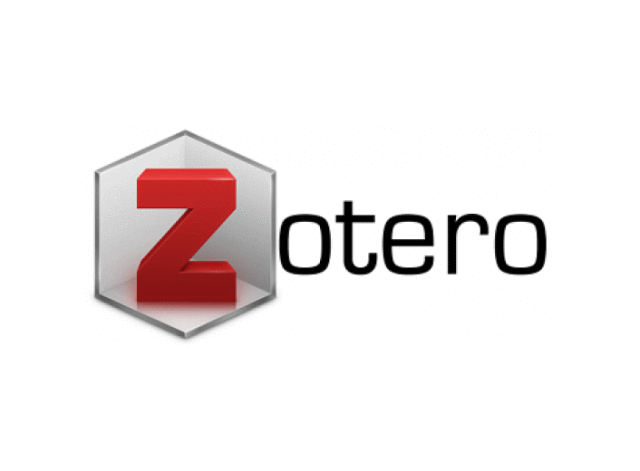
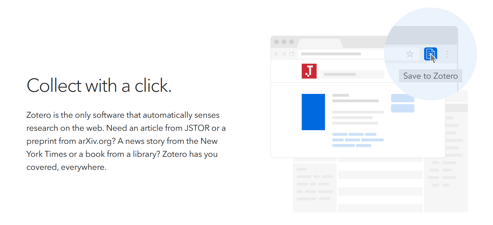
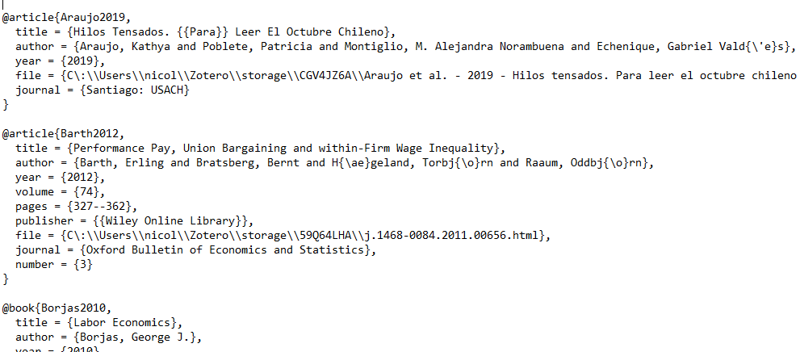

```{r setup, include=FALSE}
options(htmltools.dir.version = FALSE)
```

```{r xaringan-themer, include=FALSE, warning=FALSE}
library(xaringanthemer)
library(pagedown)
library(tidyverse)


dark_yellow <- "#EFBE43"
light_yellow <- "#FDF7E9"
gray <- "#333333"
blue <- "#4466B0"

style_duo(
  # colors
  primary_color = light_yellow,
  secondary_color = dark_yellow,
  header_color = gray,
  text_color = gray,
  code_inline_color = colorspace::lighten(gray),
  text_bold_color = colorspace::lighten(gray),
  link_color = blue,
  title_slide_text_color = blue,

  # fonts
  header_font_google = google_font("Martel", "300", "400"),
  text_font_google = google_font("Lato"),
  code_font_google = google_font("Fira Mono")
)
```

```{r echo=FALSE,include=FALSE}
#library(pagedown)
#pagedown::chrome_print("clase3b.html")

```


```{r, load_refs, include=FALSE, cache=FALSE}
library(RefManageR)
BibOptions(check.entries = FALSE,
           bib.style = "authoryear",
           cite.style = "authoryear",
           style = "markdown",
           hyperlink = "to.bib",
           dashed = FALSE)
bib <- ReadBib("bib/openscience.bib", check = FALSE)
```

class: center, middle

# Búsqueda, acceso y gestión de bibliografía

---


---

---

class: center, middle

# Zotero

---

# Zotero


--

.pull-left[

Software libre (*open source & non profit*), que funciona como "asistente personal" de investigación. 

Es un gestor bibliográfico, nos permite recolectar citas, organizarlas y citar cuando escribimos. 

]

--

.pull-right[

```{r fig.align="right", echo=FALSE, out.width="75%"}

```

]

--

A primera vista se parece y opera similar a como lo hace el gestor bibliográfico de word

--

  + Z tiene formas automáticas de guardar las bibliografías
  
--

  + Referencias pueden exportarse
  
--

  + Permite orginzar las citas, la colaboración y la sincronización

---

# Zotero

+ Descargar Zotero [acá](https://www.zotero.org/). 

--

+ Al apretar download aparece la opción Zotero y Zotero Connector. Descargar ambas. 


--

+ Es recomendable crearse una cuenta para poder sincronizar contenido desde distintos dispositivos y trabajar colaborativamente.

--

Vamos a Zotero...


---

class: center, middle

# Zotero Connector

---

# Zotero Connector

Registrar nuestras referencias "a mano" resulta agotador, lo que podría limitar nuestro interés en citar trabajos ajenos o traer a nuestro texto ideas de fuentes diversas.

--

Una alternativa económica respecto del tiempo es el uso de Zotero Connector. 

--

Este complemento nos permite guardar directamente las citas que encontremos en nuestro buscador favorito (e.g. [Google Scholar](https://scholar.google.com/)). Solo es necesario hacer click y especificar lo que queremos guardar.

--

```{r fig.align="center", echo=FALSE, out.width="60%"}

```

--

*Nota: Para que funcione tenemos que tener abierto nuestor Zotero y abierta la carpeta en la cuál queremos guardar el elemento.* 

---

class: center, middle

# Citando en texto plano

---

# Citando en texto plano

--

Se requieren 2 insumos básicos:

--

+ Archivo que almacena las referencias (.bib)

  + "Bloc de notas" con referencias (Bibtex)

  + Lo produciremos desde Zotero

--

+ Archivo con información del estilo de citación (.csl)

  + No nos meteremos en este punto (valor *default*)
  
---

# Citando en texto plano

¿Cómo se ve un bibtex?

--

```{r fig.align="left", echo=FALSE, out.width="100%"}

```

--

¿Tenemos que escribir todo ese código para cada cita en R Markdown?

--

No, desde el mismo Zotero exportamos un archivo bibtex con las citas que potencialmente queremos utilizar. 

---

# Citando en texto plano

Cada referencia en nuestro Zotero tiene una clave (*CiteKey*). Esta será la que llamaremos desde R Markdown.

--

Opcional, pero recomendado:

Para poder modificar el "estilo" de nuestra *CiteKey* y mantener actualizados los archivos exportados es necesario instalar un [complemento: Better BibTeX for Zotero](https://retorque.re/zotero-better-bibtex/installation/).

--

Ahora exportemos las referencias de Zotero (o las carpetas) que serán nuestro repertorio. Botón derecho -> exportar elemento en Formato Better BibTex, marcar "Keep Updated" y "Ok". 

--

Guardar elemento en carpeta del proyecto R. 

--

Ahora vamos a R...

---

# Citando en texto plano

Al final del YAML agregar: 

``` yaml
---
title: "Word count test"
output: html_document
bibliography: input/bib/Mi biblioteca.bib  
---
```
--

Para referenciar en texto: [@Citekey]

--

Al renderizar, al final del texto aparecerán las referencias.

--

Revisar [sintaxis de citado](https://rmarkdown.rstudio.com/authoring_bibliographies_and_citations.html) para cuestiones más específicas, como citar dos referencias, citar fuera de paréntesis, agregar números de página, etc. 

--

Veamos ejemplo...

---

# Citando en texto plano

Hay opciones hacer que todas las referencias se impriman al final del texto, aunque no hayan sido citadas. 

--

``` yaml
---
nocite: '@*'
---
```

--

Si queremos que el anexo aparezca después de la bibliografía

--

``` 
# References

<div id="refs"></div>

# Appendix
```


---

# Citando en texto plano

El estilo de citación puede cambiarse agregando función en YAML (por defecto es Chicago). Debe [descargarse el estilo](https://editor.citationstyles.org/about/) y guardarse en carpeta de protecto. 

--

``` yaml
---
bibliography: input/bib/Mi biblioteca.bib  
csl: input/bib/apa.csl
---
```

--

Para algunos puede ser desgastante recordar Citekeys o desgastante estar constantemente viendo en Zotero la clave de cada referencia. 

--

Para evitar esto existe el paquete de R `citr`, que instala un Addin en RStudio que facilita la búsqueda de las referencias. Si les interesa, revisar el [paquete en github](https://github.com/crsh/citr) (esta fuera de la CRAN en estos momentos). 

---

```{r fig.align="center", echo=FALSE, out.width="75%"}
knitr::include_graphics("https://raw.githubusercontent.com/crsh/citr/master/tools/images/addin_demo.gif")
```


---

# Recursos

+ Castillo, JC. (2020) Clase ["Citando en texto plano"](https://cienciasocialabierta.netlify.app/slides/05-bib/05_bib.html#1) en curso Ciencia Social Abierta.

+ Healy, K. (2019) [The Plain Person’s Guide to Plain Text Social Science](https://plain-text.co/). 

+ Screamox02. (2018) Como instalar [Zotero y Zotero Connector 2021](https://www.youtube.com/watch?v=Uxv3aE4XoNY).

+ Tenen, D. y Wythoff, G (2017) [Trabajar con bibliografías en RMarkdown](https://programminghistorian.org/es/lecciones/escritura-sostenible-usando-pandoc-y-markdown#trabajar-con-bibliograf%C3%ADas)

+ Yihui, X. (2020). [R Markdown Cookbook](https://bookdown.org/yihui/rmarkdown-cookbook/bibliography.html). Capítulo sobre bibliografías. 

En tanto es posible que después del curso sigas usando word para algún proyecto, te recomendamos revisar completo el video de Zotero y Zotero Connector, en el final hay una explicación sobre como vincular Zotero y Word. Para hacerlo es necesario descargar un [plugin](https://www.zotero.org/support/word_processor_integration).  


