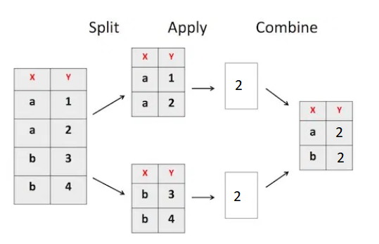

```{r, load_refs, include=FALSE, cache=FALSE}
library(RefManageR)
BibOptions(check.entries = FALSE,
           bib.style = "authoryear",
           cite.style = "authoryear",
           style = "markdown",
           hyperlink = "to.bib",
           dashed = FALSE)
bib <- ReadBib("../../bibliografia/bib.bib", check = FALSE)
```

```{r setup, include=FALSE}
options(htmltools.dir.version = FALSE)
```

```{r xaringan-themer, include=FALSE, warning=FALSE}
library(xaringanthemer)
library(dplyr)
library(guaguas)

dark_yellow <- "#EFBE43"
light_yellow <- "#FDF7E9"
gray <- "#333333"
blue <- "#4466B0"

style_duo(
  # colors
  primary_color = light_yellow,
  secondary_color = dark_yellow,
  header_color = gray,
  text_color = gray,
  code_inline_color = colorspace::lighten(gray),
  text_bold_color = colorspace::lighten(gray),
  link_color = blue,
  title_slide_text_color = blue,

  # fonts
  header_font_google = google_font("Martel", "300", "400"),
  text_font_google = google_font("Lato"),
  code_font_google = google_font("Fira Mono")
)
```

```{r echo=FALSE,include=FALSE}
#library(pagedown)
#pagedown::chrome_print("clase8c_agrupar_trasponer_combinar.html")

```


---

class: inverse, center, middle

# Transformación avanzada de datos

`Un poco más de agrupación, pivotear y combinar data frames`

---

# Introducción

La sesión subsiguiente veremos en detalle como elaborar gráficos elegantes en R.

--

Antes es necesario revisar algunos últimos aspectos sobre tranformación de datos. 

--

.inverse[La clave para elaborar buenos gráficos en R es tener una data frame coherente con el gráfico que queremos]

--

Por ejemplo, 

--

+ si queremos graficar N de hogares por región, no nos servirá una base de datos de personas.
  
--
  
+ si queremos graficar mediante barras el porcentaje de personas que reciben mas y menos del sueldo mínimo, la variable numérica salario debe ser categorizada
  
--

+ Si queremos graficar 2 variables, distinguiendo la relación por una tercera, necesitamos tener una base en formato *longer* (hacia abajo), no *wider* (hacia el lado)

---

# Introducción

A continuación veremos herramientas que nos permitirán lidiar con estos y otros problemas:

--

+ Funciones de agrupación (`group_by()`, `summarise()`).

--

+ Funciones para pivotear la data (`pivot_longer()`, `pivot_wider()`).

--

+ Funciones para combinar data (`merge()`, `rbind()` y `cbind()`)

--

Aplicaremos estas funciones a los datos del paquete Gapminder, a datos del Banco Mundial (de donde venían los de Afganistán), entre otros.

---

class: inverse, center, middle

# Agrupación de datos

`profundización función group_by()`

---

# group_by() y summarise()

En conjunto nos permiten resumir información para cada grupo de una variable

--

Podemos obtener edad promedio por sexo, número de personas en cada región, ingresos por hogar, etcétera.

--

Estrategia .inverse[split-apply-combine.]

--

Esta estrategia sucede tras bambalinas (no la vemos). Solo observamos el resultados. 

--

```{r fig.align='center', out.width = "40%", echo=FALSE}

```

---

# group_by() y summarise()

```{r echo=FALSE}
library(dplyr)
```


```{r message=FALSE, warning=FALSE}
data <- readRDS("data/Latinobarometro_2020_Esp_Rds_v1_0.rds")
```

--

Conteo de frecuencias

```{r}
data %>% group_by(sexo) %>% summarise(n=n())
```

--

Obtención de estadísitcos para cada grupo

```{r}
data %>% group_by(sexo) %>% summarise(edad=mean(edad))
```

---

# group_by() y mutate()

Con `summarise` "perdemos" la data original. Esta es resumida a una más pequeña. 

```{r}
data2 <- data %>% group_by(sexo) %>% summarise(edad=mean(edad))
dim(data2)
dim(data)
```
--

Pero en ocasiones queremos una medida de resumen sin perder la data, para poder generar nuevos cálculos. 

--

La alternativa es .inverse[agrupar] sin resumir, sino que .inverse[mutando] la data.

```{r}
data2 <- data %>% group_by(sexo) %>% mutate(edad_promedio=mean(edad))
dim(data2) 
```

---

# group_by() y mutate()

Veamos un pedazo de la nueva data

```{r}
data2 %>% select(idenpa,sexo,edad,edad_promedio) %>% head()
```

--

Edad promedio aparece en cada observación. 

Es el promedio de la edad del grupo (sexo) al que pertenece la observación. 

--

En este caso solo hay valores 41,6 (para los hombres) y 40,4 (para las mujeres)


---

# group_by() y mutate()

¿Cuál es la utilidad?

--

Sirve para el procesamiento de datos más que para el análisis.

--

Por ejemplo, identificar casos extraños dentro de un conjunto para luego editarlos.

--

Países que pertenecen a continentes pobres pero que son **MUY** ricos:

--

```{r message=FALSE, warning=FALSE}
library(gapminder)

paises_1972 <- gapminder %>% 
  filter(year==1972 ) %>% 
  group_by(continent) %>% 
  mutate(gdpPercap_continente=quantile(gdpPercap,0.90)) %>% 
  ungroup()
```


---

# group_by() y mutate()

```{r}
paises_1972  %>% 
  filter(continent %in% c("Africa","Americas") & 
        gdpPercap>gdpPercap_continente) %>%
  arrange(-gdpPercap) %>% select(-year,-continent)                          %>% knitr::kable()
```


---

class: inverse, center, middle

# Pivotear los datos

`funciones pivot_wider() y pivot_longer()`

---

# Pivotear los datos

Alargamiento o ensanchamiento de una data frame.

--

.pull-left[

**Alargamiento:** incremento en el número de filas y decrecimiento del número de columnas

**Ensanchamiento:** incremento en el número de columnas y decrecimiento del número de filas

Para esto utilizaremos las funciones `pivot_wider()` y `pivot_longer()` del paquete `tidyr`

```{r out.width = "20%", fig.pos="h", fig.align="center", echo=FALSE}
knitr::include_graphics("https://tidyr.tidyverse.org/logo.png")
```

]

--

.pull-right[

```{r out.width = "50%", fig.pos="h", fig.align="center", echo=FALSE}
knitr::include_graphics("imagenes/wide-long.png")
```

]


---

## Función pivot_wider()

Esta función se utiliza para ordenar un dataframe de forma tal de mostrar categorías de una variable como columnas de un dataframe.

--

Incrementa el número de las columnas y disminuye el número de las filas.

--

Es útil para la presentación de cuadros de resumen con doble entrada.

--

```{r echo=FALSE, message=FALSE}
data <- data %>% mutate(posicion_politica = case_when(p18st %in% c(0,1,2,3) ~ "izq",
                                              p18st %in% c(4,5,6) ~ "centro",
                                              p18st %in% c(7,8,9,10) ~ "der",
                                              p18st %in% c(97) ~ "ninguna",
                                              TRUE ~ NA_character_
                                              ))

tabla1 <-data %>%  filter(!is.na(posicion_politica)) %>%  group_by(sexo,posicion_politica) %>% summarise(n=n())
tabla1 %>% knitr::kable()
```


---

## Función pivot_wider()

Ahora vemos las categorías de sexo hacia la derecha

```{r echo=FALSE}

tabla1 %>% 
  tidyr::pivot_wider(names_from = sexo,values_from = n) %>% 
  knitr::kable()
```

--

Pasamos de un formato largo a uno ancho

--

```{r}
library(tidyr)
```

--

```{r eval=FALSE}
data %>%  
  filter(!is.na(posicion_politica)) %>% 
  group_by(sexo,posicion_politica) %>% 
  summarise(n=n()) %>% 
  pivot_wider(names_from = sexo,
              values_from = n) 

```

---

## Función pivot_wider()

Básicamente dos argumentos:

+ *names_from:* categorías que se quiere convertir en columnas

+ *values_from:* columna desde la cual extraer los valores

--

Además, podemos usar el argumento `names_prefix` cuando tenemos números

```{r message=FALSE}
data %>% filter(!is.na(posicion_politica)) %>% 
  group_by(sexo,posicion_politica) %>% 
  summarise(n=n()) %>% 
  pivot_wider(names_from = sexo,
              values_from = n,
              names_prefix = "sexo_") 
```


---

## Función pivot_longer()


---

# Pivotear los datos

Relevante para visualizar (la próxima semana lo entenderemos) y para trabajar datos importados

--

Por ejemplo, descarguemos los datos de Afganistán que usamos clases atrás. Esta vez sin trampa.

--

```{r out.width = "80%", fig.pos="h", fig.align="center", echo=FALSE, fig.link="https://datos.bancomundial.org/"}
knitr::include_graphics("imagenes/wdb.PNG")
```

---

# Pivotear los datos

¿Cómo vienen los datos?

--

```{r}
afganistan <- readxl::read_excel("data/afganistan.xlsx")
```

--

```{r echo=FALSE}
afganistan[1:5,c(2,50,57)]
```

--

.inverse[¡Las variables vienen como filas!] (lo contrario a una data tidy u ordenada)

--

¿Como graficamos el PIB de Afganistan si no es una variable? Solo podemos tabular años, lo que no tiene sentido:

--

```{r eval=FALSE}
table(afganistan$`1962`)
```


---

# Pivotear los datos

La solución es pivotear los datos. Hacer que las filas pasen a ser variables. 


--

Veamos el código y luego explicamos:

```{r}
# Alargar la data
afganistan <- afganistan %>% tidyr::pivot_longer(3:63) %>% 
  select(-`Country Name`) 

# Quitar filas repetidas para evitar errores
afganistan <- afganistan %>% 
  distinct(`Indicator Name`,value,name)

# Ensanchar la data
afganistan <- afganistan %>% 
  tidyr::pivot_wider(names_from = `Indicator Name`, 
                                  values_from = value,
                                  values_fn = {sum}) 

# Limpiar los nombres
afganistan <- afganistan %>% 
  janitor::clean_names() %>% rename(anio=name)
```

---

# Pivotear los datos

```{r echo=FALSE}
afganistan[c(57:61),c("anio","ingreso_nacional_bruto_ing_us","poblacion_total")]
```

--

```{r out.width = "30%", fig.align='center'}
boxplot(afganistan$ingreso_nacional_bruto_ing_us, horizontal = TRUE)
```

---

# Pivotear los datos

#### pivot_longer()

```{r eval=FALSE}
data %>% pivot_longer(c(col1, col2, col3))
```

Se especifican las columnas que ahora pasan a ser filas. 

--

#### pivot_wider()

```{r eval=FALSE}
data %>% pivot_wider(names_from = col1, 
                     values_from = col2) 
```

Se crean varias columnas.

Se debe especificar de que variable se tomarán los nuevos nombres y los nuevos valores. 

--

Volvamos a la transformación de Afganistán. Paso por paso. 

---

# Pivotear los datos

También podemos ocupar las funciones para hacer tablas de contingencia.

--

Agrupar por dos variables, y luego una pasarlas a columnas.

--

```{r eval=FALSE}
casen %>% 
  group_by(regiones, sexo) %>% 
  summarise(n=n()) %>% 
  pivot_wider(names_from = region, values_from = n)
```


---

class: inverse, center, middle

# Combinación de data frames

`funciones cbind(), rbind() y merge()`

---


---

### Recursos web utilizados

[Xaringan: Presentation Ninja, de Yihui Xie](https://github.com/yihui/xaringan). Para generar esta presentación.

[Ilustraciones de Allison Horst](https://github.com/allisonhorst/stats-illustrations)

### Para reforzar y seguir aprendiendo


