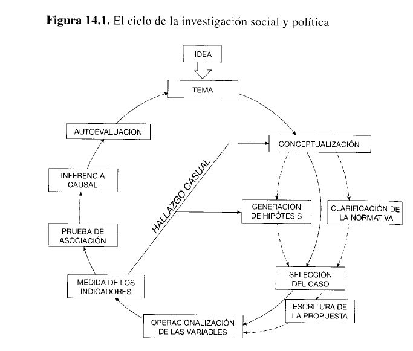
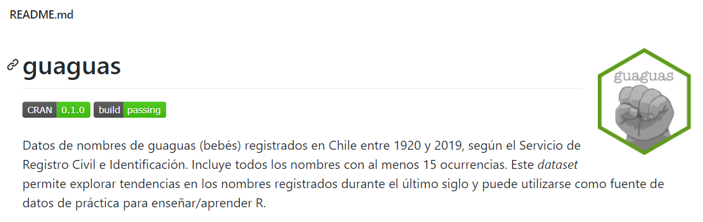
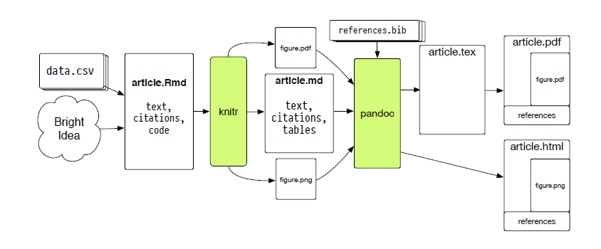

<style type="text/css">
.remark-slide-content {
    font-size: 25px;
    padding: 1em 4em 1em 4em;
    text-align: justify
}

<style>


---
# Introducción


```{r echo=FALSE,include=FALSE}
library(pagedown)
pagedown::chrome_print("clase1.html")

```


El objetivo del curso es entregar una comprensión general del proceso de investigación social cuantitativa y entregar herramientas que permitan elaborar y ejecutar diseños de investigación utilizando el lenguaje R.

--

Curso de múltiples dimensiones: epistemológica; metodológica; de revisión de investigaciones específicas; y "técnica" (uso de *softwares* y de técnicas de análisis de datos). 

--

[Programa](https://metodologia1uch.netlify.app/programa/) se divide en cuatro puntos: 

+ Epistemología y Diseños de investigación

+ Interpretación y visualización de estadística descriptiva

+ Interpretación y visualización de estadística inferencial

+ Medición y análisis unidimensional


---

# Introducción

El proceso de investigación cuantitativa según Schmitter (2013).

```{r echo=FALSE, out.width="60%", fig.align = 'center'}

```


---

# Presentación del programa - web

Se esperan los siguientes resultados de aprendizaje con el curso:

--

+ Comprender el contexto epistemológico en que se desarrolla la investigación social

--

+ Formular diseños de investigación social cuantitativa.

--

+ Conocer el panorama de instrumentos de medición y tipos de estudios cuantitativos.

--

+ Interpretar y analizar los elementos centrales de una base de datos con información social.

--

+ Aplicar las técnicas más pertinentes de estadística descriptiva.

--

+ Presentar de manera visual y efectiva los datos cuantitativos.

--

+ Comprender y elaborar indicadores, índices, escalas y tipologías.


---

# Principales inspiraciones del curso

### La sociología debe aspirar a ser una ciencia (social)

--

+ Sistemática, reproducible, perfectible y explicativa (desmitificadora) de la realidad. 

+ La sociología debiese aportar a la resolución de problemas sociales. Juicio "práctico" de calidad.

--

### La sociología necesita de la ciencia abierta para ser confiable y útil

--

+ Transparentar y registrar cómo y porqué hacemos lo que hacemos; abrir a la comunidad científica y política los productos de las investigaciones; interacciones en base a argumentos y evidencia... 

---

# Principales inspiraciones del curso 

### En sociología conviven y deben convivir diferentes enfoques. 

--

+ El enfoque cuantitativo es solo una opción. Es necesario reconocer su potencial y sus limitaciones.

--

### Relación de confianza e igualdad de trato con las y los estudiantes

--

+ Con trabajo y motivación se puede llegar a elaborar productos de alta calidad; evitar controles de lectura; opinión en clase es siempre válida y provechosa. 

---

# Principales inspiraciones del curso

### Reconocimiento y respeto por el trabajo e ideas de otros/as

--

+ El plagio debe evitarse a toda costa.

--

### Apoyo constante en el aprendizaje y compañerismo

--

+ R puede ser muy difícil sí es su primera aproximación. Paciencia y apoyo desde los/as más avanzados. 

---

# Presentación del programa - web

Todo el material necesario para el desarrollo del curso se encontrará en la página web del curso (https://metodologia1uch.netlify.app/). Este se subirá progresivamente. 

Acá, podrán encontrar el calendario, la bibliografía para descargar, las presentaciones de las clases y las pautas de las tareas y trabajos. 

--

A la web no se subirá ninguna información relativa a los y las estudiantes del curso. Notas y revisiones serán subidas a u-cursos, manteniéndose el anonimato. 

--

El canal "oficial" de comunicación son los correos: <rodrigo.medel.sierralta@gmail.com> y <nicolasrattor@gmail.com>. Escribir con copia a ambos. 

---

# Presentación del programa - web

El curso se realizará por medio de la plataforma zoom, donde la metodología será una combinación de clases expositivas y de ejercicios prácticos.

--

La evaluación final del estudiante consistirá en la realización de un mini proyecto de investigación cuantitativo (60%) y la presentación de 4 tareas prácticas (40%). 

--

En otras palabras: no hay pruebas, solo examen final en caso de tener nota inferior a 4,0. 

--

La lectura de la bibliografía no se evalúa, pero es altamente recomendable leerla, en tanto se evalúa "indirectamente" en la calidad de sus entregas parciales. 

---

# Proyecto inv. cuantitativo (60%)

Consiste en plantear problema, objetivos, antecedentes, discusión teórica, análisis descriptivo de bases de datos cuantitativos (resultados) y conclusiones. 

+ Entrega 1 (15%) - 29 de abril hasta las 23:59 hrs.

+ Entrega 2 (15%) - 03 de junio hasta las 23:59 hrs.

+ Presentación final y entrega final (30%) – 12 de julio en horario de clases.

---

# Tareas prácticas (40%). 

Si entrega más de 4 se considerarán las 4 mejores. 

+ Entrega 28 de marzo hasta las 23:59 hrs.

+ Entrega 29 de abril hasta las 23:59 hrs.

+ Entrega 13 de mayo hasta las 23:59 hrs.

+ Entrega 20 de mayo hasta las 23:59 hrs.

+ Entrega 27 de mayo hasta las 23:59 hrs.

+ Entrega 3 de junio hasta las 23:59 hrs.

+ Entrega 17 de junio hasta las 23:59 hrs.

+ Entrega 24 de junio hasta las 23:59 hrs.


---

# Herramientas del curso

+ Página web <https://metodologia1uch.netlify.app/>

--

+ [RStudio](https://metodologia1uch.netlify.app/clases/clasecero/) para datos y escritura.

--

+ Buscador de bibliografía: [Google Scholar](https://scholar.google.com/). Otros buscadores más refinadas. 

--

+ Gestor bibliográfico como Zotero o Mendeley.

--

+ [Sci-hub](https://sci-hub.se/) y [libgen](http://libgen.rs/)

--

+ La idea es **no** utilizar Word ni para la gestión bibliográfica ni para la escritura de textos. Así mismo, tampoco usar excel para el procesamiento y análisis de datos.  


---


# Introducción a R

R es un lenguaje de programación (1993), creado principalmente para el análisis de datos. Al principio cuesta comprenderlo, pero con tiempo y dedicación se pueden hacer grandes cosas. Por ejemplo, con lenguaje R y un poco de otras ayudas se hacen las presentaciones de este curso o incluso la [página web](https://metodologia1uch.netlify.app/) del mismo.

--

Gracias a la Entorno de Desarrollo Integrado (IDE) **RStudio** tenemos un software "amigable" que soporta el lenguaje R y nos permite trabajar con éste.

--

R Funciona con un paquete base al que se le pueden ir agregando más funciones al instalar otros paquetes. Con esto se pueden hacer gráficos elegantes (Ggplot2), elaboración de documentos html, pdf o word (rmarkdown) o análisis estadísticos complejos como modelos factoriales (lavaan).

---

# Introducción a R

Pero si solo quiero hacer análisis descriptivos de datos, ¿por qué utilizar R y no continuar con Excel, SPSS u otros softwares que ya sabemos ocupar?

--

+ R es gratis, su código es abierto y se encuentra disponible en la mayoría de las plataformas (Windows, Mac OS, Linux).


--

+ Actualmente son bien valorados los profesioanles de las ciencias sociales que utilizan este lenguaje.

--

+ Permite registrar procesamientos y analisis estadísticos, posibilitando que nuestra investigación sea "reproducible". Mi yo del futuro, un supervisor o un colega puede leer nuestro código y volver a correrlo si le facilitamos los insumos.

--

+ Por lo anterior, facilita el trabajo colaborativo (sobre todo al agregar otros *software* como Github).


---

# Introducción a R

Ventajas de R (continuación)

+ Tiene una comunidad de usuarios activa, muy dispuesta a ayudar. Por lo general, todas nuestras "panas" ya fueron preguntadas y respondidas en foros-comunidades como [stackoverflow](https://stackoverflow.com/questions/tagged/r).

--


+ Consume pocos recursos informáticos  (no te "pega" el computador como otros programas de análisis estadístico).

--


+ Interactúa con otros lenguajes. Se pueden leer bases en spss, sas, stata o excel (hasta se pueden leer pdfs). También se puede exportar bases de datos a esos lenguajes. 

--

+ Esto facilita el trabajo colaborativo incluso con quienes no usan R.


---

# Introducción a R

Debilidades del lenguaje (todas superables):

--

+ Curva de aprendizaje "empinada" al inicio.

--

+ La mayoría de consultas, respuestas, manuales, registros, etc. están en inglés.

--

+ Un problema puede ser resuelto de muchas formas. A veces, sobre todo al inicio, se seleccionan caminos deficientes que terminan siendo incongruentes con otros procesos. 

--

+ La comunidad está más centrada en resolver problemas que en el proceso que permite su solución. A veces las soluciones no son las más elegantes y concisas. 


---

# Introducción a R

### Ahora abramos RStudio.

--


---

# Interactuando con R (dos formas)


--

## 1) A través de la consola.

El símbolo `>` significa que R está listo para que le entreguemos una instrucción a ejecutar.

Los comandos que se escriban aquí **no** serán grabados para un nuevo inicio de sesión.

El código escrito en consola se ejecuta con la tecla Enter.

---

# Interactuando con R (dos formas)

## 2) Usando archivos *script*

Una práctica habitual y recomendada es guardar rutinas completas en archivos script. Con esto guardamos el código.

--

Texto plano que contiene nuestro código, siendo los archivos `.R` los más comunes.

--

Piensen estos archivos como un "bloc de notas". 

--

Para ejecutar el código en script puedes utilizar el *shortcut* **Ctrl + Enter**.

--

El signo gato (**#**) sirve para "silenciar" códigos o comentar. 


---

# Primeras operaciones con R

R puede ser una calculadora

--

```{r}
## ¿Cuánto es 5 + 5?
5 + 5   #<<
```

--

```{r}
5 * 5 #<<
```

--

```{r}
(400+6783) * 2.7 #<<
```

---

# Primeras operaciones con R

Podemos crear objetos y asignarles valores

```{r}
a <- 7 #<<
b <- 3 #<<
a + b #<<
```
--

incluso el resultado lo podemos asignar a un objeto

```{r}
c <- a+b #<<
c #<<
```
--

Si observamos en nuestro "ambiente", vemos que ahora hay 3 nuevos objetos. 

---

# Primeras operaciones con R

La mayor parte del tiempo usaremos funciones integradas.

Pueden ser entendidas como scripts que funcionan "tras bambalinas".

--

```{r}
sum(5,10) #<<
```

--

```{r}
# aproximar
round(9.556789) #<<
```

--

Gran parte de las funciones que utilizamos en R vienen contenidas en paquetes (packages).

--

Las funciones que acabamos de conocer pertenecen al paquete base, que viene con el software R.

--

Existen más de 10.000 paquetes en R -> funciones y datos.

---

# Bases de datos en R

Existen varios tipos de objetos en R. 

--

Por temas de tiempo recomendamos que revisen sobre [vectores](https://bookdown.org/gboccardo/manual-ED-UCH/uso-basico-de-rstudio.html#tipos-de-objetos-en-r-vectores), [matrices](https://bookdown.org/jboscomendoza/r-principiantes4/matrices-y-arrays.html) y [listas](https://bookdown.org/jboscomendoza/r-principiantes4/listas.html) en otros lugares, después de la clase. 

--

Comenzaremos viendo una estructura relativamente compleja, las *data frame* o bases de datos. 

--

Es el formato más común al que nos enfrentamos diariamente en hojas de cálculo, o programas como SPSS, Stata, etc.

--

Cuando cargamos una base de datos, nuestro objeto `a` ya no será un simple número, como 7. 

--

Al objeto `a` ahora le podemos asignar una base de datos.

---

# Bases de datos en R

Para empezar, y con el objeto que sea sencillo, cargaremos una base desde un "paquete".

--



--

```{r}
#install.packages(guaguas)
library(guaguas)  #<<
```

--

```{r}
a<-guaguas  #<<
```


---

# Bases de datos en R

En el ambiente podemos ver que tenemos un objeto `a` con `r nrow(a)` filas y `r ncol(a)` columnas.

--

Si le damos "click" al objeto `a` que hemos creado, veremos la base de datos guagua en una ventana emergente. 

--

Esta es la forma "fea" de observar nuestra base de datos. Cuando la base es muy grande nos traerá problemas.

--

```{r}
 ## Forma para ver la "cabeza" de la base de datos.
head(a)   #<<
```


---

# Bases de datos guaguas en R

La base indica para cada año, desde 1920 hasta 2019, el número de veces que fue inscrito cada nombre en el registro civil. 

--

Podemos ver cuantos nombres de mujeres y hombres hay en total. Al poner nombres de mujeres hay más imaginación:


```{r}
table(a$sexo) #<<
```

--


 

```{r}
## Pueden poner sus nombres y probar.
b<-a[a$nombre=="Jimmy",] #<<  
nrow(b) #<<
sum(b$n) #<<


```

---


# Actividad práctica


Prueben hacer algunas cosas ustedes, 

--

+ Saquen una tabla para año
+ Saquen información para María
+ Hagan una tabla cruzada entre año y sexo (los códigos se separan por una coma ,)

--

tienen 3 minutos. 


```{r, echo=FALSE}
#devtools::install_github("gadenbuie/countdown")
library(countdown) 
countdown(minutes=3, seconds=0)
```

--

Se pueden hacer muchas cosas más. Esto es solo una pincelada para lo que viene...


---

# Introducción a RMarkdown

R Markdown provee de un marco para generar **documentos** en el contexto del análisis de datos. Estos documentos pueden estar básicamente en formato `pdf`, `html` o `word`. 

--

La idea es "integrar" código de análisis de datos con texto plano (R + Markdown).

En un único documento de RMarkdown podemos:

+ Guardar y ejecutar código.

+ Generar reportes de alta calidad que pueden ser compartidos fácilmente.

+ Los documentos creados con R Markdown son completamente reproducibles.

---

# Introducción a RMarkdown

La lógica de los archivos `.rmd` es cercana a un bloc de notas, con la excepción de un "encabezado" (*yaml*). Todo su contenido es texto plano, pudiendose agregar "bloques" (*chunks*) de código `.R` 

--

File -> New File -> RMarkdown -> OK -> knit

--

```{r echo=FALSE, out.width="30%", fig.align = 'center'}
knitr::include_graphics("imagenes/knit-logo.png")
```


---

# RMarkdown

Para ser esquemáticos: los archivos de `R Markdown` en general tienen 3 partes:

(1). Un encabezado que permite configurar inicialmente el documento que vamos a escribir (**yaml**)

--


---


# R Markdown


(2). "Pedazos de código" (o en inglés, ***chunk codes***).

--


---

# R Markdown

(3). Los **cuerpos de texto** donde podemos hacer comentarios sin necesidad de usar "#"

--


---

# R Markdown

En los cuerpos de texto se pueden agregar de forma simple y rápida propiedades y elementos. Siendo los principales:

(4). **Énfasis**

```
 *cursiva*   **negrita**
```

--

(5). **Encabezados**

```
# Capítulo

## Subcapítulo

```

--

(6). **Imagenes**

Imágenes en la web o archivos locales en el mismo directorio:

```


```


---

# R Markdown

Para generar el documento se puede utilizar el comando render o bien utilizar el botón Knit (Tejer).

¿Como funciona? 

.middle[

]


---

# Tarea práctica N°1

Generar en RMarkdown un reporte simple, en formato html o pdf, que contenga los siguientes elementos:

--

+ Nombre del estudiante

--

+ No más de cuatro párrafos que contengan una presentación académica-profesional del estudiante (que estudió y por qué; en que ha trabajado; que cosas que ha investigado; a futuro, en que se ve trabajando o ejerciendo)

--

+ Párrafo en donde se comente brevemente que temática de investigación y, de que forma, le gustaría desarrollar a lo largo del curso.

--

+ Agrega una foto de tu pokemón favorito. Encuentra la lista y fotos para descargar [acá](https://pokemon.fandom.com/es/wiki/Lista_de_Pok%C3%A9mon) (charmander y pikachu están reservados). Sí prefieres algo más serio puede ser una foto de tu científico/a social favorito

---

# Tarea práctica N°1

Entrega a más tardar el 01 de abril hasta las 23:59 hrs. 

Envíos y consultas a mails de profesores. 

Adjuntar comprimido con código en `.rmd`, archivos `html` o `pdf`, y la foto utilizada.

La pauta con las especificaciones se puede [descargar acá](../tarea1/tarea1.pdf)


---

# Recursos consultados y utilizados

+ [Breznau, N. (2021)](https://www.mdpi.com/2075-4698/11/1/9). Does Sociology Need Open Science? Societies, 11(1), 9.

+ [Capacitaciones en R del INE](https://capacitacionesdet.github.io/).

+ Curso ["Ciencia Social Abierta"](https://cienciasocialabierta.netlify.app/) de Juan Carlos Castillo. 

+ [R Markdown. Hoja de referencia](https://rstudio.com/wp-content/uploads/2015/03/rmarkdown-spanish.pdf). 

+ Schmitter, P. 2013. *“El Diseño de La Investigación Social Y Política.”* En Enfoques Y Metodologías de Las Ciencias Sociales: Una Perspectiva Pluralista, 281–312. Akal.

+ [Wickham, H. y Grolemund, G. (2020)](https://es.r4ds.hadley.nz/). R para Ciencia de Datos.

+ [Xaringan: Presentation Ninja, de Yihui Xie](https://github.com/yihui/xaringan). Para generar esta presentación.


