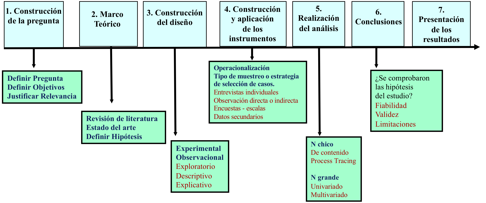

```{r, load_refs, include=FALSE, cache=FALSE}
library(RefManageR)
BibOptions(check.entries = FALSE,
           bib.style = "authoryear",
           cite.style = "authoryear",
           style = "markdown",
           hyperlink = "to.bib",
           dashed = FALSE)
bib <- ReadBib("../../bibliografia/bib.bib", check = FALSE)
```

```{r setup, include=FALSE}
options(htmltools.dir.version = FALSE)
```

```{r xaringan-themer, include=FALSE, warning=FALSE}
library(xaringanthemer)


dark_yellow <- "#EFBE43"
light_yellow <- "#FDF7E9"
gray <- "#333333"
blue <- "#4466B0"

style_duo(
  # colors
  primary_color = light_yellow,
  secondary_color = dark_yellow,
  header_color = gray,
  text_color = gray,
  code_inline_color = colorspace::lighten(gray),
  text_bold_color = colorspace::lighten(gray),
  link_color = blue,
  title_slide_text_color = blue,

  # fonts
  header_font_google = google_font("Martel", "300", "400"),
  text_font_google = google_font("Lato"),
  code_font_google = google_font("Fira Mono")
)
```

```{r echo=FALSE,include=FALSE}
#library(pagedown)
#pagedown::chrome_print("clase3a_diseno.html")

```


class: inverse, center, middle

# Introducción

---

Cuando analizamos datos cuantitativos, representaciones numéricas del mundo social, nos encontraremos con cosas muy diferentes.

--

Antes de comprender cómo se producen los datos, revisaremos los distintos datos que nos encotramos en la investigación social. 


---
class: inverse, center, middle

# Tipos de datos cuantitativos

---

# Niveles de medición

--

Los números tienen propiedades:

+ 1 es distinto de 3

+ 1 es menor que 3

+ 1 está dos unidades antes que 3

--

Los números se pueden utilizar para representar:

+ categorías (mujer y hombre, como 1 y 2)

+ orden ()

+ grado ()


---
class: inverse, center, middle

# Diseños de investigación


---

# El proceso de investigación

```{r fig.align='center', out.width = "50%", echo=FALSE}

```


---

# El diseño

Plan estructurado de acción y ordenamiento de la situación de investigación, que está orientado a responder empíricamente (evidencia observable) una pregunta de investigación.

+ ¿Qué aspecto de la teoría va a ser testeado?

+ ¿Qué observaciones se harán para responder a la pregunta de investigación?

+ ¿Cómo se levantarán o producirán los datos (observaciones)?

+ ¿Cómo se analizará la información recolectada?

--

Todo buen diseño de investigación busca el mismo objetivo: Sacar conclusiones
fundamentadas y relevantes a partir de un correcto tratamiento de la evidencia
empírica.


---

### Bibliografía utilizada

```{r echo=FALSE, results=FALSE}
Citet(bib, "Wickham2021")
Citet(bib, "Schmitter2013")
```

```{r refs, echo=FALSE, results="asis"}
PrintBibliography(bib)
```


---
class: inverse, center, middle

# Un poco más de R base e introducción a paquete dplyr

```{r, echo=FALSE}
#devtools::install_github("gadenbuie/countdown")
library(countdown) 
countdown(minutes=10, seconds=30)
```


