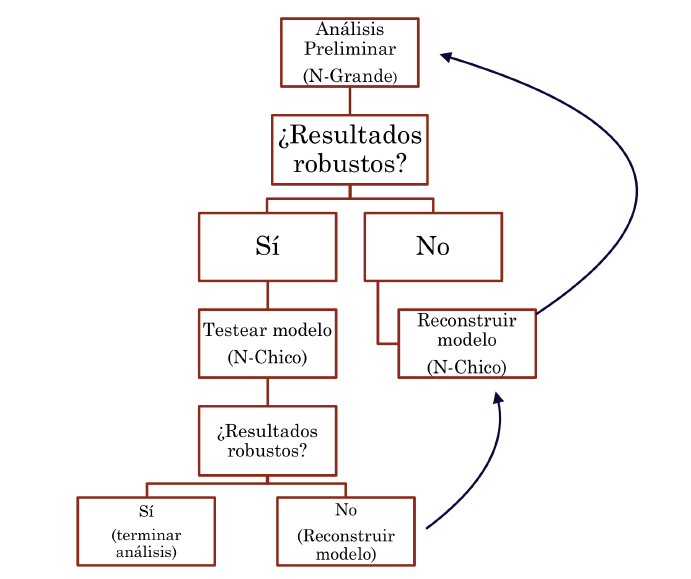

# Métodos Mixtos

--

+ ¿En qué consisten? ¿Cuáles son sus fortalezas y debilidades?

--

+ El año 2005 Liebreman propuso sistematizar el uso de los métodos mixtos en lo que él llamó: "Nested Analysis" (Lieberman, 2005).

--

+ La estrategia de combinar ambos acercamientos busca:

--

  + Mejorar la calidad de la conceptualización y de las medidas (Validez interna)

  + Analizar explicaciones rivales o alternativas y generalizar (Validez externa).
  
  + Una mayor confianza en los hallazgos principales del estudio (Triangulación).


---

# Métodos Mixtos

--

En términos específicos:

+ El análisis de N-grande ayuda a:

    + A Dar luces sobre explicaciones alternativas y descartarlas o explorarlas.

    + B Motiva a una buena estrategia de seleccion de casos de N-chico.

--

+ El análisis de N-chico ayuda a:

    + A Mejorar y afirmar los instrumentos de medición.

    + B Ayuda a mejorar las especificaciones del modelo.


---

# Métodos Mixtos: Lieberman (2005)

```{r fig.align="center", echo=FALSE, out.width="75%"}

```