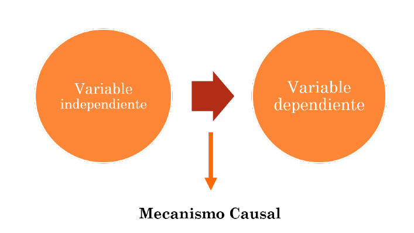
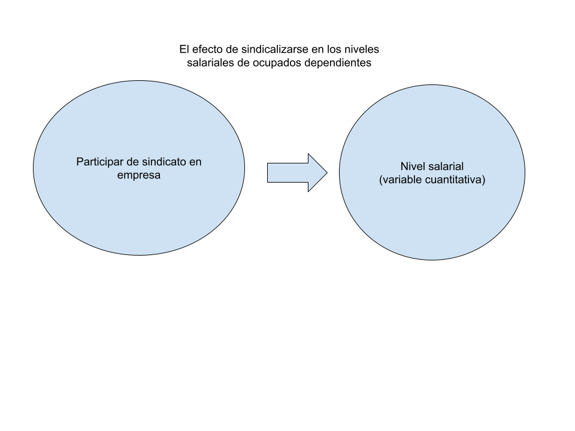
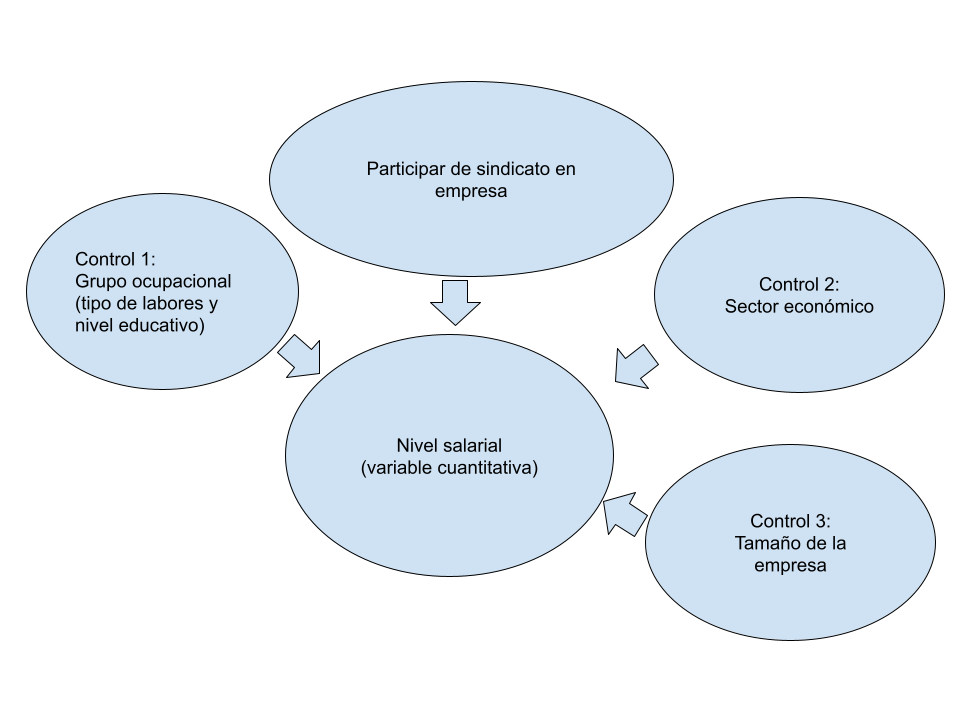

```{r, load_refs, include=FALSE, cache=FALSE}
library(RefManageR)
BibOptions(check.entries = FALSE,
           bib.style = "authoryear",
           cite.style = "authoryear",
           style = "markdown",
           hyperlink = "to.bib",
           dashed = FALSE)
bib <- ReadBib("bib.bib", check = FALSE)
```

```{r setup, include=FALSE}
options(htmltools.dir.version = FALSE)
```

```{r xaringan-themer, include=FALSE, warning=FALSE}
library(xaringanthemer)


dark_yellow <- "#EFBE43"
light_yellow <- "#FDF7E9"
gray <- "#333333"
blue <- "#4466B0"

style_duo(
  # colors
  primary_color = light_yellow,
  secondary_color = dark_yellow,
  header_color = gray,
  text_color = gray,
  code_inline_color = colorspace::lighten(gray),
  text_bold_color = colorspace::lighten(gray),
  link_color = blue,
  title_slide_text_color = blue,

  # fonts
  header_font_google = google_font("Martel", "300", "400"),
  text_font_google = google_font("Lato"),
  code_font_google = google_font("Fira Mono")
)
```

```{r echo=FALSE,include=FALSE}
#library(pagedown)
#pagedown::chrome_print("clase4a_diseno.html")

```


class: inverse, center, middle

# Diseños de investigación

---

# El diseño

Antes de recolectar y analizar datos necesitamos **un plan**

--

Nuestras ideas e intereses de investigación deben formalizarse en **objetivos** y en un plan que permita su consecución. 

--

El diseño es este **plan estructurado** de acción y ordenamiento de la situación de investigación.

--

+ ¿Qué aspecto de la teoría va a ser observado?

+ ¿Qué observaciones se harán para responder a la pregunta de investigación?

+ ¿Cómo se levantarán o producirán los datos (observaciones)?

+ ¿Cómo se analizará la información recolectada?

--

El objeto es sacar conclusiones fundamentadas y relevantes a partir de un correcto tratamiento de la evidencia
empírica.

---

# La investigación social

En la investigación social el objetivo es la inferencia.

+ La inferencia, **en sentido amplio**, es un proceso en el que se utilizan hechos que conocemos para aprender sobre los que desconocemos.

--

Las inferencias pueden ser descriptivas o causales

--

**Inferencias descriptivas:**

Describir fenómenos, proponer conceptos nuevos, asociaciones o agrupaciones entre ellos. 

*Lógica de descubrimiento.*

--

**Inferencias causales:**

Conocer efectos causales o encontrar causas necesarias y/o suficientes a partir de los datos observados. 

*Lógica de demostración.*

---

# Clasificación de los diseños

¿Qué factores determinan la elección de un diseño?

--

Según los **objetivos** de la investigación los diseños pueden ser:

+ Descriptivos

+ Causales

--

Según el grado de **intervención** y control del investigador:

+ Experimentales

+ Observacionales

--

```{r fig.align='center', out.width = "100%", echo=FALSE}
knitr::include_graphics("imagenes/experimentos_observacional.png")
```

---

class: inverse, center, middle

# I. Estudios observacionales descriptivos

---

# Estudios Descriptivos

--

El centro de este curso. 

--

De acuerdo con `r Citet(bib, "Gerring2012")`, la **descripción** y la **causalidad** son en última instancias argumentos.

--

Los argumentos descriptivos se refieren a lo **que es / fue** (por ejemplo, cuándo, quién, de qué, de qué manera).

--

*Por ejemplo: “En el transcurso de los dos últimos siglos ha habido tres grandes olas de democratización”.*

--

Por el contrario, los argumentos causales intentan responder preguntas de por qué.

--

Para responder con certeza se requiere controlar por **explicaciones rivales** y tener un **contrafactual**.

--

*Por ejemplo: “La tercera ola de democratización fue causada, en parte, por el final del Guerra Fría.”*


---

# Estudios Descriptivos

+ Tipo de diseño en "decadencia" en revistas científicas *mainstream*
+ En cursos se suele hacer tratamiento rápido de técnicas de recolección y análisis descriptivos. 
+ Énfasis en relación causal sin tener claras definiciones mismas de los conceptos (democracia y convivencia pacífica entre países)

--

Estudio explicativo sustantivo debería anteceder de una rica descripción. 

--

Además, la descripción es parte del método científico por derecho propio.

Mundo social variante y en movimiento. Necesario saber que está pasando y como funciona. 

--

En cs. naturales parte central de la actividad es descrubir "nuevas cosas afuera" que deben ser nombradas, medidas, caracterizadas, clasificadas o reclasificadas. 

--

**Dificultad descriptiva:** decir cosas nuevas requiere invertir tiempo, fondos y trabajo. 

Para que sea de calidad requiere más información incluso que el diseño causal

--

Realizamos acciones muy diferentes cuando describimos...

---

# Estudios descriptivos

```{r fig.align='center', out.width = "100%", echo=FALSE}
knitr::include_graphics("imagenes/description.png")
```

---

class: inverse, center, middle

# II. El problema de la causalidad y diseños experimentales

---

# Diseños causales

EL objetivo será explicar un fenómeno (`Y`).

--

Para su explicación se puede buscar aislar el efecto específico de un fenómeno de interés (`X1`)

--

O se puede buscar explicar parte importante de Y por otras varias variables (`X1`, `X2`, `X3`, etc.)

--

Para afirmar que `X` es causa de `Y`:

+ Correlación

+ Relación no espuria (¿se mantiene relación al controlar por 3ras variables)

+ Orden temporal (y lógico)

--

**Advertencia:** en ciencias sociales `X1` nunca será la causa necesaria y suficiente de `Y`.


---

# 1. Correlación

Correlación no es causalidad. 

--

Que dos o más variables cavaríen no implica que ambas estén afectadas por el mismo fenómeno o, que una explique a la otra.

--

¿El gasto de EEUU en ciencia afecta impacta en la tasa de suicidios?

--

```{r fig.align='center', out.width = "80%", echo=FALSE, fig.link="https://www.tylervigen.com/spurious-correlations"}
knitr::include_graphics("imagenes/suicides_eeuu.png")
```

---

# Otra más absurda

```{r fig.align='center', out.width = "100%", echo=FALSE, fig.link="https://www.tylervigen.com/spurious-correlations"}
knitr::include_graphics("imagenes/cage.png")
```

---

# 2. Relaciones espurias

+ En estos casos la relación entre las variables es pura casualidad. 

--

+ En otros casos una puede estar afectando a la otra efectivamente.

--

+ Y en otros casos una tercera **variable oculta** u **omitida** puede estar generando la variación observada. 


--

[¿Las cigueñas traen a los niños/as recién nacidos?](https://priceonomics.com/do-storks-deliver-babies/)

--

Hay estudios que indican que **existe relación**, pero no de causalidad entre una u otra. 

--

Hay una variable **"omitida"** que explica la asociación (el tiempo):

--

*Las cigüeñas son aves migratorias que regresan a Alemania en primavera, aproximadamente 9 meses después de la mitad del verano (cuando "se hacen los bebés").*

---

# 3. Orden temporal

¿Que viene primero?, ¿EL huevo o la gallina?

--

```{r fig.align="center", echo=FALSE, out.width="50%"}
knitr::include_graphics("Imagenes/musulm.PNG")
```

¿Como determinamos que la relación entre las dos variables es causal?

--

Perfectamente la relación podría ser inversa. 

---

# 4. Contrafácticos

Otra forma de determinar relación causal:

Si `Y` ocurre cuando ocurre `X`, ¿que pasa cuando X no ocurre?

--

Las cigueñas durante la primavera traen a los niños/as recién nacidos

+ Si no llegan cigueñas en primavera no aumenta la natalidad

--

Cómete la comida para que crezcas sano.

+ Si no te comes la comida, no vas a crecer sano.

--

EEUU invadió Irak porque Bush era el presidente.

+ Si Al Gore hubiera ganado las elecciones, EEUU no hubiera invadido Irak.

--

La ayuda internacional genera crecimiento en los países que la reciben.

+ Sin la ayuda internacional, el país receptor hubiera crecido menos.

---

# 4. Contrafácticos

Efectos causales son afirmaciones relacionadas a una acción (tratamiento / manipulación) que se ejerció sobre una unidad.

--

Contrafactual: lo que hubiera pasado sí sobre la unidad no se ejercía el tratamiento.

--

El problema fundamental de la inferencia causal es que **no podemos observar simultáneamente** el valor de la unidad con y sin el tratamiento. 

--

Por lo tanto, no podemos observar el efecto causal en la unidad.


---

# La solución: experimentos

--

Asignación **aleatoria** de sujetos a dos grupos. A uno se le aplica un tratamiento y al otro no.

--

Los **efectos** generados solo podrían deberse por el tratamiento, ya que por el azar en todos los demás aspectos los grupos son iguales. 

--

Permite tener el mayor control posible sobre la variable independiente, las unidades de análisis y el entorno donde ocurre el fenómeno.

--

Por este control decimos que la situación es *cómo* de laboratorio. 

--

*¿La vacuna X reduce la mortalidad por Covid-19?*

--

*¿El concientizar ciudadanos de EEUU sobre historia musulmana reduce sus prejuicios?*

---

# Experimentos

### Pregunta clásica:

¿la variable **X** tiene un efecto significativo sobre la variable **Y**?

¿Cuál es la **dirección** y **fuerza** de ese efecto?

--

### Elementos:

.pull-left[

+ Manipulación del Tratamiento (Variable Independiente dicotómica)

+ Variable Dependiente

+ Pretest

]

.pull-right[

+ Posttest

+ Grupo experimental

+ Grupo de control

+ Asignación aleatoria

]

---

# Experimento

```{r fig.align='center', out.width = "80%", echo=FALSE}
knitr::include_graphics("imagenes/Esquema experimento clásico.png")
```

---

# Experimento

```{r fig.align='center', out.width = "80%", echo=FALSE}
knitr::include_graphics("imagenes/experimento musulmanes.png")
```

---

# Problemas experimentales

--

+ Alto costo

--

+ La mayoría de lo que nos interesa estudiar en sociología no puede ser manipulado experimentalmente.

--

+ Alta validez interna: Capacidad de explicar la variable de interés al poder controlar por explicaciones alternativas.

--

+ Escasa validez Externa: poca capacidad de generalizar los resultados al mundo real:

    + Aleatorización es de los grupos, no de quienes participan.
    
    + Tratamiento tiene forma específica (efecto de cine/tv) 


--

+ Efecto Howthorne (grupo experimental altera comportamiento al estar sometido a test-tratamiento-retest)

--

+ Aprendizaje al replicarse el test

--

+ Eventuales problemas éticos (daños psicológicos)


---

# ¿Soluciones?

--

16 tipos de experimentos diferentes. Van solucionando problemas parciales. 

--

Cuasi experimentos: **experimentos naturales**

+ Grupo de Tratamiento y de Control

+ Asignación aleatoria del tratamiento o "como si fuera" aleatoria

+ El investigador no controla la asignación

+ Difícilmente hay pretest

--

Medir y controlar variables observacionalmente...


---

class: inverse, center, middle

# III. Diseños observacionales explicativos

---

# Obs. explicativos

#### ¿Por qué observacionales?

+ Investigador no manipula variables experimentales ni asigna aleatoriamente a sujetos a tratamientos.

--

+ Presencia o ausencia de variables independientes no está en poder de investigador. 

--

+ Se observan propiedades variables entre los sujetos (que pueden variar en el tiempo)

--

#### Tipos de observacionales

--

.pull-left[

+ Cualitativos:
  
    + Estudio de caso (N=1)
    
    + Estudio comparado (N>1 & N<20)

]

--

.pull-right[
    
+ Cuantitativos:
  
    + Transversales
    
    + Longitudinales

+ Mixtos

]

---

# Estudio de caso

+ Se selecciona un caso en el que los valores apropiados de las variables independientes y dependientes están presentes.

--

+ El estudio de caso busca establecer si existe un vínculo real entre las variables, es decir, estudia los mecanismos causales.

--

+ No se refieren a cuánto importan las variables, sino de qué manera o cómo importan.

--

+ Hace frente a la correlación espuria al exigir que se identifique un *"camino causal ininterrumpido"* entre las causas hipotéticas y los resultados observados.

---

# Estudio de caso

```{r fig.align="center", echo=FALSE, out.width="100%"}

```

---

# Estudios comparados 

+ Este tipo de investigación involucra más de un caso; se denominan a menudo estudios de casos comparativos.

--

+ Múltiples casos no deben considerarse como una "muestra"

--

+ Más bien, los casos se eligen por la presencia o ausencia de factores que la teoría política ha indicado que son importantes.

--

+ Se pueden buscar casos paradigmáticos del fenómeno de interés o casos raros que se salen de las trayectorias presupuestadas.

--

+ ¿Por qué no apareció un movimiento socialista en EEUU pero sí en Francia? (Lipset y Marks, 2000)

--

Coller, X. (2000) [Estudio de casos. Cuadernos Metodológicos. Centro de Investigaciones Sociológicas.](https://books.google.cl/books/about/Estudio_de_casos.html?id=VwwXjmCNcLUC&redir_esc=y)


---

# Diseños transversales

Volvamos al mundo cuantitativo.

--

+ Los datos se toman aproximadamente al mismo tiempo y el investigador no controla ni manipula la variable independiente

--

+ Si las unidades de análisis son individuos, se suelen emplear encuestas.

--

+ Discutible la capacidad de **"aislar completamente"** el efecto de la variable independiente de interés.

--

+ Observación de fenómenos en entornos más naturales y realistas con alta capacidad de generalización.

--

+ Nunca hay completo naturalismo. Se fuerzan situaciones para la producción del dato. 

---

# Diseños transversales

```{r fig.align="center", echo=FALSE, out.width="80%"}

```

---

# Diseños transversales

```{r fig.align="center", echo=FALSE, out.width="80%"}

```

---

# Diseños transversales

+ La típica forma de analizar los datos es con regresión líneal simple o múltiple.

--

+ Pero hay muchas otras formas como ecuaciones estructurales, modelos multinivel, etcétera.

--

+ La realidad social cambia y una foto de un momento particular puede no ser suficiente.

--

+ ¿Como determinar que una variable es la causa de la otra? 

--

Una posible solución es recurrir al tiempo.


---

# Diseños longitudinales

+ Aplicar mediciones en diferentes momentos del tiempo (variabilidad temporal)

--

+ Se hacen cargo del criterio causal del "orden temporal".

--

+ Pueden ser del tipo **panel**, **cohorte** y de **tendencias**.

--

```{r fig.align='center', out.width = "70%", echo=FALSE, fig.link="https://www.tylervigen.com/spurious-correlations"}
knitr::include_graphics("imagenes/cross_longitudinal.png")
```

---

# De tendencia

Una característica dada de alguna población se supervisa a lo largo del tiempo.

--

+ Preferencias electorales de las y los chilenos

--

+ Evolución de la tasa de desocupación y del producto interno bruto en países


---

# Cohorte

Subpoblación o cohorte se estudia a lo largo del tiempo (generación de los 2000, del 2010, etc.). 

Los datos se pueden recopilar de diferentes miembros en cada conjunto de observaciones

--

```{r fig.align='center', out.width = "80%", echo=FALSE, fig.link="https://www.tylervigen.com/spurious-correlations"}
knitr::include_graphics("imagenes/cohort.png")
```


---

# Estudio Panel

Datos se recopilan del mismo conjunto de personas (la muestra o el panel) en varios momentos del tiempo.

--

Variabilidad de las unidades en cada momentos y en el tiempo. 

--

Facilita la inferencia causal y observar desfases de conducta `r Citep(bib, "Wooldridge2006a")`

--

Dificultades

+ Difícil de obtener. Mortalidad del panel y abandono (*atrición*) -> refresco de muestra o paneles rotativos

+ Desafío de transformación de datos (long-wide)

+ Desafío de análisis (Efectos fijos y aleatorios, Diff in diff, etc.)


---

# Conclusiones

--

+ Todas las formas tienen sus ventajas y desventajas.

--

+ El mejor diseño va a depender de nuestra pregunta de investigación.

--

+ Por tanto, el mejor diseño va a ser el que ayude mejor a responder una pregunta de investigación.

--

+ Tanto los diseños causales cómo los descriptivos hacen aportes al progreso científico

--

+ Importancia de la validez de los diseños (experimentos problemas de validez externa)

--

+ Limitación de los observacionales causales: imposibilidad de controlar por todos los elementos


---

# Referencias bibliográficas

```{r echo=FALSE, results=FALSE}
Citet(bib, "Gerring2012")
Citet(bib, "Babbie2014")
Citet(bib, "Corbetta2007")
Citet(bib, "Elster2010")
Citet(bib, "Schmitter2013")
```

```{r refs, echo=FALSE, results="asis"}

PrintBibliography(bib)

```

---

class: inverse, center, middle

# Revisión tarea, R project e importar data (.rds)

```{r, echo=FALSE}
#devtools::install_github("gadenbuie/countdown")
library(countdown) 
countdown(minutes=10, seconds=30)
```

---
