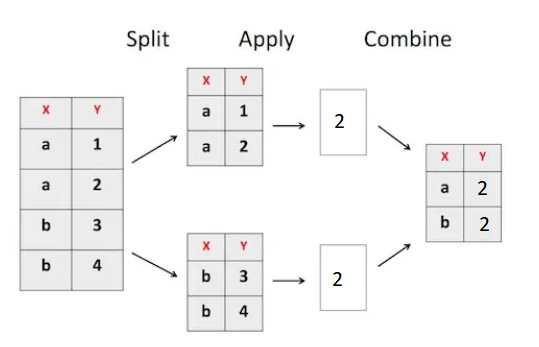

```{r, load_refs, include=FALSE, cache=FALSE}
library(RefManageR)
BibOptions(check.entries = FALSE,
           bib.style = "authoryear",
           cite.style = "authoryear",
           style = "markdown",
           hyperlink = "to.bib",
           dashed = FALSE)
bib <- ReadBib("../../bibliografia/bib.bib", check = FALSE)
```

```{r setup, include=FALSE}
options(htmltools.dir.version = FALSE)
```

```{r xaringan-themer, include=FALSE, warning=FALSE}
library(xaringanthemer)
library(dplyr)
library(guaguas)

dark_yellow <- "#EFBE43"
light_yellow <- "#FDF7E9"
gray <- "#333333"
blue <- "#4466B0"

style_duo(
  # colors
  primary_color = light_yellow,
  secondary_color = dark_yellow,
  header_color = gray,
  text_color = gray,
  code_inline_color = colorspace::lighten(gray),
  text_bold_color = colorspace::lighten(gray),
  link_color = blue,
  title_slide_text_color = blue,

  # fonts
  header_font_google = google_font("Martel", "300", "400"),
  text_font_google = google_font("Lato"),
  code_font_google = google_font("Fira Mono")
)
```

```{r echo=FALSE,include=FALSE}
#library(pagedown)
#pagedown::chrome_print("clase6b_pipe_dplyr_codigo.html")

```


class: inverse, center, middle

# Pipe

`comando para concatenar funciones`

---

# Operador pipe

--

Significa "tubo", "tubería" o "cañería".

--

Es un operador de `magrittr` que .inverse[se combina con los verbos de `dplyr`]

(si cargamos `dplyr` ya podemos usarlo).

--

Se escribe `%>%` (ctrl + shift + m)

```{r fig.align='center', out.width = "50%", echo=FALSE}
knitr::include_graphics("https://thinktecno.com/wp-content/uploads/2020/05/1589395831_455_Atajos-de-teclado-importantes-en-Microsoft-Outlook.jpg")
```

--

Nos permite concatenar funciones, haciendo más sencilla la lectura del código.

---


```{r fig.align='center', out.width = "80%", echo=FALSE}
knitr::include_graphics("imagenes/pipes.jpg")
```

---

# Operador pipe 

¿Como saber los nombres de las variables de la base de datos `guaguas`?

--

```{r}
names(guaguas)   ## la manera "tradicional" o R base  
```

--

Con pipes sería así:

--

```{r}
guaguas %>% names()  ## el objeto primero, luego la función
```


---

# Operador pipe 

¿Cuál es la importancia relativa del nombre María en 1920, 1950, 1980 y 2020?

--

```{r}
filter(guaguas, 
       (anio==1920|anio==1950|anio==1980|anio==2020) & nombre=="María")
```

--

Con pipes sería así:

--

```{r eval=FALSE}
guaguas %>% 
  filter( (anio==1920|anio==1950|anio==1980|anio==2020) & 
            nombre=="María")
```


---

# Operador pipe

¿Y cuál es la gracia de la tubería?

--

Con pipes .inverse[podemos concatenar funciones].

--

¿Cuáles son los años en los que el nombre María es más importante?, ¿Que porcentajes representa el nombre María?

--

Sin pipes tendríamos que hacer algo más o menos así (con el riesgo de confundir paréntesis)


```{r eval=FALSE}
select(mutate(head(arrange(
  filter(guaguas,nombre=="María"),
  -proporcion),4),porcentaje=round(proporcion*100,1)),
  anio,nombre,porcentaje)
```

--

Se dificulta bastante la lectura (**desde el centro hacia afuera**)

---

# Operador pipe

Con pipes es como leer, .inverse[de izquierda a derecha]:

(y de arriba hacia abajo opcional)

--

```{r}
guaguas %>% 
  filter(nombre=="María") %>% 
  arrange(-proporcion) %>% 
  head(4) %>% 
  mutate(porcentaje=round(proporcion*100,1)) %>% 
  select(anio,nombre,porcentaje)
```

--

Todo es una sola línea de código. No tuve que crear ningún objeto extra.

---

class: inverse, center, middle

# Continuación encuestas en Chile 

`aplicando operador *pipe*`

---

# Encuesta Laboral (Encla)

La encuesta busca diagnosticar el estado y evolución de las **condiciones de empleo y trabajo**, de las 
**relaciones laborales** y de la **igualdad de género** en las empresas regidas por el Código del Trabajo en Chile. 

--

Su población objetivo corresponde a las .inverse[empresas formales] vigentes con cinco o más trabajadores contratados directamente.

--

Cada empresa cuenta con tres unidades de observación (informante). Informantes en microdatos diferentes: 

+ Empleadores (gerente RRHH)

+ Autoaplicado (gerente RRHH)

+ Trabajadores (trabajador aleatorio)

+ Sindicatos (dirigente sindical)

--

+ El año 2019 se aplicó la [última versión](https://www.ine.cl/estadisticas/sociales/mercado-laboral/condiciones-de-empleo-y-relaciones-laborales): .inverse[3.670 empresas, 4 microdato.]


---

# Encuesta Laboral (Encla)

Solo descarguemos la data de .inverse[sindicatos] (esta vez en formato `stata`).

--

La lógica será la misma que en spss:

+ guardar en carpeta donde esté el R Project con el que estamos trabajando.

+ Cargar paquete y llamar función `read_dta()`

--

```{r message=FALSE, warning=FALSE}
library(haven); library(dplyr)
encla <- read_dta("data/bbdd-sindicatos-bp.dta")
```

--

Veamos las primeras 4 columnas y 2 filas

```{r}
encla %>% select(1:4) %>% slice(1:2)
```


---

# Encuesta Laboral (Encla)

Para explorar la data usemos `sjmisc` y `sjlabelled`

(ambos paquetes de [Daniel Lüdecke](https://github.com/strengejacke))

--

```{r message=FALSE, warning=FALSE}
library(sjmisc)
#install.packages("sjlabelled") 
library(sjlabelled)
```

--

Para ver etiqueta de **todas** las variables:

```{r eval=FALSE}
get_label(encla)
```

---

# Encuesta Laboral (Encla)

Para buscar palabras o conceptos en data:

```{r eval=FALSE}
find_var(encla,"conflicto")
```

```{r echo=FALSE}
find_var(encla,"conflicto")[3]
```

---

# Encuesta Laboral (Encla)

```{r fig.align='center', out.width = "100%", echo=FALSE}
knitr::include_graphics("Imagenes/motivos_conflicto.png")
```


---

# Encuesta Laboral (Encla)

Etiqueta de variable:

```{r eval=FALSE}
get_label(encla$h2_1)  # Pregunta o enunciado
```

--

```{r eval=FALSE}
get_labels(encla$h2_1) # Categorías de respuesta
```
--

Distribución de la variable con .inverse[`frq(encla$h2_1)`]

```{r echo=FALSE}
frq(encla$h2_1)
```


---

# Encuesta Laboral (Encla)

Ahora con una variable cuantitativa

--

```{r}
get_label(encla$g2_3)
```

--

Descripción con `R base`

```{r}
summary(encla$g2_3)
```

--

Descripción con `sjmisc`

```{r eval=FALSE}
descr(encla$g2_3)
```

---

# Encuesta Laboral (Encla)

.inverse[¿Cuántos socios/as hay en promedio por sector económico?]

--

```{r}
table(encla$agrupacion_actividad)
get_labels(encla$agrupacion_actividad)
```


---

# Encuesta Laboral (Encla)

A esta altura ya somos conscientes de que en R hay muchas formas de hacer las cosas.

--

La forma manual sería la más intuitiva

--

Que sería como hacer esto para cada valor de `agrupacion_actividad`

```{r}
encla %>% filter(agrupacion_actividad==1) %>% 
  select(g2_3) %>% summary()
```

---

# Encuesta Laboral (Encla)

.inverse[¿El problema de esta forma?]

--

+ Poca economía en el código (muchas líneas)

+ posibilidad de cometer errores 

+ dificultad para combinar cada `summary()`

+ Desgastante para variables con muchas categorías (e.g. comuna)

--

Por suerte, el .inverse[paquete dplyr] nos trae una solución con .inverse[group_by()]

--

La variable de sector económico la definimos como la que establece los grupos. 

Para cada grupo queremos un estadístico particular (media y mediana, por ejemplo)

---

# Encuesta Laboral (Encla)

```{r eval=FALSE}
encla %>% 
  group_by(agrupacion_actividad) %>% 
  summarise(media=mean(g2_3),mediana=median(g2_3))
```


```{r echo=FALSE}
encla %>% 
  group_by(agrupacion_actividad) %>% 
  summarise(media=mean(g2_3),mediana=median(g2_3)) %>% remove_all_labels()
```

--

Comprendamos la función...

---

class: inverse, center, middle

# Profundización *dplyr*: 

`group_by()`, `if_else()` y `case_when()`

---

# group_by()

Estrategia .inverse[split-apply-combine.]

--

Esta estrategia sucede tras bambalinas (no la vemos). Solo observamos el resultados. 

--

Con group_by()

+ se divide el data frame en x grupos (x es el número de categorías de la variable).

--

+ Luego se opera una función en cada grupo

--

+ Finalmente se combinan los resultados alcanzados en cada grupo.

--

```{r fig.align='center', out.width = "40%", echo=FALSE}

```

---

# group_by()

Vimos la función `group_by()` para medias:

```{r}
encla %>% 
  group_by(agrupacion_actividad) %>% 
  summarise(media=mean(g2_3))                                                    %>% remove_all_labels()
```

---

# group_by()

Pero perfectamente podríamos haber sumado el número de casos (empresas)

```{r}
encla %>% 
  group_by(agrupacion_actividad) %>% 
  summarise(empresas=n())                                                            %>% remove_all_labels()
```

---

# group_by()

El resultado suma 1172 (número de empresas en la data)

```{r}
encla %>% group_by(agrupacion_actividad) %>% 
  summarise(empresas=n()) %>% select(empresas) %>% sum()
```
--

Como vimos, también podemos agrupar sacando medianas y otras medidas

```{r}
encla %>% 
  group_by(agrupacion_actividad) %>% 
  summarise(median(g2_3),min(g2_3),max(g2_3)) %>% 
  slice(1:3)                                                                     %>% remove_all_labels()
```

---

# group_by()

Incluso podemos ordenar la data en base a un criterio y seleccionar al primer caso que lo cumple. 

--

¿Cuáles fueron los nombres más populares en el año 2020 según sexo?

--

```{r}
guaguas::guaguas %>% 
  filter(anio==2020) %>% 
  arrange(-n) %>% 
  group_by(sexo) %>% 
  slice(1)
```

---

# group_by()

Incluso podemos mezclar `group_by()` con `sjmisc`

--

.pull-left[

```{r}
encla %>% 
group_by(agrupacion_actividad) %>% 
descr(g2_3)
```

]

.pull-right[

```{r fig.align='center', out.width = "40%", echo=FALSE}
knitr::include_graphics("https://c.tenor.com/bD9vHNiR1rQAAAAd/boom-mind-blown.gif")
```

]

---

# if_else()

La hemos ocupado para crear dos categorías:

--

```{r echo=FALSE}
esi2020 <- haven::read_sav("data/esi-2020---personas_s.sav")
```


```{r} 
esi2020 <- esi2020 %>%                        # Data
           mutate(filtro_mas_de_1M =          # Nueva variable
                    if_else(ing_t_d>1000000,  # Condición
                                          1,  # Verdadero
                                         0))  # Falso 
```

--

```{r}
table(esi2020$filtro_mas_de_1M)
```

--

¿Podríamos usar [if_else()]() para crear variables con más de dos categorías?

---

# if_else()

Pensemos en 4 tramos de ingresos...

--

Podemos usar varios [if_else()]() consecutivamente

--

```{r} 
esi2020 <- esi2020 %>%      
  
 mutate(filtro_4 = 
  if_else(ing_t_d==0, "sin ingresos", ""),

 filtro_4 = 
  if_else(ing_t_d>0 & ing_t_d<300000, "primer tramo", filtro_4),
           
 filtro_4 = 
  if_else(ing_t_d<700000 & ing_t_d>=300000, "segundo tramo", filtro_4),
           
 filtro_4 = 
  if_else(ing_t_d<1000000 & ing_t_d>=700000, "tercer tramo", filtro_4),
           
 filtro_4 = 
  if_else(ing_t_d>=1000000, "cuarto tramo", filtro_4)
                  )  
```

---

# if_else()

```{r}
table(esi2020$filtro_4)
```
--

Funciona, pero es bastante código.

Hay otras formas de hacerlo más sencillo. 

--

Una de esas es con [case_when()]()

--

Esta es la lógica (cada línea independiente)

```{r eval=FALSE}

dataframe %>%
  mutate(nueva = case_when(condicion_1 ~ valor_1,
                           condicion_2 ~ valor_2,
                           condicion_3 ~ valor_3))
```


---

# case_when()

Y así su forma general:

```{r fig.align='center', out.width = "80%", echo=FALSE}
knitr::include_graphics("Imagenes/case_when_mutate.png")
```

---

# case_when()

Recodificar ingresos con [case_when()]()

```{r} 
esi2020 <- esi2020 %>%      
    mutate(filtro_4 = case_when(
              ing_t_d>0 & ing_t_d<300000 ~ "primer tramo",
              ing_t_d<700000 & ing_t_d>=300000 ~ "segundo tramo", 
              ing_t_d<1000000 & ing_t_d>=700000 ~ "tercer tramo", 
              ing_t_d>=1000000 ~ "cuarto tramo",
              TRUE ~ "sin ingresos",
                  )) 
```

--

```{r}
table(esi2020$filtro_4)
```

---

# case_when

La [virgulilla (~)]() tiene que se utilizada entre la condición y el valor a asignar.

.inverse[`Alt` + `Control` + `+` = `~`]

--

Los valores a asignar deben ser de la misma clase.

--

No funciona con variables factores, tienen que ser character o numeric

--

La nueva variable debe ser numérica o carácter, no puede ser una combinación.

--

**RECOMENDACIONES:**

--

+ Siempre probar la variable creada con `table()` (que tenga sentido)

--

+ Llamar con nuevo nombre a la nueva variable (no sobre escribir)

--

+ Usar espacios para ordenar y facilitar la lectura

--

Paciencia con la función, al principio saltan varios errores


---

class: inverse, center, middle

# Prácticas para una buena codificación

`Por Lindsay Carr`


---

# Por [Lindsay Carr](https://waterdata.usgs.gov/blog/intro-best-practices/)

--

+ Carga de librerías al inicio del código (usando `library()`)

--

+ Usa RStudio projects para organizar scripts, data y salidas

--

+ Modulariza el código (todavía no)

--

+ No guardar *workplace image*

--

+ No usar funciones que cambian el computador de otro (`install.package()` o `setwd()`) 

--

+ Comenta el código, pero sin pasarte (no incluir interpretaciones o resultados). 

--

+ El principal destinatario de tus comentarios eres tú en 3 meses más. 

--

+ Si quieres interpretar el código y mostrar los resultados usa RMarkdown

---

# Por [Lindsay Carr](https://waterdata.usgs.gov/blog/intro-best-practices/)

+ Aprovecha el autollenado de RStudio (evita errores de tipeo)

--

+ Copia y pega código utilizado anteriormente o por otros. 

--

+ Utiliza loops o **funciones** cuando te veas copiando y pegando código reemplazando valores

+ Las tareas mecánicas en R pueden automatizarse

--

+ Evita códigos anchos (sobre todo con pipes)

--

Ideal:

```{r eval=FALSE}
data %>% 
  funcion1() %>% 
  funcion2() %>% 
  funcion3()
```


---

class: inverse, center, middle

# Ejercicio práctico

`Utilizando Encuesta Suplementaria de Ingresos (ESI)`

---

# Ejercicio práctico ESI

+ Carga el microdato de la ESI personas 2020 (la de la prueba 1)


+ Crea 3 tablas con el promedio de ingresos (cualquier variable de ingresos) según sexo, región y sector económico


+ ¿Cuántas personas tienen entre 0 y 17 años, entre 18 y 29 años, entre 30 y 64 años, y 65 o más años? (cuatro grupos)


+ Crea una nueva data donde cada unidad (fila) sean los hogares y que solo tenga 3 variables: identificador del hogar, ingresos del hogar y región en la que se ubica el hogar.


+ ¿Cuántos hogares son?, ¿Cómo se distribuyen regionalmente estos hogares?

+ Envía por correo a equipo docente (antes del 08 de octubre)


---

### Recursos web utilizados

[Xaringan: Presentation Ninja, de Yihui Xie](https://github.com/yihui/xaringan). Para generar esta presentación.

[Ilustraciones de Allison Horst](https://github.com/allisonhorst/stats-illustrations)

### Para reforzar y seguir aprendiendo

Explicaciones simples y rápidas de función [group_by()](https://rsanchezs.gitbooks.io/rprogramming/content/chapter9/groupby.html) y operador [pipe](https://rsanchezs.gitbooks.io/rprogramming/content/chapter9/pipeline.html)

Un poco más del operador [pipe](https://es.r4ds.hadley.nz/pipes.html) (por Wickham)

### Bibliografía utilizada

```{r echo=FALSE, results=FALSE}
Citet(bib, "Wickham2021")
```

```{r refs, echo=FALSE, results="asis"}
PrintBibliography(bib)
```


